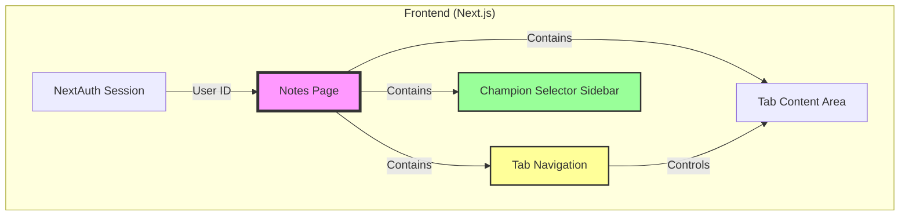

# 設計書: ノートページ基本レイアウト

## 概要

本ドキュメントは、LoL Labアプリケーションのノートページ（`/notes`）の基本レイアウトとタブナビゲーションの設計を定義します。この機能は、ノート管理システムの土台となるUI骨組みを提供します。

本Specでは、以下のみを実装します：
- タブナビゲーション（対策ノート・汎用ノート）
- 左サイドバーのチャンピオン選択UI
- 各タブのプレースホルダー表示

**実際のノート作成・編集・一覧表示機能は別Specで実装します。**

## アーキテクチャ

### システム構成



### ページレイアウト構造

```
┌─────────────────────────────────────────────────────────┐
│ Navbar (既存)                                            │
├─────────────────────────────────────────────────────────┤
│ Tab Navigation                                           │
│ [対策ノート] [汎用ノート]                                │
├──────────────────┬──────────────────────────────────────┤
│                  │                                      │
│  Champion        │  Tab Content Area                    │
│  Selector        │                                      │
│  Sidebar         │  (プレースホルダー表示)              │
│                  │                                      │
│  - 自分選択      │                                      │
│  - 相手選択      │                                      │
│  - よく使う      │                                      │
│  - 一覧          │                                      │
│                  │                                      │
└──────────────────┴──────────────────────────────────────┘
```

### 状態管理

```typescript
interface NotesPageState {
  // タブ選択状態
  activeTab: 'create' | 'general' | 'matchup';
  
  // チャンピオン選択状態
  myChampionId: string | null;
  enemyChampionId: string | null;
  
  // UI状態
  loading: boolean;
  sidebarOpen: boolean; // モバイル用
}
```

## コンポーネント設計

### ページコンポーネント

#### Notes Page (`/notes`)

**責務**: ノートページ全体のレイアウトとタブ管理

**状態管理**:
```typescript
interface NotesPageState {
  activeTab: 'create' | 'general' | 'matchup';
  myChampionId: string | null;
  enemyChampionId: string | null;
  loading: boolean;
  sidebarOpen: boolean; // モバイル用
}
```

**主要機能**:
- タブナビゲーション表示
- 左サイドバー表示制御（タブによって表示/非表示）
- チャンピオン選択状態の管理
- レスポンシブレイアウト

**レイアウト構造**:
```typescript
<div className="min-h-screen bg-gray-50">
  {/* タブナビゲーション */}
  <TabNavigation activeTab={activeTab} onTabChange={setActiveTab} />
  
  <div className="flex">
    {/* 左サイドバー（条件付き表示） */}
    {shouldShowSidebar && (
      <ChampionSelectorSidebar
        myChampionId={myChampionId}
        enemyChampionId={enemyChampionId}
        onMyChampionChange={setMyChampionId}
        onEnemyChampionChange={setEnemyChampionId}
      />
    )}
    
    {/* 右メインエリア */}
    <div className="flex-1">
      {renderTabContent()}
    </div>
  </div>
</div>
```

### UIコンポーネント

#### TabNavigation

**責務**: タブの表示と切り替え

**Props**:
```typescript
interface TabNavigationProps {
  activeTab: 'create' | 'general' | 'matchup';
  onTabChange: (tab: 'create' | 'general' | 'matchup') => void;
}
```

**実装詳細**:
```typescript
const tabs = [
  { id: 'matchup', label: '対策ノート' },
  { id: 'general', label: '汎用ノート' }
];

// アクティブタブのスタイル
const activeStyle = 'border-b-2 border-black text-black';
const inactiveStyle = 'text-gray-600 hover:text-gray-800';
```

**レイアウト**:
- 横並びタブ（デスクトップ）
- 適切な間隔とパディング
- アクティブタブは下線とピンク色で強調

#### ChampionSelectorSidebar

**責務**: チャンピオン選択UI全体と選択モード管理

**Props**:
```typescript
interface ChampionSelectorSidebarProps {
  myChampionId: string | null;
  enemyChampionId: string | null;
  onMyChampionChange: (championId: string) => void;
  onEnemyChampionChange: (championId: string) => void;
}
```

**選択ボックスの実装**:
```typescript
// 自分のチャンピオン選択ボックス
<button
  onClick={() => setSelectionMode('my')}
  className={`
    w-full p-3 rounded-lg transition-colors
    ${selectionMode === 'my' 
      ? 'bg-blue-100 border-2 border-blue-400' 
      : 'bg-gray-50 border border-gray-200 hover:bg-gray-100'
    }
  `}
>
  {myChampion ? (
    <div className="flex items-center gap-3">
      
      <div className="flex flex-col items-start">
        <span className="text-xs text-gray-500">自分</span>
        <span className="text-base font-semibold text-gray-800">
          {myChampion.name}
        </span>
      </div>
    </div>
  ) : (
    <p className="text-sm text-gray-400">
      自分のチャンピオンを選択
    </p>
  )}
</button>

// 相手のチャンピオン選択ボックス
<button
  onClick={() => setSelectionMode('enemy')}
  className={`
    w-full p-3 rounded-lg transition-colors
    ${selectionMode === 'enemy' 
      ? 'bg-red-100 border-2 border-red-400' 
      : 'bg-gray-50 border border-gray-200 hover:bg-gray-100'
    }
  `}
>
  {enemyChampion ? (
    <div className="flex items-center gap-3">
      
      <div className="flex flex-col items-start">
        <span className="text-xs text-gray-500">相手</span>
        <span className="text-base font-semibold text-gray-800">
          {enemyChampion.name}
        </span>
      </div>
    </div>
  ) : (
    <p className="text-sm text-gray-400">
      相手のチャンピオンを選択
    </p>
  )}
</button>
```

**チャンピオン選択ハンドラー**:
```typescript
const handleChampionSelect = (championId: string) => {
  if (selectionMode === 'my') {
    onMyChampionChange(championId);
    // 自分のチャンピオンを選択したら、次は相手のチャンピオン選択モードに
    setSelectionMode('enemy');
  } else {
    onEnemyChampionChange(championId);
  }
};
```

**内部状態**:
```typescript
interface SidebarState {
  searchQuery: string;
  filteredChampions: Champion[];
  selectionMode: 'my' | 'enemy'; // 選択モード
}
```

**選択フロー**:
1. 初期状態は「自分のチャンピオン選択」モード
2. 自分のチャンピオンを選択すると、自動的に「相手のチャンピオン選択」モードに切り替わる
3. 選択ボックスをクリックすると、そのモードに切り替わり変更可能
4. 両方のチャンピオンが選択されたら、検索バー以下（よく使うチャンピオン、チャンピオン一覧）を非表示にし、リセットボタンを表示
5. リセットボタンをクリックすると、両方の選択をクリアし、検索バー以下を再表示

**セクション構成**:
1. **自分のチャンピオンを選択**
   - クリック可能なボックス
   - 未選択時: 「自分のチャンピオンを選択」とグレーテキスト表示
   - 選択後: チャンピオン画像（48px）+ 「自分」ラベル（小・グレー）+ チャンピオン名（大・黒）
   - 選択モード時: 明るい青色（bg-blue-100, border-blue-400）でハイライト
   - 非選択モード時: グレー（bg-gray-50, border-gray-200）

2. **相手のチャンピオンを選択**
   - クリック可能なボックス
   - 未選択時: 「相手のチャンピオンを選択」とグレーテキスト表示
   - 選択後: チャンピオン画像（48px）+ 「相手」ラベル（小・グレー）+ チャンピオン名（大・黒）
   - 選択モード時: 明るい赤色（bg-red-100, border-red-400）でハイライト
   - 非選択モード時: グレー（bg-gray-50, border-gray-200）

3. **チャンピオン検索**
   - 検索入力欄（見出しなし）
   - リアルタイムフィルタリング
   - 両方のチャンピオンが選択されたら非表示

4. **よく使うチャンピオン**
   - 横スクロール可能なリスト
   - 円形チャンピオン画像
   - 最大10チャンピオン表示
   - 現在のモードに応じた選択状態を表示
   - 両方のチャンピオンが選択されたら非表示

5. **チャンピオン一覧**
   - スクロール可能なリスト
   - チャンピオン画像 + 日本名（左） + 英名（右・グレー）
   - 現在のモードに応じた選択状態のハイライト
   - 両方のチャンピオンが選択されたら非表示

6. **リセットボタン**
   - 両方のチャンピオンが選択されたときのみ表示
   - クリックすると両方の選択をクリア
   - ボーダーのみのボタン（bg-white border-2 border-gray-300 text-gray-700）
   - 中央に「リセット」テキスト表示

**スタイル**:
```typescript
// サイドバー幅
const sidebarWidth = 'w-80'; // 320px

// セクション間隔
const sectionSpacing = 'mb-4';

// チャンピオン画像サイズ
const championImageSize = 'w-8 h-8'; // 32px
```

#### ChampionButton

**責務**: 個別チャンピオンの選択ボタン

**Props**:
```typescript
interface ChampionButtonProps {
  champion: Champion;
  selected: boolean;
  onClick: () => void;
}
```

**実装**:
```typescript
<button
  onClick={onClick}
  className={`
    flex items-center gap-2 p-1.5 rounded w-full
    transition-colors duration-150
    ${selected 
      ? 'bg-gray-100 border-2 border-black' 
      : 'hover:bg-gray-50'
    }
  `}
>
  
  <div className="flex items-center justify-between flex-1 min-w-0">
    <span className="text-xs">{champion.name}</span>
    <span className="text-xs text-gray-400 ml-2">{champion.id}</span>
  </div>
</button>
```

#### FavoriteChampions

**責務**: よく使うチャンピオンの横スクロールリスト

**Props**:
```typescript
interface FavoriteChampionsProps {
  champions: Champion[];
  selectedId: string | null;
  onSelect: (championId: string) => void;
}
```

**実装**:
```typescript
<div className="overflow-x-auto">
  <div className="flex gap-3 pb-2">
    {champions.map(champion => (
      <button
        key={champion.id}
        onClick={() => onSelect(champion.id)}
        className="flex flex-col items-center gap-1 min-w-[48px]"
      >
        
        <span className="text-[10px] text-center">{champion.name}</span>
      </button>
    ))}
  </div>
</div>
```

#### TabContentPlaceholder

**責務**: 各タブのプレースホルダー表示

**Props**:
```typescript
interface TabContentPlaceholderProps {
  tab: 'create' | 'general' | 'matchup';
  myChampionId: string | null;
  enemyChampionId: string | null;
}
```

**表示内容**:

**対策ノートタブ**:
```typescript
<div className="flex items-center justify-center h-full p-8">
  <div className="text-center text-gray-500">
    <p className="text-lg mb-2">チャンピオンを選択してください</p>
    <p className="text-sm">
      左のパネルで自分のチャンピオンと相手のチャンピオンを選択してください
    </p>
  </div>
</div>
```

**汎用ノートタブ**:
```typescript
<div className="flex items-center justify-center h-full p-8">
  <div className="text-center text-gray-500">
    <p className="text-lg mb-2">汎用ノート機能</p>
    <p className="text-sm">
      汎用ノート機能は別Specで実装予定です
    </p>
  </div>
</div>
```

**チャンピオン対策ノートタブ**:
```typescript
<div className="flex items-center justify-center h-full p-8">
  <div className="text-center text-gray-500">
    <p className="text-lg mb-2">チャンピオンを選択してください</p>
    <p className="text-sm">
      対策ノート一覧機能は別Specで実装予定です
    </p>
  </div>
</div>
```

## データモデル

### Champion型

```typescript
interface Champion {
  id: string;        // チャンピオンID（例: "Ahri", "Zed"）
  name: string;      // 表示名（例: "アーリ", "ゼド"）
  imagePath: string; // 画像パス（例: "/images/champion/Ahri.png"）
}
```

### チャンピオンデータ

```typescript
// frontend/src/lib/data/champions.ts
export const champions: Champion[] = [
  { id: 'Aatrox', name: 'エイトロックス', imagePath: '/images/champion/Aatrox.png' },
  { id: 'Ahri', name: 'アーリ', imagePath: '/images/champion/Ahri.png' },
  // ... 全171チャンピオン
];

// よく使うチャンピオン（仮データ）
export const favoriteChampions: Champion[] = [
  { id: 'Ahri', name: 'アーリ', imagePath: '/images/champion/Ahri.png' },
  { id: 'Zed', name: 'ゼド', imagePath: '/images/champion/Zed.png' },
  { id: 'Yasuo', name: 'ヤスオ', imagePath: '/images/champion/Yasuo.png' },
  { id: 'Akali', name: 'アカリ', imagePath: '/images/champion/Akali.png' },
];
```

### タブ型定義

```typescript
type TabType = 'create' | 'general' | 'matchup';

interface Tab {
  id: TabType;
  label: string;
  showSidebar: boolean; // サイドバー表示フラグ
}

const tabs: Tab[] = [
  { id: 'matchup', label: '対策ノート', showSidebar: true },
  { id: 'general', label: '汎用ノート', showSidebar: false }
];
```

## スタイリング設計

### カラーパレット

```typescript
const colors = {
  // 選択状態（黒系）
  selection: {
    background: 'bg-gray-100',
    border: 'border-black',
    ring: 'ring-black',
    text: 'text-black'
  },
  
  // グレー系
  gray: {
    50: 'bg-gray-50',
    100: 'bg-gray-100',
    200: 'border-gray-200',
    500: 'text-gray-500',
    600: 'text-gray-600',
    800: 'text-gray-800'
  }
};
```

### レイアウト定数

```typescript
const layout = {
  sidebarWidth: 'w-80',           // 320px
  sidebarWidthMobile: 'w-full',   // モバイル: 全幅
  contentPadding: 'p-4',          // 16px
  sectionSpacing: 'mb-4',         // 16px
  championImageSize: 'w-8 h-8',   // 32px
  favoriteImageSize: 'w-12 h-12'  // 48px
};
```

### レスポンシブブレークポイント

```typescript
const breakpoints = {
  mobile: '768px',   // タブレット未満
  tablet: '1024px',  // デスクトップ未満
  desktop: '1280px'  // 大画面
};

// Tailwindクラス
// sm: 640px
// md: 768px
// lg: 1024px
// xl: 1280px
```

## 認証設計

### NextAuth.js統合

```typescript
// セッション確認
const { data: session, status } = useSession();

if (status === 'loading') {
  return <GlobalLoading loading={true} />;
}

if (status === 'unauthenticated') {
  return (
    <div className="flex items-center justify-center min-h-screen">
      <div className="text-center">
        <h2 className="text-2xl font-bold mb-4">ログインが必要です</h2>
        <p className="text-gray-600">
          ノート機能を利用するには、ログインしてください。
        </p>
      </div>
    </div>
  );
}

// ユーザーIDの取得
const userId = session?.user?.id;
```

### 認証フロー

1. ページアクセス時にセッション確認
2. 未認証の場合はログインメッセージとログインボタンを表示
3. 認証済みの場合はユーザーIDを状態管理に使用

## パフォーマンス最適化

### レンダリング最適化

#### React.memo

```typescript
const TabNavigation = React.memo(({ activeTab, onTabChange }: TabNavigationProps) => {
  // コンポーネント実装
});

const ChampionSelectorSidebar = React.memo(({ 
  myChampionId, 
  enemyChampionId, 
  onMyChampionChange, 
  onEnemyChampionChange 
}: ChampionSelectorSidebarProps) => {
  // コンポーネント実装
});

const ChampionButton = React.memo(({ champion, selected, onClick }: ChampionButtonProps) => {
  // コンポーネント実装
});
```

#### useMemo / useCallback

```typescript
// チャンピオンリストのフィルタリング
const filteredChampions = useMemo(() => {
  if (!searchQuery) return champions;
  return champions.filter(c => 
    c.name.toLowerCase().includes(searchQuery.toLowerCase()) ||
    c.id.toLowerCase().includes(searchQuery.toLowerCase())
  );
}, [searchQuery]);

// イベントハンドラーのメモ化
const handleTabChange = useCallback((tab: TabType) => {
  setActiveTab(tab);
}, []);

const handleChampionSelect = useCallback((championId: string) => {
  setMyChampionId(championId);
}, []);
```

### 画像最適化

#### 遅延読み込み

```typescript

```

### チャンピオンデータのキャッシング

```typescript
// チャンピオンデータは静的ファイルから読み込み、メモリ上にキャッシュ
import { champions } from '@/lib/data/champions';

// 初回読み込み後は再利用
const [championList] = useState(champions);
```

## レスポンシブデザイン

### ブレークポイント

```typescript
const breakpoints = {
  mobile: '768px',   // md未満
  tablet: '1024px',  // lg未満
  desktop: '1280px'  // xl未満
};
```

### レイアウト調整

#### ノートページ全体

```typescript
// デスクトップ: サイドバー + メインエリア（横並び）
<div className="flex">
  <aside className="w-80 hidden md:block">
    <ChampionSelectorSidebar />
  </aside>
  <main className="flex-1">
    <TabContent />
  </main>
</div>

// モバイル: サイドバーはオーバーレイ表示
{sidebarOpen && (
  <div className="fixed inset-0 z-50 md:hidden">
    <div className="absolute inset-0 bg-black/50" onClick={closeSidebar} />
    <aside className="absolute left-0 top-0 bottom-0 w-80 bg-white">
      <ChampionSelectorSidebar />
    </aside>
  </div>
)}
```

#### タブナビゲーション

```typescript
// デスクトップ: 横並び
<div className="flex gap-4 border-b">
  {tabs.map(tab => (
    <button className="px-4 py-2">{tab.label}</button>
  ))}
</div>

// モバイル: 適切なフォントサイズとパディング
<div className="flex gap-2 border-b overflow-x-auto">
  {tabs.map(tab => (
    <button className="px-3 py-2 text-sm whitespace-nowrap">
      {tab.label}
    </button>
  ))}
</div>
```

#### チャンピオン一覧

```typescript
// チャンピオンボタンのサイズ調整
// デスクトップ: 32px画像
// モバイル: 32px画像


```

#### ハンバーガーメニュー

```typescript
// モバイルのみ表示
<button 
  className="md:hidden fixed bottom-4 right-4 z-40 bg-gray-800 text-white p-4 rounded-full shadow-lg hover:bg-black"
  onClick={toggleSidebar}
>
  <MenuIcon />
</button>
```

## 依存関係

### 外部Spec

- **Spec 1-1 (basic-ui-structure)**: ルートレイアウト、ナビゲーションバー、認証システム
- **Spec 1-2 (common-components)**: Panel、GlobalLoading、スタイル定数

### 使用する共通コンポーネント

#### Panel

```typescript
import Panel from '@/components/ui/Panel';

<Panel className="mb-4">
  <h2>対策ノート</h2>
  {/* コンテンツ */}
</Panel>
```

#### GlobalLoading

```typescript
import GlobalLoading from '@/components/GlobalLoading';

<GlobalLoading loading={isLoading} />
```

#### スタイル定数

```typescript
import { BORDER_STYLE_1 } from '@/components/ui/Panel';

<input 
  type="text"
  placeholder="チャンピオン名で検索..."
  className={BORDER_STYLE_1}
/>
```

## フォント設定

### Noto Sans JP

プロジェクト全体で使用する日本語フォント

```typescript
// frontend/src/app/layout.tsx
import { Noto_Sans_JP } from 'next/font/google';

const notoSansJP = Noto_Sans_JP({
  subsets: ['latin'],
  weight: ['400', '500', '600', '700'],
  variable: '--font-noto-sans-jp',
});

// HTMLに適用
<html lang="ja" className={notoSansJP.variable}>
  <body className={notoSansJP.className}>
```

```javascript
// frontend/tailwind.config.js
module.exports = {
  theme: {
    extend: {
      fontFamily: {
        sans: ['Noto Sans JP', 'sans-serif'],
      },
    },
  },
}
```

## ファイル構造

```
frontend/src/
├── app/
│   ├── layout.tsx                      # ルートレイアウト（フォント設定）
│   └── notes/
│       └── page.tsx                    # ノートページ（タブナビゲーション + レイアウト）
├── components/
│   └── notes/
│       ├── TabNavigation.tsx           # タブナビゲーション
│       ├── ChampionSelectorSidebar.tsx # 左サイドバー
│       ├── ChampionButton.tsx          # チャンピオン選択ボタン
│       ├── FavoriteChampions.tsx       # よく使うチャンピオン
│       └── TabContentPlaceholder.tsx   # タブコンテンツプレースホルダー
└── lib/
    └── data/
        └── champions.ts                # チャンピオンデータ
```

## 実装優先順位

### Phase 1: データ準備
1. チャンピオンデータファイル（champions.ts）作成
2. Champion型定義

### Phase 2: 基本コンポーネント
1. ChampionButton（個別チャンピオンボタン）
2. FavoriteChampions（よく使うチャンピオン）
3. TabNavigation（タブナビゲーション）

### Phase 3: サイドバー実装
1. ChampionSelectorSidebar（左サイドバー全体）
2. チャンピオン検索機能
3. チャンピオン一覧表示

### Phase 4: ページ統合
1. Notes Page（/notes）
2. タブ切り替え機能
3. サイドバー表示制御
4. プレースホルダー表示

### Phase 5: レスポンシブ対応
1. モバイルレイアウト
2. サイドバーオーバーレイ
3. ハンバーガーメニュー

## 今後の拡張（別Spec）

以下の機能は本Specの範囲外とし、別Specで実装します：

- **ノート作成機能**: チャンピオン選択後の作成フォーム、ルーン・スペル・アイテム選択、保存機能
- **汎用ノート機能**: 汎用ノートのCRUD操作、一覧表示
- **ノート一覧・編集機能**: 既存ノートの一覧表示、編集・削除機能

本Specでは、これらの機能のプレースホルダーのみを表示します。
