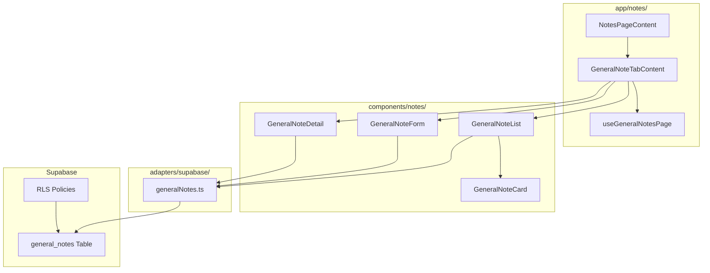
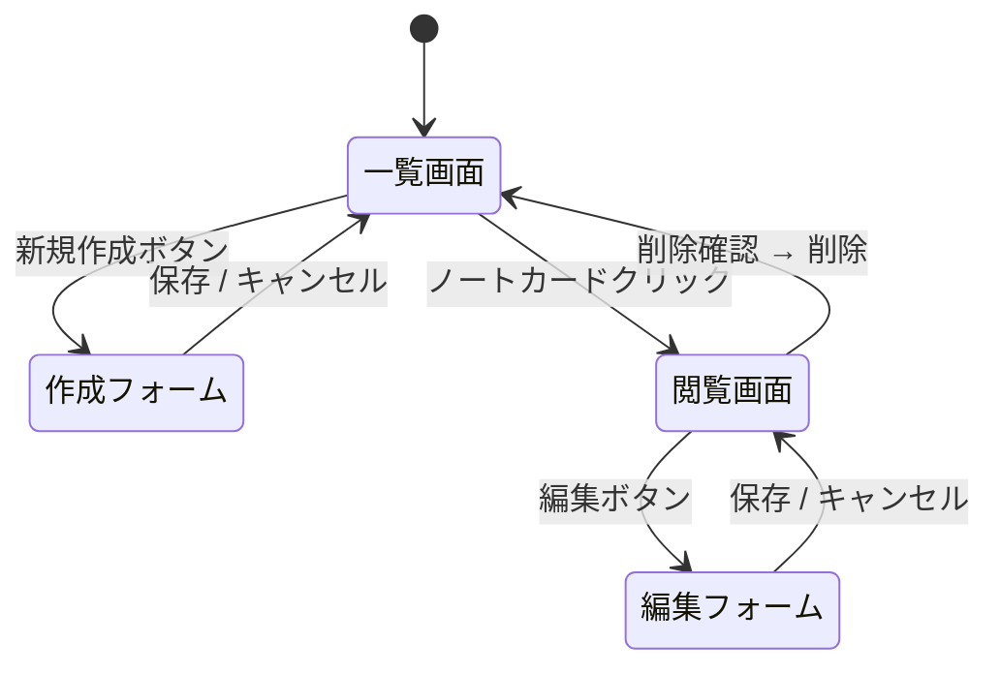

# 設計書: 汎用ノート作成機能

## 概要

本ドキュメントは、LoL Labの「汎用ノート」タブに汎用ノート作成・閲覧・管理機能を実装するための技術設計を定義します。

現在 `TabContentPlaceholder` で表示されている汎用ノートタブを、実際の機能に置き換えます。対策ノートと異なり、チャンピオン選択サイドバーは不要です。

## アーキテクチャ

### システム構成



### 画面遷移フロー



### 依存方向

```
app/notes/ → components/notes/ → adapters/supabase/ → Supabase
```

## コンポーネントと インターフェース

### 新規ファイル一覧

| ファイル | 責務 |
|---------|------|
| `types/generalNote.ts` | GeneralNote型定義 |
| `adapters/supabase/generalNotes.ts` | general_notes CRUD |
| `components/notes/GeneralNoteList/index.ts` | Public API |
| `components/notes/GeneralNoteList/GeneralNoteList.tsx` | ノート一覧 |
| `components/notes/GeneralNoteCard/index.ts` | Public API |
| `components/notes/GeneralNoteCard/GeneralNoteCard.tsx` | ノートカード |
| `components/notes/GeneralNoteForm/index.ts` | Public API |
| `components/notes/GeneralNoteForm/GeneralNoteForm.tsx` | 作成・編集フォーム |
| `components/notes/GeneralNoteForm/TagInput.tsx` | タグ入力UI |
| `components/notes/GeneralNoteForm/CharCounter.tsx` | 文字数カウンター |
| `components/notes/GeneralNoteDetail/index.ts` | Public API |
| `components/notes/GeneralNoteDetail/GeneralNoteDetail.tsx` | 閲覧画面 |
| `components/notes/GeneralNoteDetail/MarkdownRenderer.tsx` | マークダウンレンダラー |
| `components/notes/GeneralNoteDetail/ChampionMention.tsx` | チャンピオンメンション変換 |
| `app/notes/GeneralNoteTabContent.tsx` | 汎用ノートタブコンテンツ |
| `app/notes/useGeneralNotesPage.tsx` | 汎用ノート状態管理 |

### 既存ファイルの変更

| ファイル | 変更内容 |
|---------|---------|
| `app/notes/NotesPageContent.tsx` | `activeTab === 'general'` 時に `GeneralNoteTabContent` を表示 |
| `app/notes/useNotesPage.tsx` | `useGeneralNotesPage` の状態を統合 |
| `adapters/supabase/index.ts` | `generalNotes` をエクスポート追加 |

### コンポーネントインターフェース

#### GeneralNoteList

```typescript
interface GeneralNoteListProps {
  refreshKey: number;
  onCreateNew: () => void;
  onNoteClick: (noteId: number) => void;
}
```

#### GeneralNoteCard

```typescript
interface GeneralNoteCardProps {
  note: GeneralNote;
  isSelected: boolean;
  onClick: (noteId: number) => void;
}
```

#### GeneralNoteForm

```typescript
interface GeneralNoteFormProps {
  mode: 'create' | 'edit';
  initialData?: GeneralNote;
  onSave: (data: GeneralNoteFormData) => Promise<void>;
  onCancel: () => void;
}
```

#### GeneralNoteDetail

```typescript
interface GeneralNoteDetailProps {
  note: GeneralNote;
  onEdit: () => void;
  onDelete: () => void;
}
```

#### TagInput

```typescript
interface TagInputProps {
  tags: string[];
  onChange: (tags: string[]) => void;
  maxTags?: number;       // デフォルト: 10
  maxTagLength?: number;  // デフォルト: 20
}
```

#### CharCounter

```typescript
interface CharCounterProps {
  current: number;
  max: number;
}
```

## データモデル

### GeneralNote型

```typescript
// types/generalNote.ts
export interface GeneralNote {
  id: number;
  user_id: string;
  title: string;
  body: string | null;
  tags: string[];
  created_at: string;
  updated_at: string;
}

export interface GeneralNoteFormData {
  title: string;
  body: string;
  tags: string[];
}
```

### バリデーションルール

| フィールド | ルール |
|-----------|-------|
| title | 必須、1〜100文字 |
| body | 任意、最大10,000文字 |
| tags | 最大10個、各タグ最大20文字 |

### Supabase Adapter

```typescript
// adapters/supabase/generalNotes.ts
export async function getGeneralNotes(): Promise<GeneralNote[]>
export async function createGeneralNote(data: GeneralNoteFormData): Promise<GeneralNote>
export async function updateGeneralNote(id: number, data: GeneralNoteFormData): Promise<GeneralNote>
export async function deleteGeneralNote(id: number): Promise<void>
```

- `getGeneralNotes`: `updated_at DESC` でソート、RLSにより自動的にユーザーフィルタリング
- `createGeneralNote`: `auth.getUser()` でuser_idを取得してINSERT
- パラメータ化クエリ（`.eq('id', id)`）を使用、文字列結合クエリ禁止

## 状態管理設計

### useGeneralNotesPage

```typescript
type GeneralViewMode = 'list' | 'view' | 'edit' | 'create';

// 管理する状態
- viewMode: GeneralViewMode
- selectedNote: GeneralNote | null
- refreshKey: number
- noteLoading: boolean
- showDeleteDialog: boolean
```

### 状態遷移

| アクション | 遷移先 |
|-----------|-------|
| 新規作成ボタン | `create` |
| ノートカードクリック | `view` + selectedNote設定 |
| 編集ボタン | `edit` |
| 保存成功 | `view` or `list` + refreshKey++ |
| キャンセル | `view` or `list` |
| 削除確認 | `list` + selectedNote=null |

## UIレイアウト

### 2カラムレイアウト

```
┌─────────────────────────────────────────────────────┐
│ タブナビゲーション（対策ノート | 汎用ノート）           │
├──────────────────────┬──────────────────────────────┤
│ 左カラム（ノート一覧）│ 右カラム（詳細/フォーム）      │
│                      │                              │
│ [新規作成]           │ ← 未選択: プレースホルダー    │
│                      │ ← 選択時: GeneralNoteDetail  │
│ ┌──────────────────┐ │ ← 作成時: GeneralNoteForm    │
│ │ NoteCard         │ │                              │
│ │ タイトル         │ │                              │
│ │ 本文プレビュー   │ │                              │
│ │ タグ             │ │                              │
│ │ 更新日時         │ │                              │
│ └──────────────────┘ │                              │
└──────────────────────┴──────────────────────────────┘
```

- 左カラム: `w-80` 固定幅、スクロール可能
- 右カラム: `flex-1`、メインコンテンツ
- 汎用ノートタブではサイドバー（チャンピオン選択）を非表示

### GeneralNoteDetail UI

```
┌─────────────────────────────────────────────────────┐
│ タイトル                    更新日時 [編集] [削除]   │
├─────────────────────────────────────────────────────┤
│ 本文（マークダウンレンダリング）                      │
│ /yasuo → [画像] Yasuo に気を付ける                   │
├─────────────────────────────────────────────────────┤
│ タグ: [タグ1] [タグ2] ...                            │
└─────────────────────────────────────────────────────┘
```

### GeneralNoteForm UI

```
┌─────────────────────────────────────────────────────┐
│ タイトル入力欄                                        │
├─────────────────────────────────────────────────────┤
│ 本文入力欄（textarea）                               │
│                                          0/10000     │
├─────────────────────────────────────────────────────┤
│ タグ: [タグ1 ×] [タグ2 ×] [入力欄]                  │
├─────────────────────────────────────────────────────┤
│                              [キャンセル] [保存]     │
└─────────────────────────────────────────────────────┘
```

## 正確性プロパティ

*プロパティとは、システムの全ての有効な実行において成立すべき特性や振る舞いのことです。プロパティは人間が読める仕様と機械で検証可能な正確性保証の橋渡しをします。*

### Property 1: NoteCardは全フィールドを表示する

*For any* GeneralNoteオブジェクトに対して、GeneralNoteCardのレンダリング結果はtitle・本文プレビュー（先頭100文字以内）・tags・created_at・updated_atを全て含む

**Validates: Requirements 1.2, 1.3, 1.4, 1.5, 1.6**

### Property 2: ノート一覧は更新日時降順でソートされる

*For any* 任意の順序のGeneralNoteリストに対して、表示されるノートの順序は updated_at の降順である

**Validates: Requirements 1.8**

### Property 3: NoteDetailは全フィールドを表示する

*For any* GeneralNoteオブジェクトに対して、GeneralNoteDetailのレンダリング結果はtitle・本文・tags・updated_atを全て含み、編集ボタンと削除ボタンが存在する

**Validates: Requirements 2.1, 2.2, 2.3, 2.4, 2.5, 2.6, 2.7**

### Property 4: チャンピオンメンション変換

*For any* 有効なchampionIdを含む `/championId` パターンを持つ文字列に対して、変換後の出力は対応するチャンピオン画像要素とチャンピオン名を含み、後続テキストが保持される

**Validates: Requirements 4.1, 4.2, 4.5**

### Property 5: 無効なチャンピオンIDはテキストのまま表示される

*For any* 存在しないchampionIdを含む `/invalidId` パターンに対して、変換後の出力はそのテキストをそのまま含む

**Validates: Requirements 4.3**

### Property 6: タグ数制約

*For any* タグリストと追加操作の組み合わせに対して、最終的なタグ数は常に10以下である

**Validates: Requirements 6.3**

### Property 7: タグ文字数制約

*For any* 文字列に対して、20文字を超えるタグは拒否され、タグリストに追加されない

**Validates: Requirements 6.4**

### Property 8: タイトルバリデーション

*For any* 文字列に対して、タイトルが空または100文字を超える場合はバリデーションエラーとなり保存が実行されない

**Validates: Requirements 9.1, 9.4**

### Property 9: 本文文字数バリデーション

*For any* 文字列に対して、本文が10,000文字を超える場合はバリデーションエラーとなり保存が実行されない

**Validates: Requirements 9.2, 9.4**

### Property 10: 文字数カウンターの正確性

*For any* 文字列に対して、CharCounterが表示する現在文字数はその文字列の長さと一致し、「現在数/上限数」の形式で表示される

**Validates: Requirements 7.1, 7.2**

## エラーハンドリング

| エラー種別 | 表示メッセージ | 対応 |
|-----------|--------------|------|
| ネットワークエラー | ネットワークエラーが発生しました | Toastで表示 |
| データベースエラー | 保存に失敗しました | Toastで表示 |
| 認証エラー | ログインが必要です | Toastで表示 |
| バリデーションエラー | 各フィールドのエラーメッセージ | 入力欄近くに表示 |

- Toastは3秒後に自動クローズ
- try-catchでエラーをキャッチし、エラー種別に応じたメッセージを表示
- 詳細なエラー情報（スタックトレース等）はコンソールのみに出力

## テスト戦略

### ユニットテスト（Jest + React Testing Library）

- バリデーション関数（title/body/tag制約）
- ソート関数（updated_at降順）
- ChampionMention変換関数
- CharCounter表示フォーマット
- TagInput追加・削除ロジック

### プロパティベーステスト（Jest + fast-check）

- 各プロパティを最低100イテレーションで実行
- タグ名: `Feature: general-note-create, Property {N}: {property_text}`
- Property 1〜10 を実装

```typescript
// 例: Property 6 タグ数制約
it('Feature: general-note-create, Property 6: タグ数制約', () => {
  fc.assert(fc.property(
    fc.array(fc.string({ minLength: 1, maxLength: 20 }), { maxLength: 20 }),
    (tags) => {
      const result = addTagsWithConstraint(tags);
      return result.length <= 10;
    }
  ), { numRuns: 100 });
});
```

### インテグレーションテスト

- Supabase CRUD操作（モック使用）
- RLSポリシーによるデータ分離
- マークダウンレンダリング（react-markdown）

### PBTライブラリ

- **fast-check** を使用（既存プロジェクトのJest環境と互換）
