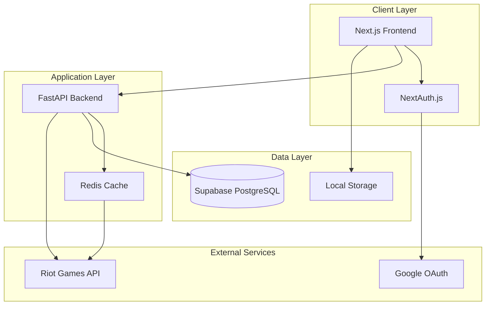

# Design Document: LoL Lab Complete Application

## Overview

LoL Lab is a comprehensive League of Legends strategy application that combines summoner analysis, champion note-taking, and match history review. The system is built on a modern web architecture using Next.js frontend with FastAPI backend, leveraging Supabase for data persistence and integrating with the Riot Games API for real-time League of Legends data.

The application serves as a strategic companion for League of Legends players, enabling them to research opponents, document effective strategies, and build a comprehensive knowledge base of champion matchups and counter-strategies.

## Architecture

### High-Level Architecture



### Technology Stack

**Frontend:**
- Next.js 14 with App Router
- TypeScript for type safety
- Tailwind CSS for styling
- NextAuth.js for authentication

**Backend:**
- Python FastAPI for API endpoints
- Pydantic for data validation
- Redis for caching layer
- Vercel serverless functions

**Database:**
- Supabase (PostgreSQL) for persistent data
- Local Storage for user preferences

**External Integrations:**
- Riot Games API for League of Legends data
- Google OAuth for user authentication

## Components and Interfaces

### Frontend Components

#### Core UI Components
- **SearchBar**: Summoner search with region selection
- **SummonerProfile**: Display summoner rank and statistics
- **MatchHistory**: Tabular display of recent matches
- **ChampionNoteEditor**: Form for creating/editing champion notes
- **NotesList**: Grid/list view of saved notes with filtering
- **LoadingSpinner**: Consistent loading states across the app

#### Page Components
- **HomePage**: Search interface with recent searches and pinned champions
- **SummonerPage**: Summoner profile with match history
- **NotesPage**: Champion note management interface
- **NoteDetailPage**: Individual note view and editing

### Backend API Endpoints

#### Summoner Endpoints
```typescript
GET /api/summoner/{region}/{summonerName}
Response: {
  id: string,
  name: string,
  level: number,
  rank: {
    tier: string,
    division: string,
    leaguePoints: number
  }
}

GET /api/summoner/{region}/{summonerName}/matches
Response: {
  matches: Array<{
    gameId: string,
    champion: string,
    kda: { kills: number, deaths: number, assists: number },
    cs: number,
    damage: number,
    gameMode: string,
    result: 'win' | 'loss'
  }>
}
```

#### Notes Endpoints
```typescript
GET /api/notes
Response: { notes: ChampionNote[] }

POST /api/notes
Body: {
  myChampionId: string,
  enemyChampionId: string,
  runes: object,
  spells: string[],
  items: string[],
  memo: string
}

PUT /api/notes/{noteId}
DELETE /api/notes/{noteId}
```

#### User Management
```typescript
POST /api/users/register
Body: { email: string, name: string, provider: string, providerId: string }

GET /api/users/profile
Response: { user: UserProfile }
```

### Data Models

#### User Model
```typescript
interface User {
  id: string;
  email: string;
  name: string;
  image?: string;
  provider: string;
  providerId: string;
  createdAt: Date;
}
```

#### Champion Note Model
```typescript
interface ChampionNote {
  id: number;
  userId: string;
  myChampionId: string;
  enemyChampionId: string;
  runes: RuneConfiguration;
  spells: SummonerSpell[];
  items: Item[];
  memo: string;
  createdAt: Date;
  updatedAt: Date;
}

interface RuneConfiguration {
  primary: {
    tree: string;
    keystone: string;
    slot1: string;
    slot2: string;
    slot3: string;
  };
  secondary: {
    tree: string;
    slot1: string;
    slot2: string;
  };
  shards: {
    offense: string;
    flex: string;
    defense: string;
  };
}
```

#### Summoner Data Models
```typescript
interface SummonerProfile {
  id: string;
  accountId: string;
  puuid: string;
  name: string;
  profileIconId: number;
  summonerLevel: number;
  rank?: RankInfo;
}

interface RankInfo {
  tier: string;
  rank: string;
  leaguePoints: number;
  wins: number;
  losses: number;
}

interface MatchData {
  gameId: string;
  gameCreation: number;
  gameDuration: number;
  participants: ParticipantData[];
}

interface ParticipantData {
  championId: string;
  championName: string;
  kills: number;
  deaths: number;
  assists: number;
  totalMinionsKilled: number;
  totalDamageDealtToChampions: number;
  win: boolean;
}
```

### Caching Strategy

#### Redis Cache Structure
```typescript
// Cache keys and TTL
"summoner:{region}:{name}" -> SummonerProfile (5 minutes)
"matches:{region}:{summonerId}" -> MatchData[] (5 minutes)
"champion-data" -> ChampionData[] (24 hours)
"rate-limit:{apiKey}" -> RequestCount (1 minute)
```

#### Cache Implementation
- **Cache-First Strategy**: Check cache before API calls
- **Background Refresh**: Update cache asynchronously for frequently accessed data
- **Rate Limit Tracking**: Monitor API usage to prevent violations
- **Fallback Handling**: Serve stale data if API is unavailable

## Correctness Properties

*A property is a characteristic or behavior that should hold true across all valid executions of a system-essentially, a formal statement about what the system should do. Properties serve as the bridge between human-readable specifications and machine-verifiable correctness guarantees.*

Before defining the correctness properties, I need to analyze the acceptance criteria from the requirements to determine which ones are testable as properties.

### Property 1: Summoner API Integration
*For any* valid summoner name and region combination, querying the Riot API should return a properly structured summoner profile containing all required fields (id, name, level, rank information).
**Validates: Requirements 1.1, 1.2**

### Property 2: Match History Display
*For any* summoner with match history, the system should display exactly the last 10 ranked matches with complete information (champion, K/D/A, CS, damage statistics).
**Validates: Requirements 1.3**

### Property 3: Error Handling for Invalid Summoners
*For any* invalid summoner name or region, the system should return a descriptive error message without crashing.
**Validates: Requirements 1.4**

### Property 4: Champion Note CRUD Operations
*For any* valid champion note data, creating, updating, or deleting the note should properly persist changes to the database with correct user association and maintain data integrity.
**Validates: Requirements 2.3, 2.5, 3.1**

### Property 5: Note Interface Provision
*For any* champion matchup selection, the system should provide a complete interface containing all required form elements (runes, summoner spells, items, strategy text).
**Validates: Requirements 2.1, 2.2**

### Property 6: User Data Retrieval and Display
*For any* authenticated user, logging in should retrieve all their saved notes and display them with complete information in an organized format.
**Validates: Requirements 2.4, 3.2, 9.2**

### Property 7: Search and Filtering Functionality
*For any* search criteria (my champion, enemy champion, or both), the system should return only notes that match the specified filters.
**Validates: Requirements 3.3, 9.1**

### Property 8: Local Storage Persistence
*For any* recent search or pinned champion data, the information should persist across browser sessions through local storage.
**Validates: Requirements 3.4**

### Property 9: API Rate Limiting
*For any* sequence of Riot API requests, the system should respect rate limits and prevent API violations through proper throttling.
**Validates: Requirements 4.1**

### Property 10: Cache Behavior
*For any* API response, the system should cache the data for the specified duration and return cached results for subsequent identical requests within the cache window.
**Validates: Requirements 4.2, 4.3**

### Property 11: Data Table Operations
*For any* data table display, sorting and filtering operations should correctly organize and filter the displayed data.
**Validates: Requirements 5.3**

### Property 12: User-Friendly Error Messages
*For any* error condition, the system should display user-friendly error messages with suggested actions rather than technical error details.
**Validates: Requirements 5.4**

### Property 13: Authentication Enforcement
*For any* protected feature or endpoint, the system should require Google OAuth authentication before allowing access.
**Validates: Requirements 6.1**

### Property 14: User Profile Management
*For any* successful login, the system should create or update the user profile in the app_users table with correct information.
**Validates: Requirements 6.2**

### Property 15: Data Authorization
*For any* user data access, the system should ensure users can only view and modify their own notes and cannot access other users' data.
**Validates: Requirements 6.3**

### Property 16: Input Validation and Sanitization
*For any* user input (summoner names, note data), the system should validate format, data types, and sanitize content to prevent security issues.
**Validates: Requirements 6.4, 8.1, 8.2**

### Property 17: Malformed Data Handling
*For any* malformed API response or invalid data, the system should handle parsing errors gracefully without crashing.
**Validates: Requirements 8.3**

### Property 18: Database Constraint Violations
*For any* database constraint violation, the system should provide specific, actionable error messages to users.
**Validates: Requirements 8.4**

### Property 19: Note Sorting and Pagination
*For any* note list display, the system should provide correct sorting by date, champion, or frequency, and implement pagination for large result sets.
**Validates: Requirements 9.4, 9.5**

## Error Handling

### API Error Handling
- **Riot API Failures**: Implement circuit breaker pattern with fallback to cached data
- **Rate Limit Exceeded**: Queue requests with exponential backoff retry logic
- **Network Timeouts**: Provide user feedback and retry mechanisms
- **Invalid Responses**: Parse and validate all API responses with error recovery

### Database Error Handling
- **Connection Failures**: Implement connection pooling with automatic retry
- **Constraint Violations**: Provide specific error messages for each constraint type
- **Transaction Failures**: Implement proper rollback mechanisms
- **Data Corruption**: Validate data integrity before and after operations

### User Input Error Handling
- **Invalid Summoner Names**: Validate format and provide suggestions
- **Malformed Note Data**: Validate all fields with specific error messages
- **Authentication Failures**: Redirect to login with clear error messages
- **Authorization Failures**: Provide appropriate access denied messages

### Frontend Error Handling
- **Component Errors**: Implement error boundaries with fallback UI
- **Network Errors**: Show offline indicators and retry options
- **Loading Failures**: Provide loading states and timeout handling
- **State Management Errors**: Implement proper error state management

## Testing Strategy

### Dual Testing Approach

The application will implement both unit testing and property-based testing to ensure comprehensive coverage:

**Unit Tests** focus on:
- Specific examples and edge cases
- Integration points between components
- Error conditions and boundary cases
- UI component rendering and interactions

**Property Tests** focus on:
- Universal properties that hold for all inputs
- Comprehensive input coverage through randomization
- Data integrity and consistency across operations
- API contract validation

### Property-Based Testing Configuration

**Testing Library**: Use `fast-check` for JavaScript/TypeScript property-based testing
**Test Configuration**: Minimum 100 iterations per property test
**Test Tagging**: Each property test must reference its design document property using the format:
`// Feature: lol-lab-complete-app, Property {number}: {property_text}`

### Unit Testing Strategy

**Frontend Testing**:
- React component testing with React Testing Library
- User interaction testing with Jest
- API integration testing with MSW (Mock Service Worker)
- Authentication flow testing

**Backend Testing**:
- FastAPI endpoint testing with pytest
- Database operation testing with test database
- External API integration testing with mock responses
- Authentication and authorization testing

### Integration Testing

**End-to-End Flows**:
- Complete user registration and authentication flow
- Summoner search to match history display flow
- Champion note creation, editing, and deletion flow
- Search and filtering functionality across the application

**Performance Testing**:
- API response time validation
- Database query performance testing
- Cache effectiveness measurement
- Concurrent user handling validation

### Test Data Management

**Test Fixtures**:
- Sample summoner data for various scenarios
- Champion note examples covering all data types
- Mock Riot API responses for different conditions
- User authentication test data

**Data Generation**:
- Property-based test generators for summoner names
- Random champion note data generation
- Mock API response generators
- User session data generators