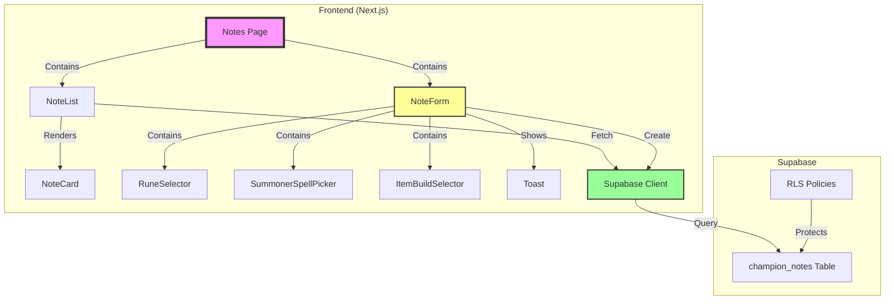
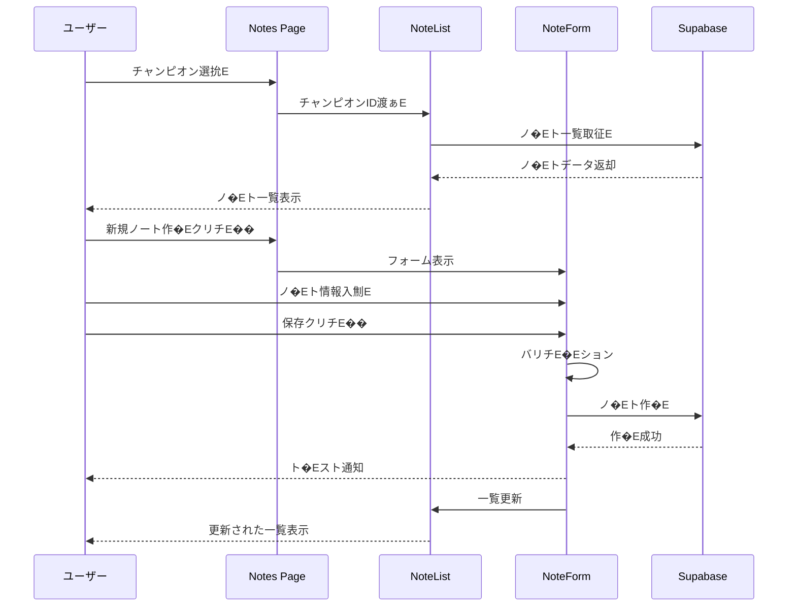

# 設計書: ノ�Eト一覧・作�E機�E

## 概要E

本ドキュメント�E、チャンピオン対策ノート�E一覧表示と新規作�E機�Eの設計を定義します、E

本機�Eは、Spec 2-1で実裁E��た基本レイアウトとチャンピオン選択UIを活用し、ノート�E作�Eと一覧表示機�Eを提供します、E

**編雁E�E削除機�EはSpec 2-2Bで実裁E��ます、E*

## アーキチE��チャ

### シスチE��構�E



### チE�Eタフロー



## コンポ�Eネント設訁E

### ペ�Eジコンポ�EネンチE

#### Notes Page (`/notes`)

**責勁E*: ノ�Eト�Eージ全体�E状態管琁E��レイアウチE

**状態管琁E*:
```typescript
interface NotesPageState {
  activeTab: 'create' | 'general' | 'matchup';
  myChampionId: string | null;
  enemyChampionId: string | null;
  showForm: boolean;
  loading: boolean;
}
```

**主要機�E**:
- タブナビゲーション表示�E�Epec 2-1から継承�E�E
- 左サイドバー表示制御�E�Epec 2-1から継承�E�E
- チャンピオン選択状態�E管琁E
- ノ�Eト一覧とフォームの刁E��替ぁE

**レイアウト構造**:
```typescript
<div className="min-h-screen bg-gray-50">
  {/* タブナビゲーション�E�Epec 2-1�E�E*/}
  <TabNavigation activeTab={activeTab} onTabChange={setActiveTab} />
  
  <div className="flex">
    {/* 左サイドバー�E�Epec 2-1�E�E*/}
    <ChampionSelectorSidebar
      myChampionId={myChampionId}
      enemyChampionId={enemyChampionId}
      onMyChampionChange={setMyChampionId}
      onEnemyChampionChange={setEnemyChampionId}
    />
    
    {/* 右メインエリア */}
    <div className="flex-1 p-6">
      {showForm ? (
        <NoteForm
          myChampionId={myChampionId}
          enemyChampionId={enemyChampionId}
          onCancel={() => setShowForm(false)}
          onSave={() => {
            setShowForm(false);
            // 一覧を更新
          }}
        />
      ) : (
        <NoteList
          myChampionId={myChampionId}
          enemyChampionId={enemyChampionId}
          onCreateNew={() => setShowForm(true)}
        />
      )}
    </div>
  </div>
</div>
```


### UIコンポ�EネンチE

#### NoteList

**責勁E*: ノ�Eト一覧の表示と管琁E

**Props**:
```typescript
interface NoteListProps {
  myChampionId: string | null;
  enemyChampionId: string | null;
  onCreateNew: () => void;
}
```

**状態管琁E*:
```typescript
interface NoteListState {
  notes: ChampionNote[];
  loading: boolean;
  error: string | null;
}
```

**実裁E��細**:
```typescript
const NoteList: React.FC<NoteListProps> = ({ 
  myChampionId, 
  enemyChampionId, 
  onCreateNew 
}) => {
  const [notes, setNotes] = useState<ChampionNote[]>([]);
  const [loading, setLoading] = useState(true);
  const [error, setError] = useState<string | null>(null);
  
  useEffect(() => {
    if (myChampionId && enemyChampionId) {
      fetchNotes();
    }
  }, [myChampionId, enemyChampionId]);
  
  const fetchNotes = async () => {
    setLoading(true);
    try {
      const data = await getNotes(myChampionId, enemyChampionId);
      setNotes(data);
    } catch (err) {
      setError('ノ�Eト�E取得に失敗しました');
    } finally {
      setLoading(false);
    }
  };
  
  // レンダリング
  if (!myChampionId || !enemyChampionId) {
    return <EmptyState message="チャンピオンを選択してください" />;
  }
  
  if (loading) {
    return <LoadingState />;
  }
  
  if (error) {
    return <ErrorState message={error} />;
  }
  
  return (
    <div>
      <div className="flex items-center justify-between mb-6">
        <h2 className="text-2xl font-bold text-gray-900">
          対策ノート一覧
        </h2>
        <button
          onClick={onCreateNew}
          className="px-4 py-2 bg-gray-800 text-white rounded-lg hover:bg-black transition"
        >
          新規ノート作�E
        </button>
      </div>
      
      {notes.length === 0 ? (
        <EmptyState message="ノ�Eトがありません" />
      ) : (
        <div className="grid grid-cols-1 md:grid-cols-2 lg:grid-cols-3 gap-4">
          {notes.map(note => (
            <NoteCard key={note.id} note={note} />
          ))}
        </div>
      )}
    </div>
  );
};
```

#### NoteCard

**責勁E*: 個別ノ�Eト�Eカード表示

**Props**:
```typescript
interface NoteCardProps {
  note: ChampionNote;
}
```

**実裁E��細**:
```typescript
const NoteCard: React.FC<NoteCardProps> = ({ note }) => {
  const myChampion = getChampionById(note.my_champion_id);
  const enemyChampion = getChampionById(note.enemy_champion_id);
  
  return (
    <div className="bg-white rounded-lg border border-gray-200 p-4 hover:shadow-md transition cursor-default">
      {/* チャンピオンアイコン */}
      <div className="flex items-center gap-3 mb-3">
        {/* eslint-disable-next-line @next/next/no-img-element */}
        
        <span className="text-gray-400">vs</span>
        {/* eslint-disable-next-line @next/next/no-img-element */}
        
      </div>
      
      {/* プリセチE��吁E*/}
      <h3 className="text-lg font-semibold text-gray-900 mb-2">
        {note.preset_name}
      </h3>
      
      {/* 日時情報 */}
      <div className="text-xs text-gray-500 space-y-1">
        <p>作�E: {formatDate(note.created_at)}</p>
        <p>更新: {formatDate(note.updated_at)}</p>
      </div>
    </div>
  );
};
```

**注愁E*: 本Specではノ�Eトカード�EクリチE��イベント�E実裁E��ません。閲覧・編雁E���EはSpec 2-2Bで実裁E��ます、E

#### NoteForm

**責勁E*: ノ�Eト作�Eフォームの表示と入力管琁E

**Props**:
```typescript
interface NoteFormProps {
  myChampionId: string;
  enemyChampionId: string;
  onCancel: () => void;
  onSave: () => void;
}
```

**状態管琁E*:
```typescript
interface NoteFormState {
  presetName: string;
  runes: RuneConfig | null;
  runeKey: number; // ルーンコンポーネントのリセット用キー
  spells: string[];
  items: string[];
  memo: string;
  errors: Record<string, string>;
  saving: boolean;
}
```

**実裁E��細**:
```typescript
const NoteForm: React.FC<NoteFormProps> = ({
  myChampionId,
  enemyChampionId,
  onCancel,
  onSave
}) => {
  const [presetName, setPresetName] = useState('');
  const [runes, setRunes] = useState<RuneConfig | null>(null);
  const [runeKey, setRuneKey] = useState(0); // ルーンコンポーネントのリセット用キー
  const [spells, setSpells] = useState<string[]>([]);
  const [items, setItems] = useState<string[]>([]);
  const [memo, setMemo] = useState('');
  const [errors, setErrors] = useState<Record<string, string>>({});
  const [saving, setSaving] = useState(false);
  
  const validate = (): boolean => {
    const newErrors: Record<string, string> = {};
    
    if (!presetName.trim()) {
      newErrors.presetName = 'プリセチE��名を入力してください';
    } else if (presetName.length > 100) {
      newErrors.presetName = 'プリセチE��名�E100斁E��以冁E��入力してください';
    }
    
    if (memo.length > 10000) {
      newErrors.memo = '対策メモは10,000斁E��以冁E��入力してください';
    }
    
    setErrors(newErrors);
    return Object.keys(newErrors).length === 0;
  };
  
  const handleSave = async () => {
    if (!validate()) {
      return;
    }
    
    setSaving(true);
    try {
      await createNote({
        my_champion_id: myChampionId,
        enemy_champion_id: enemyChampionId,
        preset_name: presetName,
        runes,
        spells,
        items,
        memo
      });
      
      showToast('ノ�Eトを作�Eしました', 'success');
      onSave();
    } catch (error) {
      showToast('ノ�Eト�E作�Eに失敗しました', 'error');
    } finally {
      setSaving(false);
    }
  };
  
  return (
    <div className="bg-white rounded-lg border border-gray-200 p-6">
      <h2 className="text-2xl font-bold text-gray-900 mb-6">
        新規ノート作�E
      </h2>
      
      {/* プリセチE��名�E劁E*/}
      <div className="mb-6">
        <label className="block text-sm font-medium text-gray-700 mb-2">
          プリセチE��吁E
        </label>
        <div className="flex gap-2">
          <input
            type="text"
            value={presetName}
            onChange={(e) => setPresetName(e.target.value)}
            className="flex-1 px-3 py-2 border border-gray-300 rounded-lg focus:outline-none focus:ring-2 focus:ring-gray-800"
            placeholder="侁E 序盤安定型"
          />
          <button
            onClick={handleSave}
            disabled={saving}
            className="px-6 py-2 bg-gray-800 text-white rounded-lg hover:bg-black transition disabled:opacity-50"
          >
            {saving ? '保存中...' : '保孁E}
          </button>
        </div>
        {errors.presetName && (
          <p className="text-sm text-red-600 mt-1">{errors.presetName}</p>
        )}
      </div>
      
      {/* サモナ�Eスペルと初期アイチE��を縦並び */}
      <div className="space-y-6 mb-6">
        {/* サモナ�Eスペル選抁E*/}
        <div>
          <div className="flex items-center justify-between mb-3">
            <h3 className="text-lg font-semibold text-gray-900">
              サモナ�Eスペル
            </h3>
            <button
              onClick={() => setSpells([])}
              className="text-sm text-gray-600 hover:text-gray-800"
            >
              リセチE��
            </button>
          </div>
          <SummonerSpellPicker value={spells} onChange={setSpells} />
        </div>

        {/* 初期アイチE��選抁E*/}
        <div>
          <div className="flex items-center justify-between mb-3">
            <h3 className="text-lg font-semibold text-gray-900">
              初期アイチE��
            </h3>
            <button
              onClick={() => setItems([])}
              className="text-sm text-gray-600 hover:text-gray-800"
            >
              リセチE��
            </button>
          </div>
          <ItemBuildSelector value={items} onChange={setItems} />
        </div>
      </div>
      
      {/* ルーン選抁E*/}
      <div className="mb-6">
        <div className="flex items-center justify-between mb-3">
          <h3 className="text-lg font-semibold text-gray-900">ルーン</h3>
          <button
            onClick={() => {
              setRunes(null);
              setRuneKey(prev => prev + 1); // キーを変更してコンポーネントを強制的に再マウント
            }}
            className="text-sm text-gray-600 hover:text-gray-800"
          >
            リセチE��
          </button>
        </div>
        <RuneSelector key={runeKey} value={runes} onChange={setRunes} />
      </div>
      
      {/* 対策メモ */}
      <div className="mb-6">
        <label className="block text-sm font-medium text-gray-700 mb-2">
          対策メモ
        </label>
        <textarea
          value={memo}
          onChange={(e) => setMemo(e.target.value)}
          rows={6}
          className="w-full px-3 py-2 border border-gray-300 rounded-lg focus:outline-none focus:ring-2 focus:ring-gray-800"
          placeholder="対策�EポイントやコチE��記�Eしてください"
        />
        {errors.memo && (
          <p className="text-sm text-red-600 mt-1">{errors.memo}</p>
        )}
      </div>
      
      {/* キャンセルボタン */}
      <button
        onClick={onCancel}
        className="w-full px-4 py-2 border-2 border-gray-300 text-gray-700 rounded-lg hover:bg-gray-50 transition"
      >
        キャンセル
      </button>
    </div>
  );
};
```


#### RuneSelector

**責勁E*: ルーン選択UIの表示と管琁E

**Props**:
```typescript
interface RuneSelectorProps {
  value: RuneConfig | null;
  onChange: (runes: RuneConfig) => void;
}
```

**状態管琁E*:
```typescript
interface RuneSelectorState {
  primaryPath: number | null;
  secondaryPath: number | null;
  keystone: number | null;
  primaryRunes: number[];
  secondaryRunes: number[];
  shards: number[];
}
```

**実裁E��細**:
```typescript
const RuneSelector: React.FC<RuneSelectorProps> = ({ value, onChange }) => {
  const [primaryPath, setPrimaryPath] = useState<number | null>(null);
  const [secondaryPath, setSecondaryPath] = useState<number | null>(null);
  const [keystone, setKeystone] = useState<number | null>(null);
  const [primaryRunes, setPrimaryRunes] = useState<number[]>([]);
  const [secondaryRunes, setSecondaryRunes] = useState<number[]>([]);
  const [shards, setShards] = useState<number[]>([]);
  
  // valueがnullになった時に全ての状態をリセチE��
  useEffect(() => {
    if (value === null) {
      setPrimaryPath(null);
      setSecondaryPath(null);
      setKeystone(null);
      setPrimaryRunes([]);
      setSecondaryRunes([]);
      setShards([]);
    }
  }, [value]);
  
  // 変更時にonChangeを呼び出ぁE
  useEffect(() => {
    if (primaryPath && secondaryPath && keystone && 
        primaryRunes.length === 3 && secondaryRunes.length === 2 && 
        shards.length === 3) {
      onChange({
        primaryPath,
        secondaryPath,
        keystone,
        primaryRunes,
        secondaryRunes,
        shards
      });
    }
  }, [primaryPath, secondaryPath, keystone, primaryRunes, secondaryRunes, shards]);
  
  return (
    <div className="border border-gray-200 rounded-lg p-4 bg-white">
      <div className="grid grid-cols-1 md:grid-cols-3 gap-6">
        {/* Primary */}
        <div>
          <h4 className="text-sm font-semibold text-gray-700 mb-3">Primary</h4>
          
          {/* メインルーンパス選抁E*/}
          <div className="mb-4">
            <div className="flex gap-2 flex-wrap">
              {RUNE_PATHS.map(path => (
                <button
                  key={path.id}
                  onClick={() => setPrimaryPath(path.id)}
                  className={`p-1 rounded-lg border-2 transition ${
                    primaryPath === path.id
                      ? 'border-black bg-gray-100'
                      : 'border-transparent hover:border-gray-300'
                  }`}
                >
                  {/* eslint-disable-next-line @next/next/no-img-element */}
                  
                </button>
              ))}
            </div>
          </div>

          {/* キースト�Eン選抁E*/}
          {primaryPath && (
            <div className="mb-4">
              <div className="grid grid-cols-4 gap-2">
                {getKeystones(primaryPath).map(rune => (
                  <button
                    key={rune.id}
                    onClick={() => setKeystone(rune.id)}
                    className={`p-1 rounded-lg border-2 transition ${
                      keystone === rune.id
                        ? 'border-black bg-gray-100'
                        : 'border-transparent hover:border-gray-300'
                    }`}
                  >
                    {/* eslint-disable-next-line @next/next/no-img-element */}
                    
                  </button>
                ))}
              </div>
            </div>
          )}

          {/* メインルーン選択！E段階！E*/}
          {primaryPath && (
            <div className="space-y-2">
              {[0, 1, 2].map(slot => (
                <div key={slot} className="grid grid-cols-3 gap-2">
                  {getPrimaryRunes(primaryPath, slot).map(rune => (
                    <button
                      key={rune.id}
                      onClick={() => {
                        const newRunes = [...primaryRunes];
                        newRunes[slot] = rune.id;
                        setPrimaryRunes(newRunes);
                      }}
                      className={`p-1 rounded-lg border-2 transition ${
                        primaryRunes[slot] === rune.id
                          ? 'border-black bg-gray-100'
                          : 'border-transparent hover:border-gray-300'
                      }`}
                    >
                      {/* eslint-disable-next-line @next/next/no-img-element */}
                      
                    </button>
                  ))}
                </div>
              ))}
            </div>
          )}
        </div>

        {/* Secondary */}
        <div>
          <h4 className="text-sm font-semibold text-gray-700 mb-3">Secondary</h4>
          
          {/* サブルーンパス選抁E*/}
          {primaryPath && (
            <div className="mb-4">
              <div className="flex gap-2 flex-wrap">
                {RUNE_PATHS.filter(p => p.id !== primaryPath).map(path => (
                  <button
                    key={path.id}
                    onClick={() => setSecondaryPath(path.id)}
                    className={`p-1 rounded-lg border-2 transition ${
                      secondaryPath === path.id
                        ? 'border-black bg-gray-100'
                        : 'border-transparent hover:border-gray-300'
                    }`}
                  >
                    {/* eslint-disable-next-line @next/next/no-img-element */}
                    
                  </button>
                ))}
              </div>
            </div>
          )}

          {/* サブルーン選択！Eつ、異なる行かめEつずつ�E�E*/}
          {secondaryPath && (
            <div className="grid grid-cols-3 gap-2">
              {getSecondaryRunes(secondaryPath).map(rune => (
                <button
                  key={rune.id}
                  onClick={() => {
                    // クリチE��されたルーンの行を取征E
                    const clickedSlot = getRuneSlot(secondaryPath, rune.id);
                    if (clickedSlot === null) return;

                    // 既に選択されてぁE��ルーンの行を取征E
                    const selectedSlots = secondaryRunes.map(id => getRuneSlot(secondaryPath, id));

                    if (secondaryRunes.includes(rune.id)) {
                      // 選択済みなら解除
                      setSecondaryRunes(secondaryRunes.filter(id => id !== rune.id));
                    } else if (secondaryRunes.length < 2) {
                      // 2つ未満の場吁E
                      if (selectedSlots.includes(clickedSlot)) {
                        // 同じ行�Eルーンが既に選択されてぁE��場合�E置き換ぁE
                        setSecondaryRunes(secondaryRunes.map(id => {
                          const slot = getRuneSlot(secondaryPath, id);
                          return slot === clickedSlot ? rune.id : id;
                        }));
                      } else {
                        // 異なる行なら追加
                        setSecondaryRunes([...secondaryRunes, rune.id]);
                      }
                    } else {
                      // 2つ選択済みの場吁E
                      if (selectedSlots.includes(clickedSlot)) {
                        // 同じ行�Eルーンが既に選択されてぁE��場合�E置き換ぁE
                        setSecondaryRunes(secondaryRunes.map(id => {
                          const slot = getRuneSlot(secondaryPath, id);
                          return slot === clickedSlot ? rune.id : id;
                        }));
                      } else {
                        // 異なる行�E場合�E最初�Eルーンを置き換ぁE
                        setSecondaryRunes([secondaryRunes[1], rune.id]);
                      }
                    }
                  }}
                  className={`p-1 rounded-lg border-2 transition ${
                    secondaryRunes.includes(rune.id)
                      ? 'border-black bg-gray-100'
                      : 'border-transparent hover:border-gray-300'
                  }`}
                >
                  {/* eslint-disable-next-line @next/next/no-img-element */}
                  
                </button>
              ))}
            </div>
          )}
        </div>

        {/* Shards */}
        <div>
          <h4 className="text-sm font-semibold text-gray-700 mb-3">Shards</h4>
          <div className="space-y-2">
            {[0, 1, 2].map(slot => (
              <div key={slot} className="flex gap-2">
                {getShards(slot).map(shard => (
                  <button
                    key={shard.id}
                    onClick={() => {
                      const newShards = [...shards];
                      newShards[slot] = shard.id;
                      setShards(newShards);
                    }}
                    className={`p-1 rounded-lg border-2 transition ${
                      shards[slot] === shard.id
                      ? 'border-black bg-gray-100'
                      : 'border-transparent hover:border-gray-300'
                  }`}
                >
                  {/* eslint-disable-next-line @next/next/no-img-element */}
                  
                </button>
              ))}
            </div>
          </div>
        ))}
      </div>
    </div>
  );
};
```

#### SummonerSpellPicker

**責勁E*: サモナ�Eスペル選択UIの表示と管琁E

**Props**:
```typescript
interface SummonerSpellPickerProps {
  value: string[];
  onChange: (spells: string[]) => void;
}
```

**実裁E��細**:
```typescript
const SummonerSpellPicker: React.FC<SummonerSpellPickerProps> = ({ 
  value, 
  onChange 
}) => {
  const handleSpellClick = (spellId: string) => {
    if (value.includes(spellId)) {
      // 既に選択されてぁE��場合�E解除
      onChange(value.filter(id => id !== spellId));
    } else if (value.length < 2) {
      // 2つ未満の場合�E追加
      onChange([...value, spellId]);
    } else {
      // 2つ選択済みの場合�E最初�Eスペルを置き換ぁE
      onChange([value[1], spellId]);
    }
  };
  
  return (
    <div className="grid grid-cols-2 md:grid-cols-4 lg:grid-cols-6 gap-2">
      {SUMMONER_SPELLS.map((spell) => (
        <button
          key={spell.id}
          onClick={() => handleSpellClick(spell.id)}
          className={`flex flex-col items-center justify-center p-3 rounded-lg border-2 transition ${
            value.includes(spell.id)
              ? 'border-black bg-gray-100'
              : 'border-transparent hover:border-gray-300'
          }`}
        >
          {/* eslint-disable-next-line @next/next/no-img-element */}
          
          <span className="text-xs text-gray-600 mt-1">{spell.name}</span>
        </button>
      ))}
    </div>
  );
};
```

#### ItemBuildSelector

**責勁E*: 初期アイチE��選択UIの表示と管琁E

**Props**:
```typescript
interface ItemBuildSelectorProps {
  value: string[];
  onChange: (items: string[]) => void;
}
```

**機能要件**:
1. **500g制限**: 選択したアイテムの合計金額が500gを超える場合、追加選択不可
2. **数量表示**: 同じアイテムを複数選択した場合、右上に「x2」「x3」などの数量バッジを表示
3. **選択不可UI**: 500g超過により選択できないアイテムは、opacity-50 + cursor-not-allowedで視覚的に無効化
4. **複数選択**: 通常クリックで追加、Shift+クリックまたは右クリックで削除

**実裁E��細**:
```typescript
const ItemBuildSelector: React.FC<ItemBuildSelectorProps> = ({ 
  value, 
  onChange 
}) => {
  // 選択中のアイテムの合計金額を計算
  const totalGold = useMemo(() => {
    return value.reduce((sum, itemId) => {
      const item = STARTER_ITEMS.find(i => i.id === itemId);
      return sum + (item?.gold || 0);
    }, 0);
  }, [value]);
  
  // 各アイテムの選択数をカウント
  const itemCounts = useMemo(() => {
    const counts: Record<string, number> = {};
    value.forEach(itemId => {
      counts[itemId] = (counts[itemId] || 0) + 1;
    });
    return counts;
  }, [value]);
  
  const handleItemClick = (itemId: string, event: React.MouseEvent) => {
    const item = STARTER_ITEMS.find(i => i.id === itemId);
    if (!item) return;

    const currentCount = itemCounts[itemId] || 0;

    // 右クリックまたはShift+クリックで削除
    if (event.shiftKey || event.button === 2) {
      if (currentCount > 0) {
        const index = value.lastIndexOf(itemId);
        onChange([...value.slice(0, index), ...value.slice(index + 1)]);
      }
      return;
    }

    // 通常のクリック: 500g以内なら追加
    if (totalGold + item.gold <= 500) {
      onChange([...value, itemId]);
    }
  };
  
  return (
    <div>
      {/* 合計金額表示 */}
      <div className="mb-3 text-sm">
        <span className={`font-semibold ${totalGold > 500 ? 'text-red-600' : 'text-gray-700'}`}>
          合計: {totalGold}g / 500g
        </span>
      </div>
      
      <div className="grid grid-cols-3 md:grid-cols-4 lg:grid-cols-6 gap-2">
        {STARTER_ITEMS.map((item) => {
          const count = itemCounts[item.id] || 0;
          const isSelected = count > 0;
          const wouldExceedLimit = (totalGold + item.gold > 500);
          
          return (
            <button
              key={item.id}
              onClick={(e) => handleItemClick(item.id, e)}
              onContextMenu={(e) => {
                e.preventDefault();
                handleItemClick(item.id, e as any);
              }}
              disabled={wouldExceedLimit}
              className={`relative flex flex-col items-center justify-center p-2 rounded-lg border-2 transition min-h-[100px] ${
                isSelected
                  ? 'border-black bg-pink-50'
                  : wouldExceedLimit
                  ? 'border-gray-200 opacity-50 cursor-not-allowed'
                  : 'border-gray-200 hover:border-gray-300'
              }`}
              aria-label={`初期アイチE��: ${item.name} ${item.gold}g${count > 0 ? ` (x${count})` : ''}`}
              aria-pressed={isSelected}
              aria-disabled={wouldExceedLimit}
            >
              {/* 数量バッジ（2個以上選択時） */}
              {count > 1 && (
                <div className="absolute top-1 right-1 bg-black text-white text-xs font-bold rounded-full w-5 h-5 flex items-center justify-center">
                  x{count}
                </div>
              )}
              
              {/* eslint-disable-next-line @next/next/no-img-element */}
              
              <span className="text-xs text-gray-700 text-center leading-tight mt-1">{item.name}</span>
              <span className={`text-xs ${wouldExceedLimit ? 'text-gray-400' : 'text-gray-500'}`}>
                {item.gold}g
              </span>
            </button>
          );
        })}
      </div>
    </div>
  );
};
```

**UI/UX仕様**:
- **選択状態**: `ring-2 ring-blue-500 shadow-md shadow-blue-500/20 bg-blue-50` - 青ボーダー + 青背景 + 控えめなシャドウ
- **未選択状態**: `border border-gray-200 bg-white` - グレーボーダー + 白背景
- **ホバー状態**: `hover:ring-2 hover:ring-gray-300` - グレーリング
- **フォーカス状態**: `focus:ring-2 focus:ring-blue-500` - 青リング

**チャンピオン選択ボタンの背景色**:
- **自分のチャンピオン選択**:
  - 未選択時: `bg-blue-50 border border-blue-200` - 薄い青背景
  - 選択モード時: `bg-blue-100 border-2 border-blue-400` - 濃い青背景
- **相手のチャンピオン選択**:
  - 未選択時: `bg-red-50 border border-red-200` - 薄い赤背景
  - 選択モード時: `bg-red-100 border-2 border-red-400` - 濃い赤背景

**検索フィールドのリセット**:
- チャンピオンを選択したら、検索フィールドの入力内容を自動的にリセット
- `handleChampionSelect`内で`setSearchQuery('')`を呼び出す

#### Toast

**責勁E*: ト�Eスト通知の表示

**Props**:
```typescript
interface ToastProps {
  message: string;
  type: 'success' | 'error' | 'info';
  onClose: () => void;
}
```

**実裁E��細**:
```typescript
const Toast: React.FC<ToastProps> = ({ message, type, onClose }) => {
  useEffect(() => {
    const timer = setTimeout(() => {
      onClose();
    }, 3000);
    
    return () => clearTimeout(timer);
  }, [onClose]);
  
  const bgColor = {
    success: 'bg-green-500',
    error: 'bg-red-500',
    info: 'bg-blue-500'
  }[type];
  
  return (
    <div className={`fixed bottom-4 right-4 ${bgColor} text-white px-6 py-3 rounded-lg shadow-lg animate-fadeIn`}>
      <p>{message}</p>
    </div>
  );
};

// ト�Eスト表示用のカスタムフック
const useToast = () => {
  const [toast, setToast] = useState<{
    message: string;
    type: 'success' | 'error' | 'info';
  } | null>(null);
  
  const showToast = (message: string, type: 'success' | 'error' | 'info') => {
    setToast({ message, type });
  };
  
  const hideToast = () => {
    setToast(null);
  };
  
  return { toast, showToast, hideToast };
};
```


## チE�EタモチE��

### ChampionNote垁E

```typescript
interface ChampionNote {
  id: number;
  user_id: string;
  my_champion_id: string;
  enemy_champion_id: string;
  preset_name: string;
  runes: RuneConfig | null;
  spells: string[] | null;
  items: string[] | null;
  memo: string | null;
  created_at: string;
  updated_at: string;
}
```

### RuneConfig垁E

```typescript
interface RuneConfig {
  primaryPath: number;
  secondaryPath: number;
  keystone: number;
  primaryRunes: number[];  // 3つ
  secondaryRunes: number[]; // 2つ
  shards: number[];         // 3つ
}
```

### ルーンチE�Eタ

```typescript
// frontend/src/lib/data/runes.ts

export interface RunePath {
  id: number;
  name: string;
  icon: string;
}

export interface Rune {
  id: number;
  name: string;
  icon: string;
}

export const RUNE_PATHS: RunePath[] = [
  { id: 8000, name: 'Precision', icon: '/images/runes/precision/icon.png' },
  { id: 8100, name: 'Domination', icon: '/images/runes/domination/icon.png' },
  { id: 8200, name: 'Sorcery', icon: '/images/runes/sorcery/icon.png' },
  { id: 8300, name: 'Resolve', icon: '/images/runes/resolve/icon.png' },
  { id: 8400, name: 'Inspiration', icon: '/images/runes/inspiration/icon.png' },
];

// キースト�Eンルーン�E�各パスに3-4個！E
export const KEYSTONES: Record<number, Rune[]> = {
  8000: [ // Precision
    { id: 8005, name: 'Press the Attack', icon: '/images/runes/precision/keyStones/PressTheAttack.png' },
    { id: 8008, name: 'Lethal Tempo', icon: '/images/runes/precision/keyStones/LethalTempo.png' },
    { id: 8021, name: 'Fleet Footwork', icon: '/images/runes/precision/keyStones/FleetFootwork.png' },
    { id: 8010, name: 'Conqueror', icon: '/images/runes/precision/keyStones/Conqueror.png' },
  ],
  8100: [ // Domination
    { id: 8112, name: 'Electrocute', icon: '/images/runes/domination/keyStones/Electrocute.png' },
    { id: 8124, name: 'Dark Harvest', icon: '/images/runes/domination/keyStones/DarkHarvest.png' },
    { id: 8128, name: 'Hail of Blades', icon: '/images/runes/domination/keyStones/HailOfBlades.png' },
  ],
  // ... 他�Eパス
};

// メインルーン�E�各パス、各段階に3個！E
export const PRIMARY_RUNES: Record<number, Record<number, Rune[]>> = {
  8000: { // Precision
    0: [
      { id: 9101, name: 'Overheal', icon: '/images/runes/precision/runes/firstRune/Overheal.png' },
      { id: 9111, name: 'Triumph', icon: '/images/runes/precision/runes/firstRune/Triumph.png' },
      { id: 8009, name: 'Presence of Mind', icon: '/images/runes/precision/runes/firstRune/PresenceOfMind.png' },
    ],
    1: [
      { id: 9104, name: 'Legend: Alacrity', icon: '/images/runes/precision/runes/secondRune/LegendAlacrity.png' },
      { id: 9105, name: 'Legend: Tenacity', icon: '/images/runes/precision/runes/secondRune/LegendTenacity.png' },
      { id: 9103, name: 'Legend: Bloodline', icon: '/images/runes/precision/runes/secondRune/LegendBloodline.png' },
    ],
    2: [
      { id: 8014, name: 'Coup de Grace', icon: '/images/runes/precision/runes/thirdRune/CoupDeGrace.png' },
      { id: 8017, name: 'Cut Down', icon: '/images/runes/precision/runes/thirdRune/CutDown.png' },
      { id: 8299, name: 'Last Stand', icon: '/images/runes/precision/runes/thirdRune/LastStand.png' },
    ],
  },
  // ... 他�Eパス
};

// スチE�Eタスシャード（最新パッチ設宁E 3行ÁE列！E
export const SHARDS: Record<number, Rune[]> = {
  0: [ // Offense
    { id: 5008, name: 'Adaptive Force', icon: '/images/runes/shards/StatModsAdaptiveForceIcon.png' },
    { id: 5005, name: 'Attack Speed', icon: '/images/runes/shards/StatModsAttackSpeedIcon.png' },
    { id: 5007, name: 'Ability Haste', icon: '/images/runes/shards/StatModsCDRScalingIcon.png' },
  ],
  1: [ // Flex
    { id: 5008, name: 'Adaptive Force', icon: '/images/runes/shards/StatModsAdaptiveForceIcon.png' },
    { id: 5010, name: 'Move Speed', icon: '/images/runes/shards/StatModsMovementSpeedIcon.png' },
    { id: 5001, name: 'Health Scaling', icon: '/images/runes/shards/StatModsHealthPlusIcon.png' },
  ],
  2: [ // Defense
    { id: 5001, name: 'Health', icon: '/images/runes/shards/StatModsHealthScalingIcon.png' },
    { id: 5002, name: 'Tenacity', icon: '/images/runes/shards/StatModsTenacityIcon.png' },
    { id: 5003, name: 'Health Scaling', icon: '/images/runes/shards/StatModsHealthPlusIcon.png' },
  ],
};

// ヘルパ�E関数
export const getKeystones = (pathId: number): Rune[] => {
  return KEYSTONES[pathId] || [];
};

export const getPrimaryRunes = (pathId: number, slot: number): Rune[] => {
  return PRIMARY_RUNES[pathId]?.[slot] || [];
};

export const getSecondaryRunes = (pathId: number): Rune[] => {
  const pathRunes = PRIMARY_RUNES[pathId];
  if (!pathRunes) return [];
  return [
    ...(pathRunes[0] || []),
    ...(pathRunes[1] || []),
    ...(pathRunes[2] || []),
  ];
};

// ルーンIDからそ�Eルーンが属する衁Eslot)を取征E
// Secondaryルーン選択時に同じ行かめEつ選択できなぁE��ぁE��するために使用
export const getRuneSlot = (pathId: number, runeId: number): number | null => {
  const pathRunes = PRIMARY_RUNES[pathId];
  if (!pathRunes) return null;

  for (let slot = 0; slot <= 2; slot++) {
    const runes = pathRunes[slot] || [];
    if (runes.some(rune => rune.id === runeId)) {
      return slot;
    }
  }
  return null;
};

export const getShards = (slot: number): Rune[] => {
  return SHARDS[slot] || [];
};
```

### サモナ�EスペルチE�Eタ

```typescript
// frontend/src/lib/data/summonerSpells.ts

export interface SummonerSpell {
  id: string;
  name: string;
  icon: string;
}

export const SUMMONER_SPELLS: SummonerSpell[] = [
  { id: 'SummonerFlash', name: 'Flash', icon: '/images/summonerSpells/SummonerFlash.png' },
  { id: 'SummonerDot', name: 'Ignite', icon: '/images/summonerSpells/SummonerDot.png' },
  { id: 'SummonerTeleport', name: 'Teleport', icon: '/images/summonerSpells/SummonerTeleport.png' },
  { id: 'SummonerBarrier', name: 'Barrier', icon: '/images/summonerSpells/SummonerBarrier.png' },
  { id: 'SummonerHeal', name: 'Heal', icon: '/images/summonerSpells/SummonerHeal.png' },
  { id: 'SummonerBoost', name: 'Cleanse', icon: '/images/summonerSpells/SummonerBoost.png' },
  { id: 'SummonerExhaust', name: 'Exhaust', icon: '/images/summonerSpells/SummonerExhaust.png' },
  { id: 'SummonerHaste', name: 'Ghost', icon: '/images/summonerSpells/SummonerHaste.png' },
];
```

### アイチE��チE�Eタ

```typescript
// frontend/src/lib/data/items.ts

export interface Item {
  id: string;
  name: string;
  icon: string;
  gold: number;
}

export const STARTER_ITEMS: Item[] = [
  { id: '1055', name: "Doran's Blade", icon: '/images/item/1055.png', gold: 450 },
  { id: '1054', name: "Doran's Shield", icon: '/images/item/1054.png', gold: 450 },
  { id: '1056', name: "Doran's Ring", icon: '/images/item/1056.png', gold: 400 },
  { id: '1083', name: 'Cull', icon: '/images/item/1083.png', gold: 450 },
  { id: '1036', name: 'Long Sword', icon: '/images/item/1036.png', gold: 350 },
  { id: '1082', name: 'Dark Seal', icon: '/images/item/1082.png', gold: 350 },
  { id: '1052', name: 'Amplifying Tome', icon: '/images/item/1052.png', gold: 435 },
  { id: '1001', name: 'Boots', icon: '/images/item/1001.png', gold: 300 },
  { id: '1029', name: 'Cloth Armor', icon: '/images/item/1029.png', gold: 300 },
  { id: '1027', name: 'Sapphire Crystal', icon: '/images/item/1027.png', gold: 350 },
  { id: '1028', name: 'Ruby Crystal', icon: '/images/item/1028.png', gold: 400 },
  { id: '2031', name: 'Refillable Potion', icon: '/images/item/2031.png', gold: 150 },
  { id: '2003', name: 'Health Potion', icon: '/images/item/2003.png', gold: 50 },
  { id: '2055', name: 'Control Ward', icon: '/images/item/2055.png', gold: 75 },
];
```

## Supabase連携

### API関数

```typescript
// frontend/src/lib/api/notes.ts

import { createClient } from '@/lib/supabase/client';
import { ChampionNote } from '@/types/note';

/**
 * ノ�Eト一覧を取征E
 */
export async function getNotes(
  myChampionId: string,
  enemyChampionId: string
): Promise<ChampionNote[]> {
  const supabase = createClient();
  
  const { data, error } = await supabase
    .from('champion_notes')
    .select('*')
    .eq('my_champion_id', myChampionId)
    .eq('enemy_champion_id', enemyChampionId)
    .order('updated_at', { ascending: false });
  
  if (error) {
    console.error('Failed to fetch notes:', error);
    throw new Error('ノ�Eト�E取得に失敗しました');
  }
  
  return data || [];
}

/**
 * ノ�Eトを作�E
 */
export async function createNote(
  note: Omit<ChampionNote, 'id' | 'user_id' | 'created_at' | 'updated_at'>
): Promise<ChampionNote> {
  const supabase = createClient();
  
  // ユーザーIDを取征E
  const { data: { user } } = await supabase.auth.getUser();
  if (!user) {
    throw new Error('認証が忁E��でぁE);
  }
  
  const { data, error } = await supabase
    .from('champion_notes')
    .insert({
      ...note,
      user_id: user.id,
    })
    .select()
    .single();
  
  if (error) {
    console.error('Failed to create note:', error);
    throw new Error('ノ�Eト�E作�Eに失敗しました');
  }
  
  return data;
}
```

### Supabase Client

```typescript
// frontend/src/lib/supabase/client.ts

import { createBrowserClient } from '@supabase/ssr';

export function createClient() {
  return createBrowserClient(
    process.env.NEXT_PUBLIC_SUPABASE_URL!,
    process.env.NEXT_PUBLIC_SUPABASE_ANON_KEY!
  );
}
```

## エラーハンドリング

### エラー種別

```typescript
enum ErrorType {
  NETWORK_ERROR = 'NETWORK_ERROR',
  AUTH_ERROR = 'AUTH_ERROR',
  VALIDATION_ERROR = 'VALIDATION_ERROR',
  DATABASE_ERROR = 'DATABASE_ERROR',
}

interface AppError {
  type: ErrorType;
  message: string;
  details?: unknown;
}
```

### エラーハンドリング戦略

#### ネットワークエラー
```typescript
try {
  const data = await getNotes(myChampionId, enemyChampionId);
} catch (error) {
  if (error instanceof TypeError && error.message.includes('fetch')) {
    showToast('ネットワークエラーが発生しました', 'error');
  } else {
    showToast('ノ�Eト�E取得に失敗しました', 'error');
  }
}
```

#### 認証エラー
```typescript
const { data: { user } } = await supabase.auth.getUser();
if (!user) {
  showToast('ログインが忁E��でぁE, 'error');
  redirect('/api/auth/signin');
  return;
}
```

#### バリチE�Eションエラー
```typescript
const validate = (): boolean => {
  const newErrors: Record<string, string> = {};
  
  if (!presetName.trim()) {
    newErrors.presetName = 'プリセチE��名を入力してください';
  }
  
  if (memo.length > 10000) {
    newErrors.memo = '対策メモは10,000斁E��以冁E��入力してください';
  }
  
  setErrors(newErrors);
  return Object.keys(newErrors).length === 0;
};
```

#### チE�Eタベ�Eスエラー
```typescript
const { data, error } = await supabase
  .from('champion_notes')
  .insert(note);

if (error) {
  console.error('Database error:', error);
  showToast('保存に失敗しました', 'error');
  return;
}
```


## スタイリング設訁E

### カラーパレチE��

```typescript
const colors = {
  // 選択状態（青系）
  selection: {
    background: 'bg-blue-50',
    border: 'ring-blue-500',
    shadow: 'shadow-blue-500/20',
    text: 'text-blue-700'
  },
  
  // チャンピオン選択ボタン
  championSelection: {
    my: {
      unselected: 'bg-blue-50 border-blue-200',
      selected: 'bg-blue-100 border-blue-400'
    },
    enemy: {
      unselected: 'bg-red-50 border-red-200',
      selected: 'bg-red-100 border-red-400'
    }
  },
  
  // グレー系
  gray: {
    50: 'bg-gray-50',
    100: 'bg-gray-100',
    200: 'border-gray-200',
    300: 'border-gray-300',
    500: 'text-gray-500',
    600: 'text-gray-600',
    700: 'text-gray-700',
    800: 'bg-gray-800',
    900: 'text-gray-900'
  },
  
  // ボタン
  button: {
    primary: 'bg-gray-800 hover:bg-black',
    secondary: 'border-2 border-gray-300 hover:bg-gray-50'
  }
};
```

### コンポ�Eネントサイズ

```typescript
const sizes = {
  // チャンピオン画僁E
  championIcon: 'w-8 h-8',        // 32px - ノ�EトカーチE
  
  // ルーン画僁E
  runePath: 'w-12 h-12',          // 48px - パス選抁E
  keystone: 'w-12 h-12',          // 48px - キースト�Eン
  primaryRune: 'w-10 h-10',       // 40px - メインルーン
  shard: 'w-8 h-8',               // 32px - シャーチE
  
  // サモナ�Eスペル画僁E
  spell: 'w-12 h-12',             // 48px
  
  // アイチE��画僁E
  item: 'w-10 h-10',              // 40px
};
```

### レイアウト定数

```typescript
const layout = {
  contentPadding: 'p-6',          // 24px
  cardPadding: 'p-4',             // 16px
  sectionSpacing: 'mb-6',         // 24px
  itemSpacing: 'gap-2',           // 8px
  gridCols: {
    noteCards: 'grid-cols-1 md:grid-cols-2 lg:grid-cols-3',
    spells: 'grid-cols-4',
    items: 'grid-cols-6'
  }
};
```

## パフォーマンス最適匁E

### レンダリング最適匁E

#### React.memo
```typescript
const NoteCard = React.memo(({ note }: NoteCardProps) => {
  // コンポ�Eネント実裁E
});

const RuneSelector = React.memo(({ value, onChange }: RuneSelectorProps) => {
  // コンポ�Eネント実裁E
});
```

#### useMemo / useCallback
```typescript
// ノ�Eト一覧のフィルタリング
const filteredNotes = useMemo(() => {
  return notes.filter(note => 
    note.my_champion_id === myChampionId &&
    note.enemy_champion_id === enemyChampionId
  );
}, [notes, myChampionId, enemyChampionId]);

// イベントハンドラーのメモ匁E
const handleSave = useCallback(async () => {
  await createNote(noteData);
}, [noteData]);
```

### 画像最適匁E

```typescript
// 遁E��読み込み

```

### チE�EタフェチE��ング最適匁E

```typescript
// useEffectでのチE�Eタ取征E
useEffect(() => {
  let isMounted = true;
  
  const fetchData = async () => {
    if (!myChampionId || !enemyChampionId) return;
    
    setLoading(true);
    try {
      const data = await getNotes(myChampionId, enemyChampionId);
      if (isMounted) {
        setNotes(data);
      }
    } catch (error) {
      if (isMounted) {
        setError('ノ�Eト�E取得に失敗しました');
      }
    } finally {
      if (isMounted) {
        setLoading(false);
      }
    }
  };
  
  fetchData();
  
  return () => {
    isMounted = false;
  };
}, [myChampionId, enemyChampionId]);
```

## レスポンシブデザイン

### ブレークポインチE

```typescript
const breakpoints = {
  mobile: '768px',   // md未満
  tablet: '1024px',  // lg未満
  desktop: '1280px'  // xl未満
};
```

### レイアウト調整

#### ノ�Eト一覧
```typescript
// チE��クトッチE 3カラム
// タブレチE��: 2カラム
// モバイル: 1カラム
<div className="grid grid-cols-1 md:grid-cols-2 lg:grid-cols-3 gap-4">
```

#### フォーム
```typescript
// チE��クトッチE 横並び
// モバイル: 縦並び
<div className="flex flex-col md:flex-row gap-4">
```

#### ルーン選抁E
```typescript
// スクロール可能
<div className="overflow-x-auto">
  <div className="flex gap-2 min-w-max">
```

## 依存関俁E

### 外部Spec

- **Spec 2-1 (champion-note-basic)**: タブナビゲーション、左サイドバー、チャンピオン選択UI
- **Spec 3-1 (note-database-design)**: チE�Eタベ�Eススキーマ、RLSポリシー
- **Spec 1-1 (basic-ui-structure)**: 認証シスチE��、ルートレイアウチE
- **Spec 1-2 (common-components)**: Panel、GlobalLoading

### 使用する共通コンポ�EネンチE

#### ChampionSelectorSidebar�E�Epec 2-1�E�E
```typescript
import ChampionSelectorSidebar from '@/components/notes/ChampionSelectorSidebar';

<ChampionSelectorSidebar
  myChampionId={myChampionId}
  enemyChampionId={enemyChampionId}
  onMyChampionChange={setMyChampionId}
  onEnemyChampionChange={setEnemyChampionId}
/>
```

#### TabNavigation�E�Epec 2-1�E�E
```typescript
import TabNavigation from '@/components/notes/TabNavigation';

<TabNavigation 
  activeTab={activeTab} 
  onTabChange={setActiveTab} 
/>
```

#### GlobalLoading�E�Epec 1-2�E�E
```typescript
import GlobalLoading from '@/components/GlobalLoading';

<GlobalLoading loading={isLoading} />
```

## ファイル構造

```
frontend/src/
├── app/
━E  └── notes/
━E      └── page.tsx                    # ノ�Eト�Eージ�E�既存、拡張�E�E
├── components/
━E  ├── ui/
━E  ━E  └── Toast.tsx                   # ト�Eスト通知
━E  └── notes/
━E      ├── NoteList.tsx                # ノ�Eト一覧
━E      ├── NoteCard.tsx                # ノ�EトカーチE
━E      ├── NoteForm.tsx                # ノ�Eト作�Eフォーム
━E      ├── RuneSelector.tsx            # ルーン選抁E
━E      ├── SummonerSpellPicker.tsx     # サモナ�Eスペル選抁E
━E      └── ItemBuildSelector.tsx       # アイチE��選抁E
├── lib/
━E  ├── api/
━E  ━E  └── notes.ts                    # ノ�EチEPI関数
━E  ├── data/
━E  ━E  ├── runes.ts                    # ルーンチE�Eタ
━E  ━E  ├── summonerSpells.ts           # サモナ�EスペルチE�Eタ
━E  ━E  └── items.ts                    # アイチE��チE�Eタ
━E  ├── hooks/
━E  ━E  └── useToast.ts                 # ト�EストフチE��
━E  └── supabase/
━E      └── client.ts                   # SupabaseクライアンチE
└── types/
    └── note.ts                         # ノ�Eト型定義
```

## 実裁E��先頁E��E

### Phase 1: チE�Eタ準備
1. ルーンチE�Eタファイル�E�Eunes.ts�E�作�E
2. サモナ�EスペルチE�Eタファイル�E�EummonerSpells.ts�E�作�E
3. アイチE��チE�Eタファイル�E�Etems.ts�E�作�E
4. 型定義�E�Eote.ts�E�作�E

### Phase 2: API関数
1. Supabase Client設宁E
2. getNotes関数実裁E
3. createNote関数実裁E

### Phase 3: 基本コンポ�EネンチE
1. Toast実裁E
2. NoteCard実裁E
3. NoteList実裁E

### Phase 4: フォームコンポ�EネンチE
1. RuneSelector実裁E
2. SummonerSpellPicker実裁E
3. ItemBuildSelector実裁E
4. NoteForm実裁E

### Phase 5: ペ�Eジ統吁E
1. Notes Page拡張�E�一覧とフォームの刁E��替え！E
2. チャンピオン選択との連携
3. エラーハンドリング

### Phase 6: 最適匁E
1. パフォーマンス最適匁E
2. レスポンシブ対応確誁E
3. アクセシビリチE��確誁E

## 今後�E拡張�E�別Spec�E�E

以下�E機�Eは本Specの篁E��外とし、別Specで実裁E��ます！E

- **Spec 2-2B**: ノ�Eト編雁E���E、ノート削除機�E
- **封E��実裁E*: ノ�Eト検索・フィルタリング機�E、ノート�Eタグ付け機�E、ノート�E有機�E

本Specでは、ノート�E一覧表示と新規作�E機�Eのみを実裁E��ます、E

