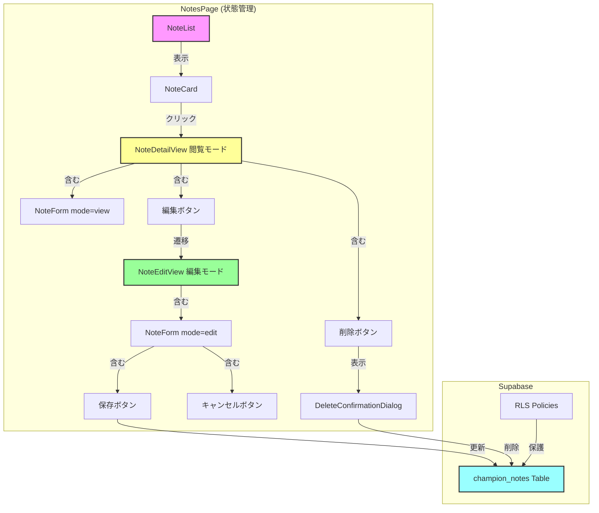
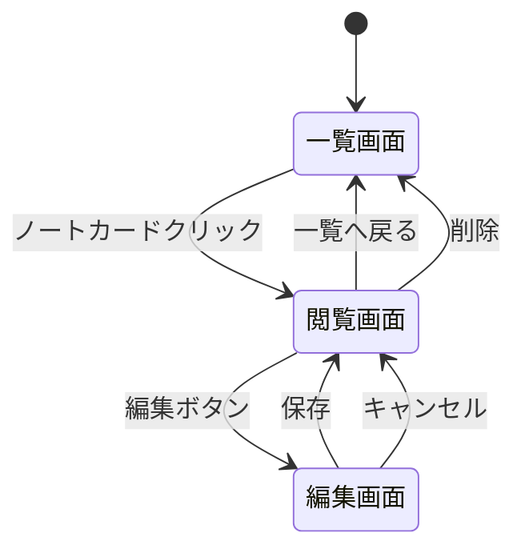

# 設計書: ノート編集・削除機能

## はじめに

本ドキュメントは、既存のチャンピオン対策ノートを閲覧・編集・削除する機能の技術設計を定義します。

Spec 2-2A（matchup-notes-create）で実装したNoteFormコンポーネントを拡張し、3つのモード（create/view/edit）に対応させます。

## アーキテクチャ概要

### システム構成



### 画面遷移フロー



## コンポーネント設計

### 1. NoteCard（拡張）

**場所**: `frontend/src/components/notes/NoteCard.tsx`

**責務**: ノート一覧のカード表示、クリックで詳細画面へ遷移

**Props拡張**:
```typescript
interface NoteCardProps {
  note: ChampionNote;
  onClick: (noteId: string) => void; // 新規追加
}
```

**変更点**:
- onClick イベントハンドラを追加
- cursor-pointer スタイルを追加
- ホバー時のリングエフェクトを追加

### 2. NoteForm（拡張）

**場所**: `frontend/src/components/notes/NoteForm.tsx`

**責務**: ノートの作成・閲覧・編集フォーム（3モード対応）

**Props拡張**:
```typescript
interface NoteFormProps {
  mode: 'create' | 'view' | 'edit'; // 新規追加
  initialData?: ChampionNote; // 新規追加（閲覧・編集時）
  onSave?: (data: NoteFormData) => Promise<void>; // 既存
  onCancel?: () => void; // 新規追加（編集モード用）
  onEdit?: () => void; // 新規追加（閲覧モード用）
  onDelete?: () => void; // 新規追加（閲覧モード用）
}
```

**モード別の動作**:

| モード | 入力欄 | 表示ボタン | 動作 |
|--------|--------|-----------|------|
| create | 編集可能 | 保存 | 新規作成 |
| view | 無効化 | 編集、削除 | 読み取り専用 |
| edit | 編集可能 | 保存、キャンセル | 更新処理 |

**実装方針**:
- mode prop に応じて入力欄の disabled 属性を切り替え
- mode に応じて表示するボタンを切り替え
- initialData が渡された場合はフォームに初期値を設定

### 3. DeleteConfirmationDialog（新規）

**場所**: `frontend/src/components/notes/DeleteConfirmationDialog.tsx`

**責務**: ノート削除の確認ダイアログ

**Props**:
```typescript
interface DeleteConfirmationDialogProps {
  isOpen: boolean;
  onConfirm: () => void;
  onCancel: () => void;
}
```

**UI要素**:
- オーバーレイ（黒50%透明）
- ダイアログボックス（白背景、角丸、シャドウ）
- メッセージ: 「このノートを削除しますか？」
- 警告: 「この操作は取り消せません」
- キャンセルボタン（グレー）
- 削除ボタン（赤色）

## 状態管理設計

### NotesPageの状態

**場所**: `frontend/src/app/notes/page.tsx`

**状態定義**:
```typescript
type ViewMode = 'list' | 'view' | 'edit';

interface NotesPageState {
  viewMode: ViewMode;
  selectedNoteId: string | null;
  selectedNote: ChampionNote | null;
}
```

**状態遷移**:
- ノートカードクリック → viewMode='view', selectedNote設定
- 編集ボタン → viewMode='edit'
- 保存 → viewMode='view', データ再取得
- キャンセル → viewMode='view'
- 削除 → viewMode='list', selectedNote=null
- 一覧へ戻る → viewMode='list', selectedNote=null

## データフロー設計

### データ取得フロー

```
ノートカードクリック
  ↓
fetchNoteById(noteId, userId)
  ↓
Supabase: SELECT * FROM champion_notes WHERE id=? AND user_id=?
  ↓
selectedNote に格納
  ↓
viewMode='view' に設定
```

### データ更新フロー

```
保存ボタンクリック
  ↓
フォームデータ検証
  ↓
updateNote(noteId, userId, data)
  ↓
Supabase: UPDATE champion_notes SET ... WHERE id=? AND user_id=?
  ↓
データ再取得
  ↓
トースト通知表示
  ↓
viewMode='view' に設定
```

### データ削除フロー

```
削除ボタンクリック
  ↓
削除確認ダイアログ表示
  ↓
確認ボタンクリック
  ↓
deleteNote(noteId, userId)
  ↓
Supabase: DELETE FROM champion_notes WHERE id=? AND user_id=?
  ↓
トースト通知表示
  ↓
viewMode='list' に設定
```

## API設計

### 1. fetchNoteById

**場所**: `frontend/src/lib/api/notes.ts`

**シグネチャ**:
```typescript
async function fetchNoteById(
  noteId: string,
  userId: string
): Promise<ChampionNote | null>
```

**処理内容**:
- Supabase から単一ノートを取得
- user_id でフィルタリング
- エラー時は null を返す

### 2. updateNote

**場所**: `frontend/src/lib/api/notes.ts`

**シグネチャ**:
```typescript
interface NoteUpdateData {
  preset_name: string;
  runes: RuneSelection;
  spells: SpellSelection;
  starting_items: number[];
  notes: string;
}

async function updateNote(
  noteId: string,
  userId: string,
  data: NoteUpdateData
): Promise<ChampionNote | null>
```

**処理内容**:
- Supabase でノートを更新
- updated_at を現在時刻に設定
- user_id でフィルタリング
- エラー時は例外をスロー

### 3. deleteNote

**場所**: `frontend/src/lib/api/notes.ts`

**シグネチャ**:
```typescript
async function deleteNote(
  noteId: string,
  userId: string
): Promise<void>
```

**処理内容**:
- Supabase からノートを削除
- user_id でフィルタリング
- エラー時は例外をスロー

## UI/UXデザイン

### 閲覧モードUI

**レイアウト**:
- 一覧へ戻るボタン（左矢印アイコン + テキスト）
- チャンピオンアイコンとマッチアップ情報
- 編集ボタン（ピンク）、削除ボタン（赤）
- フォーム内容（読み取り専用、グレー背景）

### 編集モードUI

**レイアウト**:
- 一覧へ戻るボタン
- チャンピオンアイコンとマッチアップ情報
- 保存ボタン（ピンク）、キャンセルボタン（グレー）
- フォーム内容（編集可能、白背景）

### 削除確認ダイアログUI

**レイアウト**:
- オーバーレイ（黒50%透明）
- ダイアログボックス（白背景、角丸、シャドウ）
- メッセージと警告テキスト
- キャンセルボタン、削除ボタン（赤）

### トースト通知UI

**位置**: 画面右上

**メッセージ**:
- 成功: 緑背景、「ノートを更新しました」「ノートを削除しました」
- エラー: 赤背景、「ノートの更新に失敗しました」「ノートの削除に失敗しました」

**表示時間**: 3秒間

## エラーハンドリング設計

### エラー種別と対応

| エラー種別 | 検出場所 | 表示メッセージ | 動作 |
|-----------|---------|---------------|------|
| ネットワークエラー | API呼び出し | ネットワークエラーが発生しました | トースト表示 |
| データベースエラー | Supabase操作 | 操作に失敗しました | トースト表示 |
| 認証エラー | RLSポリシー | ログインが必要です | トースト表示 |
| ノート未発見 | fetchNoteById | ノートが見つかりません | エラー画面表示 |
| バリデーションエラー（SS） | フォーム送信 | サモナースペルを2つ選択してください | フォーム内表示 |
| バリデーションエラー（ルーン） | フォーム送信 | ルーンを全て選択してください | フォーム内表示 |
| バリデーションエラー（アイテム） | フォーム送信 | アイテムを少なくとも1つ選択してください | フォーム内表示 |
| バリデーションエラー（その他） | フォーム送信 | 入力内容を確認してください | フォーム内表示 |

### エラーハンドリング方針

- try-catch でエラーをキャッチ
- エラー種別に応じて適切なメッセージを表示
- ネットワークエラー、認証エラーは特別に処理
- その他のエラーは汎用メッセージを表示

## パフォーマンス最適化

### 1. 不要な再レンダリング防止

- React.memo でコンポーネントをメモ化
- useCallback でコールバック関数をメモ化
- useMemo で計算結果をメモ化

### 2. データ取得の最適化

- ローディング状態の管理
- データ取得中はローディング表示
- エラー時は適切なエラー表示

### 3. 楽観的UI更新

- 削除時は即座にUIを更新
- バックグラウンドで削除処理を実行
- エラー時はロールバック

## レスポンシブデザイン

### ブレークポイント

- sm: 640px（モバイル）
- md: 768px（タブレット）
- lg: 1024px（デスクトップ）

### モバイル対応（768px未満）

- 1カラムレイアウト
- サイドバーとメインコンテンツを縦に配置
- ダイアログは画面幅に合わせて調整

## セキュリティ設計

### 1. 認証チェック

- ページレベルでセッションチェック
- 未認証の場合はログイン画面にリダイレクト

### 2. RLSポリシーによるデータ保護

- Supabase RLSポリシーで user_id をチェック
- 他のユーザーのノートは取得・更新・削除不可

### 3. 入力検証

- プリセット名: 100文字以内
- サモナースペル: 2つ必須（新規作成時・編集時）
- ルーン: 全て選択必須（新規作成時・編集時）
  - メインルーン: キーストーン + 3つのルーン
  - サブルーン: 2つのルーン
  - ステータスルーン: 3つのルーン
- アイテム: 1つ以上必須（新規作成時・編集時）
- 対策メモ: 10,000文字以内
- フロントエンドとバックエンドで二重チェック

## 実装順序

1. **Phase 1: コンポーネント拡張**
   - NoteCard にクリックイベント追加
   - NoteForm に mode prop 追加
   - DeleteConfirmationDialog 作成

2. **Phase 2: API実装**
   - fetchNoteById 実装
   - updateNote 実装
   - deleteNote 実装

3. **Phase 3: 状態管理**
   - NotesPage の状態管理実装
   - 画面遷移ロジック実装

4. **Phase 4: UI/UX改善**
   - トースト通知実装
   - ローディング表示実装
   - エラーハンドリング実装

5. **Phase 5: 最適化**
   - パフォーマンス最適化
   - レスポンシブ対応
   - テスト追加

## 技術的制約

- Next.js 15 (App Router)
- TypeScript 5
- React 19
- Tailwind CSS 4
- Supabase Client
- Spec 2-2A の NoteForm を拡張
- Spec 3-1 の champion_notes テーブルを使用

## 依存関係

- **Spec 2-1**: ChampionSelectorSidebar
- **Spec 2-2A**: NoteForm, NoteList, NoteCard
- **Spec 3-1**: champion_notes テーブル、RLSポリシー
- **Spec 1-1**: 認証システム
- **Spec 1-2**: Panel, GlobalLoading

## 非機能要件

- ノート詳細表示: 1秒以内
- 更新処理: 2秒以内
- 削除処理: 2秒以内
- モバイル対応: 768px未満で1カラムレイアウト
