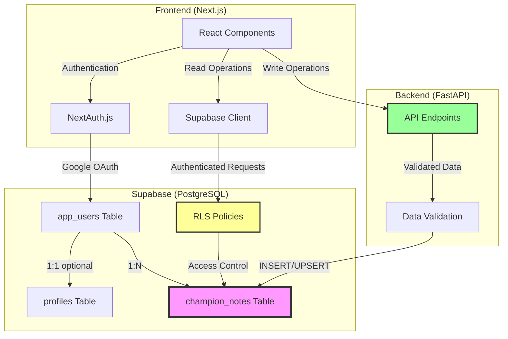
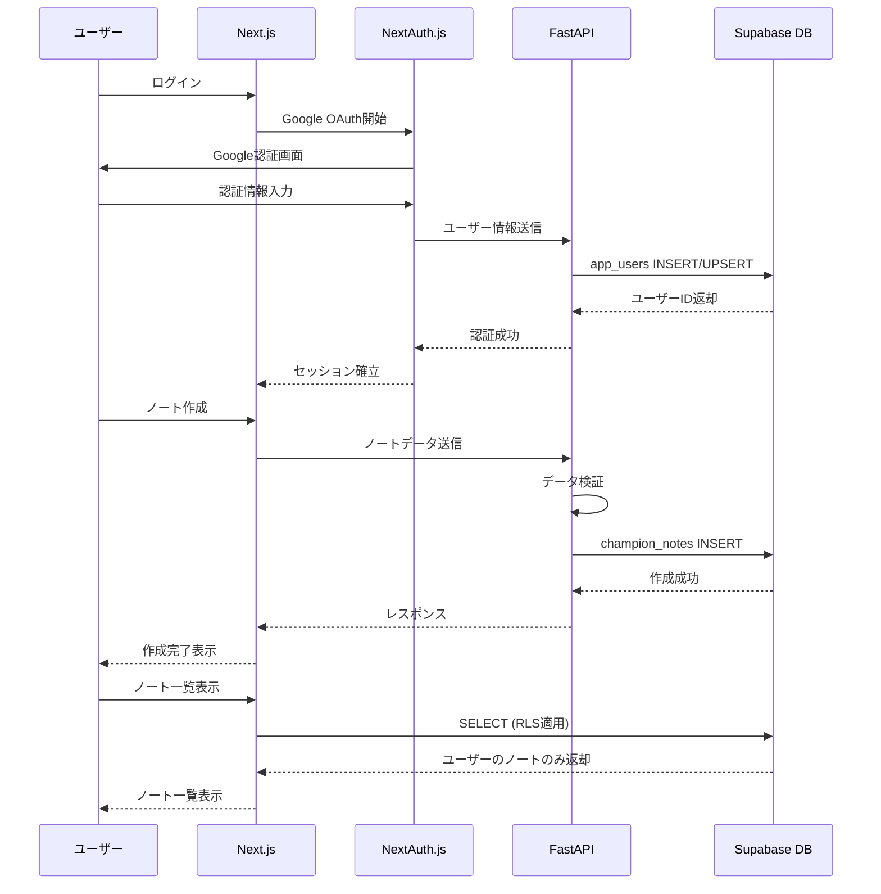
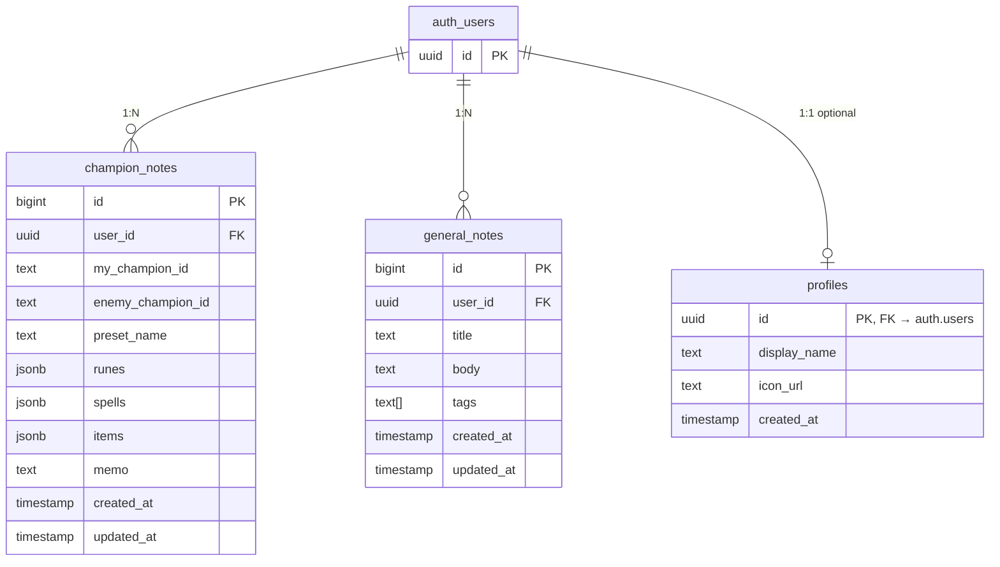

# 設計書: ノートデータベース設計

## 概要

本ドキュメントは、LoL Labのノート機能におけるデータベース設計を定義します。既存の`champion_notes`テーブルを拡張し、汎用ノート（General Note）と対策ノート（Matchup Note）の両方をサポートする柔軟なDB構造を実現します。

本設計書は、実装後に削除予定の`docs/db-schema.md`の内容を統合し、既存のテーブル定義、ER図、インデックス設計、今後の拡張案を含む包括的なデータベース設計書として機能します。

## 技術的制約

- **データベース**: Supabase (PostgreSQL 14以上)
- **認証フロー**: NextAuth.js Google認証
- **バックエンド**: FastAPI (INSERT/UPSERT操作)
- **セキュリティ**: Row Level Security (RLS) ポリシー必須
- **データ型**: JSONB型によるルーン・スペル・アイテムの柔軟な保存

## アーキテクチャ

### システム構成



### データフロー



## データベーススキーマ

### 1. 認証・ユーザー情報

Supabaseの組み込み認証テーブル `auth.users` を使用します。独自の `app_users` テーブルは作成しません。

- ユーザーIDは `auth.users.id`（uuid）を参照
- RLSポリシーで `auth.uid()` と照合してデータを分離

### 2. チャンピオン対策ノート

#### champion_notes テーブル

チャンピオン対策ノート（Matchup Note）を保存するメインテーブル。

| カラム名            | 型         | 制約           | 説明                                    |
| ------------------- | ---------- | -------------- | --------------------------------------- |
| id                  | bigint     | PK, NOT NULL   | 主キー、自動採番                        |
| user_id             | uuid       | FK, NULLABLE   | 外部キー、auth.users.id                 |
| my_champion_id      | text       | NOT NULL       | 自分のチャンピオンID（例: "Ahri"）      |
| enemy_champion_id   | text       | NOT NULL       | 相手のチャンピオンID（必須）            |
| preset_name         | text       | NOT NULL       | プリセット名（例: "序盤安定型"）        |
| runes               | jsonb      | NULL           | ルーン構成（JSON）                      |
| spells              | jsonb      | NULL           | サモナースペル（配列JSON）              |
| items               | jsonb      | NULL           | 初期アイテム（配列JSON）                |
| memo                | text       | NULL           | 対策メモ                                |
| created_at          | timestamp  | NULL           | 作成日時                                |
| updated_at          | timestamp  | NULL           | 更新日時                                |

**インデックス**:
- PRIMARY KEY: `id`
- FOREIGN KEY: `user_id` REFERENCES `auth.users(id)`

### JSON構造定義

#### runes（ルーン構成）

```json
{
  "primaryPath": 8100,
  "secondaryPath": 8200,
  "keystone": 8112,
  "primaryRunes": [8126, 8138, 8135],
  "secondaryRunes": [9111, 9104],
  "shards": [5008, 5008, 5002]
}
```

**フィールド説明**:
- `primaryPath` (number): メインルーンパスID（例: 8100 = Domination）
- `secondaryPath` (number): サブルーンパスID（例: 8200 = Sorcery）
- `keystone` (number): キーストーンルーンID（例: 8112 = Electrocute）
- `primaryRunes` (number[]): メインルーン配列（3つ）
- `secondaryRunes` (number[]): サブルーン配列（2つ）
- `shards` (number[]): シャード配列（3つ: Offense, Flex, Defense）

#### spells（サモナースペル）

```json
["SummonerFlash", "SummonerIgnite"]
```

**フィールド説明**:
- 文字列配列（2要素固定）
- 各要素はサモナースペルID（例: "SummonerFlash", "SummonerIgnite", "SummonerExhaust"）

#### items（初期アイテム）

```json
["1055", "2003"]
```

**フィールド説明**:
- 文字列配列（可変長）
- 各要素はアイテムID（例: "1055" = Doran's Blade, "2003" = Health Potion）

## ER図



## インデックス設計

### インデックス戦略

#### champion_notes テーブル

1. **user_id インデックス**
   - 目的: ユーザーごとのノート検索高速化
   - クエリ例: `SELECT * FROM champion_notes WHERE user_id = ?`
   - 重要度: 最高（全クエリで使用）

2. **my_champion_id インデックス**
   - 目的: 特定チャンピオンのノート検索最適化
   - クエリ例: `SELECT * FROM champion_notes WHERE my_champion_id = 'Ahri'`
   - 重要度: 高

3. **enemy_champion_id インデックス**
   - 目的: マッチアップ検索最適化
   - クエリ例: `SELECT * FROM champion_notes WHERE enemy_champion_id = 'Yasuo'`
   - 重要度: 高


### 複合インデックス（今後検討）

```sql
-- ユーザー + チャンピオン検索の最適化
CREATE INDEX idx_champion_notes_user_my_champion 
ON champion_notes(user_id, my_champion_id);

-- マッチアップ検索の最適化
CREATE INDEX idx_champion_notes_user_matchup 
ON champion_notes(user_id, my_champion_id, enemy_champion_id);
```

### JSONB型の利点

- **柔軟性**: ルーン・スペル・アイテムの構造変更に対応しやすい
- **拡張性**: 新しいフィールド追加が容易
- **クエリ性能**: PostgreSQLのJSONB型は効率的なインデックスとクエリをサポート
- **データ整合性**: アプリケーション層でのバリデーションと組み合わせて使用

## Row Level Security (RLS) ポリシー

### champion_notes テーブルのRLSポリシー

```sql
-- RLS有効化
ALTER TABLE champion_notes ENABLE ROW LEVEL SECURITY;

-- SELECT ポリシー: ユーザーは自分のノートのみ読み取り可能
CREATE POLICY "Users can view their own notes"
ON champion_notes
FOR SELECT
USING (auth.uid() = user_id);

-- INSERT ポリシー: ユーザーは自分のノートのみ作成可能
CREATE POLICY "Users can create their own notes"
ON champion_notes
FOR INSERT
WITH CHECK (auth.uid() = user_id);

-- UPDATE ポリシー: ユーザーは自分のノートのみ更新可能
CREATE POLICY "Users can update their own notes"
ON champion_notes
FOR UPDATE
USING (auth.uid() = user_id)
WITH CHECK (auth.uid() = user_id);

-- DELETE ポリシー: ユーザーは自分のノートのみ削除可能
CREATE POLICY "Users can delete their own notes"
ON champion_notes
FOR DELETE
USING (auth.uid() = user_id);
```

### app_users テーブルのRLSポリシー

```sql
-- RLS有効化
ALTER TABLE app_users ENABLE ROW LEVEL SECURITY;

-- SELECT ポリシー: ユーザーは自分の情報のみ読み取り可能
CREATE POLICY "Users can view their own profile"
ON app_users
FOR SELECT
USING (auth.uid() = id);

-- UPDATE ポリシー: ユーザーは自分の情報のみ更新可能
CREATE POLICY "Users can update their own profile"
ON app_users
FOR UPDATE
USING (auth.uid() = id)
WITH CHECK (auth.uid() = id);
```

## データ例

### 対策ノート（Matchup Note）の例

```json
{
  "id": 1,
  "user_id": "550e8400-e29b-41d4-a716-446655440000",
  "my_champion_id": "Ahri",
  "enemy_champion_id": "Yasuo",
  "preset_name": "序盤安定型",
  "runes": {
    "primaryPath": 8100,
    "secondaryPath": 8300,
    "keystone": 8112,
    "primaryRunes": [8126, 8138, 8135],
    "secondaryRunes": [8304, 8345],
    "shards": [5008, 5008, 5002]
  },
  "spells": ["SummonerFlash", "SummonerExhaust"],
  "items": ["1056", "2003"],
  "memo": "Yasuoのウィンドウォールに注意。Eでハラスしてから距離を取る。レベル3以降はオールインに注意。Exhaustを温存してYasuoのウルトに合わせる。",
  "created_at": "2024-01-01T00:00:00Z",
  "updated_at": "2024-01-01T00:00:00Z"
}
```

## 3. 汎用ノート

### general_notes テーブル

チャンピオンに紐付かない自由なメモ（General Note）を保存するテーブル。

| カラム名   | 型           | 制約                        | 説明                          |
| ---------- | ------------ | --------------------------- | ----------------------------- |
| id         | bigserial    | PK, NOT NULL                | 主キー、自動採番              |
| user_id    | uuid         | FK, NOT NULL                | 外部キー、app_users.id        |
| title      | text         | NOT NULL                    | タイトル（最大100文字）       |
| body       | text         | NULL                        | 本文（マークダウン、最大10,000文字） |
| tags       | text[]       | NOT NULL DEFAULT '{}'       | タグ配列（最大10個、各20文字以内） |
| created_at | timestamptz  | NOT NULL DEFAULT now()      | 作成日時                      |
| updated_at | timestamptz  | NOT NULL DEFAULT now()      | 更新日時                      |

**制約**:
- `tags_limit`: `array_length(tags, 1) <= 10`（DBレベルでタグ上限を保証）

**インデックス**:
- PRIMARY KEY: `id`
- FOREIGN KEY: `user_id` REFERENCES `app_users(id)` ON DELETE CASCADE
- INDEX: `(user_id, updated_at DESC)` — 一覧取得クエリを最適化
- GIN INDEX: `tags` — タグフィルタリング用

**SQL定義**:
```sql
CREATE TABLE general_notes (
  id         bigserial    PRIMARY KEY,
  user_id    uuid         NOT NULL REFERENCES auth.users(id) ON DELETE CASCADE,
  title      text         NOT NULL,
  body       text,
  tags       text[]       NOT NULL DEFAULT '{}',
  created_at timestamptz  NOT NULL DEFAULT now(),
  updated_at timestamptz  NOT NULL DEFAULT now(),
  CONSTRAINT tags_limit CHECK (
    array_length(tags, 1) IS NULL OR array_length(tags, 1) <= 10
  )
);

CREATE INDEX idx_general_notes_user_updated ON general_notes(user_id, updated_at DESC);
CREATE INDEX idx_general_notes_tags ON general_notes USING GIN(tags);
```

**RLSポリシー**:
```sql
ALTER TABLE general_notes ENABLE ROW LEVEL SECURITY;

CREATE POLICY "Users can view their own general notes"
ON general_notes FOR SELECT
USING (auth.uid() = user_id);

CREATE POLICY "Users can create their own general notes"
ON general_notes FOR INSERT
WITH CHECK (auth.uid() = user_id);

CREATE POLICY "Users can update their own general notes"
ON general_notes FOR UPDATE
USING (auth.uid() = user_id)
WITH CHECK (auth.uid() = user_id);

CREATE POLICY "Users can delete their own general notes"
ON general_notes FOR DELETE
USING (auth.uid() = user_id);
```

**アプリ層バリデーション**（DB制約と二重防御）:
- タイトル: 必須、100文字以内
- 本文: 任意、10,000文字以内
- タグ: 最大10個、各20文字以内


### 短期（1-3ヶ月）

1. **ノートのタグ付け機能**
   ```sql
   CREATE TABLE note_tags (
     id bigserial PRIMARY KEY,
     note_id bigint NOT NULL REFERENCES champion_notes(id) ON DELETE CASCADE,
     tag text NOT NULL,
     created_at timestamp with time zone DEFAULT now() NOT NULL
   );
   CREATE INDEX idx_note_tags_note_id ON note_tags(note_id);
   CREATE INDEX idx_note_tags_tag ON note_tags(tag);
   ```

2. **公開/非公開フラグ**
   ```sql
   ALTER TABLE champion_notes ADD COLUMN is_public boolean DEFAULT false NOT NULL;
   CREATE INDEX idx_champion_notes_is_public ON champion_notes(is_public);
   ```

3. **お気に入り機能**
   ```sql
   ALTER TABLE champion_notes ADD COLUMN is_favorite boolean DEFAULT false NOT NULL;
   CREATE INDEX idx_champion_notes_favorite ON champion_notes(user_id, is_favorite);
   ```

### 中期（3-6ヶ月）

1. **ノートのバージョン管理**
   ```sql
   CREATE TABLE note_versions (
     id bigserial PRIMARY KEY,
     note_id bigint NOT NULL REFERENCES champion_notes(id) ON DELETE CASCADE,
     version int NOT NULL,
     runes jsonb,
     spells jsonb,
     items jsonb,
     memo text,
     created_at timestamp with time zone DEFAULT now() NOT NULL
   );
   CREATE INDEX idx_note_versions_note_id ON note_versions(note_id);
   ```

2. **ノート共有機能**
   ```sql
   CREATE TABLE shared_notes (
     id bigserial PRIMARY KEY,
     note_id bigint NOT NULL REFERENCES champion_notes(id) ON DELETE CASCADE,
     shared_by uuid NOT NULL REFERENCES app_users(id) ON DELETE CASCADE,
     shared_with uuid NOT NULL REFERENCES app_users(id) ON DELETE CASCADE,
     created_at timestamp with time zone DEFAULT now() NOT NULL,
     UNIQUE(note_id, shared_with)
   );
   ```

3. **ノート統計情報**
   ```sql
   ALTER TABLE champion_notes ADD COLUMN view_count int DEFAULT 0 NOT NULL;
   ALTER TABLE champion_notes ADD COLUMN last_viewed_at timestamp with time zone;
   ```

### 長期（6ヶ月以降）

1. **チャンピオン名・アイコン外部API参照**
   - Riot Games Data Dragon APIを使用
   - champion_idをキーとして動的に名前とアイコンを取得
   - データベースには冗長化しない設計

2. **ノートのコメント機能**
   ```sql
   CREATE TABLE note_comments (
     id bigserial PRIMARY KEY,
     note_id bigint NOT NULL REFERENCES champion_notes(id) ON DELETE CASCADE,
     user_id uuid NOT NULL REFERENCES app_users(id) ON DELETE CASCADE,
     comment text NOT NULL,
     created_at timestamp with time zone DEFAULT now() NOT NULL
   );
   ```

3. **ノートの評価機能**
   ```sql
   CREATE TABLE note_ratings (
     id bigserial PRIMARY KEY,
     note_id bigint NOT NULL REFERENCES champion_notes(id) ON DELETE CASCADE,
     user_id uuid NOT NULL REFERENCES app_users(id) ON DELETE CASCADE,
     rating int NOT NULL CHECK (rating >= 1 AND rating <= 5),
     created_at timestamp with time zone DEFAULT now() NOT NULL,
     UNIQUE(note_id, user_id)
   );
   ```

## パフォーマンス考慮事項

### クエリ最適化

1. **ユーザーのノート一覧取得**
   ```sql
   -- インデックス使用: idx_champion_notes_user_id
   SELECT * FROM champion_notes 
   WHERE user_id = ? 
   ORDER BY updated_at DESC 
   LIMIT 100;
   ```

2. **特定チャンピオンのノート検索**
   ```sql
   -- インデックス使用: idx_champion_notes_user_id, idx_champion_notes_my_champion_id
   SELECT * FROM champion_notes 
   WHERE user_id = ? AND my_champion_id = ?;
   ```

3. **マッチアップノート検索**
   ```sql
   -- インデックス使用: 複合インデックス（今後追加）
   SELECT * FROM champion_notes 
   WHERE user_id = ? 
     AND my_champion_id = ? 
     AND enemy_champion_id = ?;
   ```

### データサイズ制限

- **JSONBデータ**: 最大10KB（ルーン・スペル・アイテム合計）
- **memoフィールド**: 最大10,000文字
- **1ユーザーあたりのノート数**: 最大1,000件（ソフトリミット）

### キャッシング戦略（今後）

- ユーザーのノート一覧をRedisでキャッシュ
- TTL: 5分
- 更新時にキャッシュ無効化

## セキュリティ考慮事項

### データ保護

1. **RLS（Row Level Security）**: 全テーブルで有効化
2. **外部キー制約**: CASCADE削除でデータ整合性保証
3. **CHECK制約**: note_typeとenemy_champion_idの整合性検証

### 入力検証

1. **アプリケーション層**:
   - FastAPIでPydanticモデルによるバリデーション
   - チャンピオンIDの存在確認
   - JSON構造の検証

2. **データベース層**:
   - NOT NULL制約
   - CHECK制約
   - UNIQUE制約

### 認証・認可

1. **認証**: NextAuth.js + Google OAuth
2. **認可**: Supabase RLSポリシー
3. **セッション管理**: JWT（NextAuth.js）

## マイグレーション戦略

現在のSupabaseスキーマは既に対策ノート専用の構造になっているため、マイグレーションは不要です。

### 現在のスキーマ確認

```sql
-- 現在のスキーマを確認
SELECT column_name, data_type, is_nullable
FROM information_schema.columns
WHERE table_name = 'champion_notes'
ORDER BY ordinal_position;
```

### 期待されるスキーマ

- `id`: bigint, NOT NULL
- `user_id`: uuid, NOT NULL
- `my_champion_id`: text, NOT NULL
- `enemy_champion_id`: text, NOT NULL
- `preset_name`: text, NOT NULL
- `runes`: jsonb, NULL
- `spells`: jsonb, NULL
- `items`: jsonb, NULL
- `memo`: text, NULL
- `created_at`: timestamp with time zone, NOT NULL
- `updated_at`: timestamp with time zone, NOT NULL

## 参考資料

- [Supabase ドキュメント](https://supabase.com/docs)
- [PostgreSQL JSONB 型](https://www.postgresql.jp/document/14/html/datatype-json.html)
- [PostgreSQL Row Level Security](https://www.postgresql.jp/document/14/html/ddl-rowsecurity.html)
- [Riot Games Data Dragon API](https://developer.riotgames.com/docs/lol#data-dragon)
