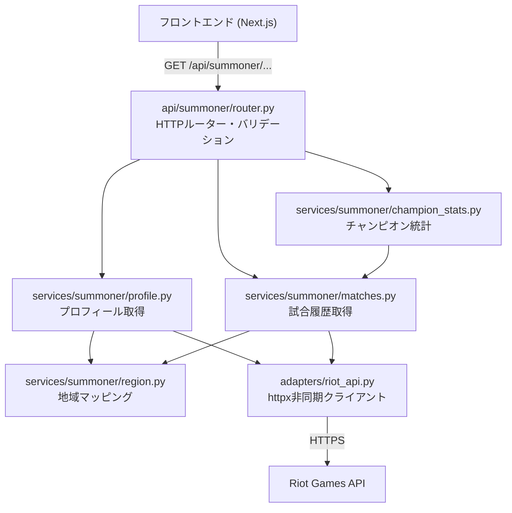

# 設計書: サモナー検索API

## Overview

Riot Games APIに接続し、サモナーのプロフィール・ランク情報・試合履歴・チャンピオン統計を取得するFastAPIバックエンドを実装する。

既存の `adapters/riot_api.py` を拡張し、`api/summoner/ → services/summoner/ → adapters/riot_api.py` のレイヤー構造に従って実装する。

## Architecture



### Riot API エンドポイント構成

Riot APIは2種類のホストを使い分ける：

| ホスト種別 | 用途 | 例 |
|---|---|---|
| Platform | サモナー情報・ランク情報 | `jp1.api.riotgames.com` |
| Regional | アカウント情報・試合履歴 | `asia.api.riotgames.com` |

## Components and Interfaces

### ファイル構成

```
backend/
├── adapters/
│   └── riot_api.py          # 既存（変更なし）
├── api/
│   └── summoner/
│       ├── __init__.py
│       └── router.py        # HTTPルーター・バリデーション
├── services/
│   └── summoner/
│       ├── __init__.py
│       ├── region.py        # 地域マッピング
│       ├── profile.py       # プロフィール取得
│       ├── matches.py       # 試合履歴取得
│       └── champion_stats.py # チャンピオン統計
├── schemas/
│   └── summoner.py          # Pydanticスキーマ
├── main.py                  # ルーター登録追加
└── requirements.txt         # httpx追加

frontend/
├── src/
│   ├── lib/
│   │   ├── api/
│   │   │   └── summoner.ts  # BEへのAPI呼び出し関数
│   │   └── summoner-search/
│   │       └── ...          # バリデーション・フィルタリング等
│   └── components/
│       └── summoner-search/
│           ├── SearchResultPage.tsx  # 実APIデータ表示（ローディング・エラー対応）
│           └── SummonerProfile.tsx   # プロフィールアイコン・ランクエンブレム表示
└── public/
    └── images/
        ├── rank/            # ランクエンブレム画像（ローカル静的配置）
        │   ├── iron.png
        │   ├── bronze.png
        │   ├── silver.png
        │   ├── gold.png
        │   ├── platinum.png
        │   ├── emerald.png
        │   ├── diamond.png
        │   ├── master.png
        │   ├── grandmaster.png
        │   └── challenger.png
        └── loading/
            └── nunu.gif     # ローディングアニメーション
```

### api/summoner/router.py

```python
# エンドポイント定義
GET /api/summoner/{region}/{gameName}/{tagLine}
    → SummonerData

GET /api/summoner/{region}/{gameName}/{tagLine}/matches
    → list[MatchData]
    クエリパラメータ: count: int = Query(default=10, ge=1, le=20)

GET /api/summoner/{region}/{gameName}/{tagLine}/champion-stats
    → list[ChampionStatData]
```

バリデーション責務：
- `region`: `Literal["JP", "KR", "NA", "EUW", "EUNE", "OCE"]`
- `gameName`: `str = Path(..., min_length=1, max_length=16)`
- `tagLine`: `str = Path(..., min_length=1, max_length=5)`
- `count > 20` → HTTP 400（`Query(le=20)` で自動的に422）

### services/summoner/region.py

```python
PLATFORM_MAP: dict[str, str] = {
    "JP": "jp1", "KR": "kr", "NA": "na1",
    "EUW": "euw1", "EUNE": "eun1", "OCE": "oc1",
}

REGIONAL_MAP: dict[str, str] = {
    "JP": "asia", "KR": "asia", "NA": "americas",
    "EUW": "europe", "EUNE": "europe", "OCE": "sea",
}

def get_platform(region: str) -> str: ...  # 無効値は HTTP 400
def get_regional(region: str) -> str: ...  # 無効値は HTTP 400
```

### services/summoner/profile.py

処理フロー：
1. `get_regional(region)` でRegionalホスト取得
2. `/riot/account/v1/accounts/by-riot-id/{gameName}/{tagLine}` → PUUID・gameName取得
3. `get_platform(region)` でPlatformホスト取得
4. `/lol/summoner/v4/summoners/by-puuid/{puuid}` → サモナー情報取得
5. `/lol/league/v4/entries/by-puuid/{puuid}` → ランク情報取得（※`by-summoner`は廃止）
6. `SummonerData` を組み立てて返す（`name`は`account["gameName"]`を使用）

> **注意**: Riot APIの仕様変更により、`/lol/summoner/v4/summoners/by-puuid/` のレスポンスから `id` と `name` フィールドが削除された。ランク取得は `/lol/league/v4/entries/by-puuid/{puuid}` を使用し、サモナー名は `/riot/account/v1/accounts/` の `gameName` を使用する。

### services/summoner/matches.py

処理フロー：
1. PUUID取得（profile.pyと共通）
2. `/lol/match/v5/matches/by-puuid/{puuid}/ids?count={count}` → 試合IDリスト取得
3. 各試合IDに対して `/lol/match/v5/matches/{matchId}` → 試合詳細取得
4. PUUIDで参加者データを特定
5. `MatchData` を組み立てて返す（取得失敗した試合はスキップ）

### services/summoner/champion_stats.py

処理フロー：
1. 直近20試合の `MatchData` リストを取得（matches.pyを利用）
2. チャンピオン名でグループ化
3. wins/losses/cs/kda を集計
4. total games降順でソート
5. `ChampionStatData` リストを返す

## Data Models

### schemas/summoner.py

```python
class RankData(BaseModel):
    queueType: str
    tier: str        # "UNRANKED" | "IRON" | ... | "CHALLENGER"
    rank: str        # "I" | "II" | "III" | "IV" | ""
    leaguePoints: int
    wins: int
    losses: int

class SummonerData(BaseModel):
    name: str
    tagLine: str
    level: int
    profileIconId: int
    rank: RankData
    previousSeasonRank: str  # 現在は常に "UNRANKED"

class MatchData(BaseModel):
    matchId: str
    isWin: bool
    gameMode: str
    championName: str
    kills: int
    deaths: int
    assists: int
    cs: int
    gameDurationSeconds: int
    itemIds: list[int]
    timeAgoSeconds: int

class ChampionStatData(BaseModel):
    championName: str
    wins: int
    losses: int
    cs: float
    kda: float
```

### Riot API レスポンスの主要フィールド

**アカウント情報** (`/riot/account/v1/accounts/by-riot-id/...`):
```json
{ "puuid": "...", "gameName": "...", "tagLine": "..." }
```

**サモナー情報** (`/lol/summoner/v4/summoners/by-puuid/...`):
```json
{ "puuid": "...", "profileIconId": 123, "summonerLevel": 100, "revisionDate": 1700000000000 }
```
> **注意**: `id` と `name` フィールドはRiot APIの仕様変更により廃止。

**ランク情報** (`/lol/league/v4/entries/by-puuid/...`):
```json
[{ "queueType": "RANKED_SOLO_5x5", "tier": "GOLD", "rank": "II", "leaguePoints": 50, "wins": 100, "losses": 80 }]
```
> **注意**: `/lol/league/v4/entries/by-summoner/{summonerId}` は廃止。`by-puuid/{puuid}` を使用する。

**試合詳細** (`/lol/match/v5/matches/...`):
```json
{
  "metadata": { "matchId": "JP1_..." },
  "info": {
    "gameMode": "CLASSIC",
    "gameDuration": 1800,
    "gameEndTimestamp": 1700000000000,
    "participants": [
      {
        "puuid": "...",
        "championName": "Ahri",
        "kills": 5, "deaths": 2, "assists": 8,
        "totalMinionsKilled": 150, "neutralMinionsKilled": 10,
        "win": true,
        "item0": 3157, "item1": 3089, ...
      }
    ]
  }
}
```

## Correctness Properties

*プロパティとは、システムの全ての有効な実行において成立すべき特性や振る舞いのことです。プロパティは人間が読める仕様と機械で検証可能な正確性保証の橋渡しをします。*

### Property 1: 地域マッピングの完全性

*全ての* 有効なRegion値（JP, KR, NA, EUW, EUNE, OCE）に対して、`get_platform()` と `get_regional()` は空でない文字列を返す。

**Validates: Requirements 2.1, 2.2, 2.4**

### Property 2: 無効地域のエラー

*全ての* 許可されていないRegion文字列に対して、`get_platform()` および `get_regional()` はHTTP 400エラーを発生させる。

**Validates: Requirements 2.3**

### Property 3: 5xxエラーの502変換

*任意の* 5xxステータスコード（500〜599）をRiot APIが返した場合、サービス層はHTTP 502エラーを発生させる。

**Validates: Requirements 3.4**

### Property 4: KDA計算のゼロ除算回避

*任意の* kills, deaths（0以上の整数）, assists の組み合わせに対して、KDA計算 `(kills + assists) / max(deaths, 1)` は常に有限の非負数を返す。

**Validates: Requirements 6.4**

### Property 5: チャンピオン統計のソート順

*任意の* 試合リストから生成されたチャンピオン統計において、結果リストは総試合数（wins + losses）の降順で並んでいる。

**Validates: Requirements 6.5**

### Property 6: 入力バリデーションの一貫性

*任意の* 17文字以上のgameName、または6文字以上のtagLine、または許可されていないregion値に対して、ルーターはHTTP 422エラーを返す。

**Validates: Requirements 7.1, 7.2, 7.3**

### Property 7: エラーレスポンス形式の一貫性

*任意の* エラー条件（400, 404, 422, 429, 502）において、レスポンスボディは `{"detail": "<message>"}` 形式であり、スタックトレースや内部実装の詳細を含まない。

**Validates: Requirements 8.1, 8.4**

## フロントエンド UI仕様

### SearchResultPage

- 検索実行後、BEの3エンドポイント（profile / matches / champion-stats）を並列取得
- ローディング中: `nunu.gif` をセンター表示
- エラー時: エラーメッセージをセンター表示
- クエリ形式: `名前#タグ`（`#`なしの場合はリージョンのデフォルトタグを補完）

### SummonerProfile

- **プロフィールアイコン**: Data Dragon CDNから動的取得
  - URL: `https://ddragon.leagueoflegends.com/cdn/{version}/img/profileicon/{profileIconId}.png`
  - レベルをアイコン下部にバッジで重ねて表示
- **ランクエンブレム**: ローカル静的画像 `/images/rank/{tier小文字}.png`
  - ランクバナー右側に表示（64×64px）
  - `UNRANKED` の場合は画像なし

### lib/api/summoner.ts

```typescript
fetchSummoner(region, gameName, tagLine): Promise<SummonerData>
fetchMatches(region, gameName, tagLine, count?): Promise<MatchData[]>
fetchChampionStats(region, gameName, tagLine): Promise<ChampionStatData[]>
```

- `NEXT_PUBLIC_BACKEND_URL` 環境変数でBEのURLを設定
- エラー時は `response.detail` をエラーメッセージとして使用

## Error Handling

### Riot APIエラーコードのマッピング

| Riot APIステータス | HTTPException | メッセージ |
|---|---|---|
| 404 | 404 | "サモナーが見つかりません" |
| 429 | 429 | "レート制限に達しました。しばらく待ってから再試行してください" |
| 5xx | 502 | "Riot APIが一時的に利用できません" |
| その他 | 502 | "Riot APIが一時的に利用できません" |

### エラーハンドリング実装方針

`adapters/riot_api.py` の `get()` 関数は `httpx.HTTPStatusError` を発生させる。各サービス関数でこれをキャッチし、適切な `HTTPException` に変換する。

```python
# services/summoner/_error.py（共通ヘルパー）
def handle_riot_error(e: httpx.HTTPStatusError) -> None:
    status = e.response.status_code
    if status == 404:
        raise HTTPException(status_code=404, detail="サモナーが見つかりません")
    elif status == 429:
        raise HTTPException(status_code=429, detail="レート制限に達しました。しばらく待ってから再試行してください")
    else:
        logger.error(f"Riot API error: {status}", exc_info=True)
        raise HTTPException(status_code=502, detail="Riot APIが一時的に利用できません")
```

5xxエラーは `logging.error()` でログに記録する。スタックトレースはログにのみ記録し、レスポンスには含めない。

### 試合取得の部分失敗

試合詳細の取得は並列ではなく逐次処理し、個別の失敗は `logger.warning()` でログに記録してスキップする（要件5.6）。

## Testing Strategy

### ユニットテスト（例示ベース）

- `region.py`: 各Region値のマッピング結果を確認
- `profile.py`: ランクデータなし時のUNRANKEDデフォルト値
- `matches.py`: 試合取得失敗時のスキップ動作
- `champion_stats.py`: 試合履歴なし時の空リスト返却
- エラーマッピング: 404/429/5xx → 対応するHTTPException

### プロパティベーステスト（pytest + hypothesis）

プロパティベーステストには `hypothesis` ライブラリを使用する。各プロパティテストは最低100回のイテレーションで実行する。

| プロパティ | テスト対象 | 生成戦略 |
|---|---|---|
| プロパティ1 | `get_platform()`, `get_regional()` | `sampled_from(["JP","KR","NA","EUW","EUNE","OCE"])` |
| プロパティ2 | `get_platform()`, `get_regional()` | `text()` でフィルタリング（有効値を除外） |
| プロパティ3 | サービス層エラーハンドリング | `integers(min_value=500, max_value=599)` |
| プロパティ4 | KDA計算関数 | `integers(min_value=0)` × 3 |
| プロパティ5 | `aggregate_champion_stats()` | `lists(builds(MatchData, ...))` |
| プロパティ6 | FastAPIルーター | `text(min_size=17)` / `text(min_size=6)` / `text()` |
| プロパティ7 | FastAPIルーター | 各エラー条件のモック |

タグ形式: `# Feature: summoner-search-api, Property {N}: {property_text}`

### インテグレーションテスト

- `adapters/riot_api.py`: `httpx` を使った実際のHTTPリクエスト（`respx` でモック）
- エンドポイント全体: `TestClient` を使ったE2Eフロー確認（Riot APIはモック）

### テスト実行

```bash
# ユニット・プロパティテスト
pytest backend/tests/ -v

# カバレッジ付き
pytest backend/tests/ --cov=backend --cov-report=term-missing
```
