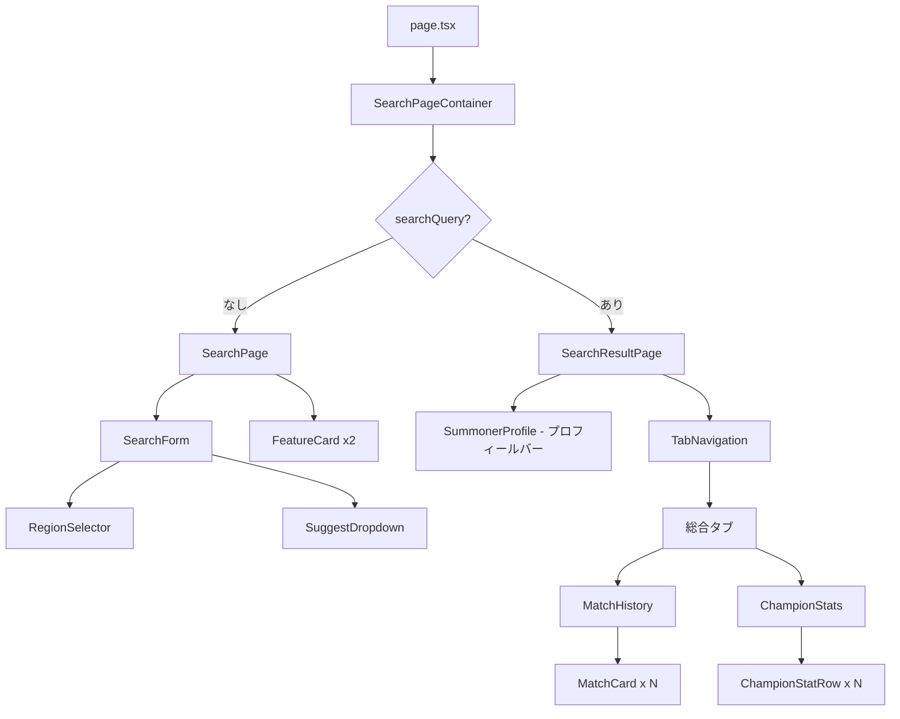

# 設計書: サモナー検索機能

## 概要

LoL Lab のホーム画面（`/`）にサモナー検索UIを実装する。
検索前はフォームと機能紹介カードを表示し、検索後はプロフィールバー→タブメニュー→タブコンテンツの縦積みレイアウトを表示する。
プロフィールバーは全幅で基本情報とランクを横並び表示し、タブメニュー（総合/チャンピオン/現在の対戦）で表示内容を切り替える。
「総合」タブでは左カラムにランク情報・チャンピオン統計、右カラムに対戦履歴を表示する。

## アーキテクチャ

```
app/page.tsx
  └── SearchPageContainer（状態管理）
        ├── SearchPage（検索前）
        └── SearchResultPage（検索後）
              ├── SummonerProfile（プロフィールバー・全幅）
              ├── TabNavigation（タブメニュー）
              └── タブコンテンツ
                    └── 総合タブ: ChampionStats + MatchHistory
```

状態管理は `SearchPageContainer` 内の `useState` で行い、`searchQuery` と `region` を保持する。



## コンポーネントとインターフェース

### ファイル構成

```
frontend/src/
├── app/page.tsx
├── components/
│   └── summoner-search/
│       ├── index.ts
│       ├── SearchPageContainer.tsx       # 状態管理（'use client'）
│       ├── SearchPage.tsx                # 検索前画面
│       ├── SearchForm.tsx                # 検索フォーム（'use client'）
│       ├── RegionSelector.tsx            # 地域選択ドロップダウン（'use client'）
│       ├── SuggestDropdown.tsx           # 候補プルダウン
│       ├── FeatureCard.tsx               # 機能紹介カード
│       ├── SearchResultPage.tsx          # 検索後画面（タブ状態管理）
│       ├── TabNavigation.tsx             # タブメニュー（総合/チャンピオン/現在の対戦）
│       ├── SummonerProfile.tsx           # プロフィールバー（全幅・横並び）
│       ├── MatchHistory.tsx
│       ├── MatchCard.tsx
│       ├── ChampionStats.tsx
│       └── ChampionStatRow.tsx
└── types/
    └── summoner.ts
```

### コンポーネントインターフェース

```typescript
// SearchPageContainer: props なし

// SearchPage
interface SearchPageProps {
  onSearch: (query: string, region: Region) => void;
}

// SearchForm
interface SearchFormProps {
  onSearch: (query: string, region: Region) => void;
}

// RegionSelector
interface RegionSelectorProps {
  value: Region;
  onChange: (region: Region) => void;
}

// SuggestDropdown
interface SuggestDropdownProps {
  query: string;
  region: Region;
  onSelect: (candidate: SuggestCandidate) => void;
  onClose: () => void;
  focusedIndex: number;
}

// SearchResultPage
interface SearchResultPageProps {
  query: string;
  region: Region;
  onSearch: (query: string, region: Region) => void;
}

// TabNavigation
type TabType = 'overview' | 'champions' | 'live-game';

interface TabNavigationProps {
  activeTab: TabType;
  onTabChange: (tab: TabType) => void;
}
```

## データモデル

```typescript
// types/summoner.ts

export type Region = 'JP' | 'KR' | 'NA' | 'EUW' | 'EUNE' | 'OCE';

export const REGION_DEFAULT_TAGS: Record<Region, string> = {
  JP: 'JP1',
  KR: 'KR1',
  NA: 'NA1',
  EUW: 'EUW',
  EUNE: 'EUNE',
  OCE: 'OCE1',
};

export interface SuggestCandidate {
  name: string;
  tagLine: string;
  region: Region;
}

export interface SummonerData {
  name: string;
  tagLine: string;
  level: number;
  profileIconId: number;
  rank: RankData;
}

export interface RankData {
  queueType: string;
  tier: string;
  rank: string;
  leaguePoints: number;
  wins: number;
  losses: number;
}

export interface MatchData {
  matchId: string;
  isWin: boolean;
  gameMode: string;
  championName: string;
  kills: number;
  deaths: number;
  assists: number;
  cs: number;
  gameDurationSeconds: number;
  itemIds: number[];
  timeAgoSeconds: number;
}

export interface ChampionStatData {
  championName: string;
  wins: number;
  losses: number;
  cs: number;
  kda: number;
}
```

### モックデータ

`lib/summoner-search/mockData.ts` にサジェスト候補のモックデータを定義する。
サモナー・試合・チャンピオン統計データはバックエンドAPIから取得する。

## ランク順位API設計

### バックエンド

`league-v4`の`/entries/{queue}/{tier}/{division}`を使用し、同ティア内の順位と上位%を算出する。

```typescript
// レスポンス型
interface RankPositionData {
  position: number;       // 同ティア内順位
  totalPlayers: number;   // 同ティア内プレイヤー数
  topPercent: number;     // 上位%（全体推定）
}
```

**エンドポイント**: `GET /api/summoner/{region}/{name}/{tag}/rank-position`

**算出ロジック**:
1. `league-v4/entries/{queue}/{tier}/{division}`で同ティア・同ディビジョンのエントリ一覧を取得
2. LP降順でソートし、対象プレイヤーの順位を特定
3. 各ティアの推定人口比率から全体上位%を概算

## お気に入りAPI設計

### Supabaseテーブル

```sql
CREATE TABLE favorites (
  id UUID DEFAULT gen_random_uuid() PRIMARY KEY,
  user_id UUID NOT NULL REFERENCES auth.users(id) ON DELETE CASCADE,
  summoner_name TEXT NOT NULL,
  tag_line TEXT NOT NULL,
  region TEXT NOT NULL,
  created_at TIMESTAMPTZ DEFAULT now(),
  UNIQUE(user_id, summoner_name, tag_line, region)
);

CREATE INDEX idx_favorites_user_id ON favorites(user_id);
```

### エンドポイント

- `GET /api/favorites` — ログインユーザーのお気に入り一覧取得
- `POST /api/favorites` — お気に入り追加（上限10人チェック）
- `DELETE /api/favorites/{id}` — お気に入り削除

```typescript
interface FavoriteEntry {
  id: string;
  summonerName: string;
  tagLine: string;
  region: Region;
  createdAt: string;
}
```

## 検索履歴設計

### フロントエンド（localStorage）

```typescript
interface RecentSearch {
  name: string;
  tagLine: string;
  region: Region;
  searchedAt: number; // Unix timestamp
}
```

- 最大20件保持（古いものから削除）
- `localStorage`キー: `lollab_recent_searches`
- `lib/recentSearches.ts`に読み書きロジックを集約

## 追加ファイル構成

```
frontend/src/
├── components/summoner-search/
│   ├── SearchHistoryDropdown.tsx    # 最近の検索・お気に入りタブ付きドロップダウン
│   └── FavoriteButton.tsx           # お気に入りボタン（☆/★）
├── adapters/
│   └── favorites.ts                 # お気に入りAPI呼び出し
└── lib/
    └── recentSearches.ts            # localStorage読み書き

backend/
├── api/favorites/
│   └── router.py                    # お気に入りCRUDエンドポイント
├── services/favorites/
│   └── crud.py                      # お気に入りビジネスロジック
├── services/summoner/
│   └── rank_position.py             # ランク順位算出ロジック
└── schemas/
    └── favorites.py                 # Pydanticスキーマ
```

## SearchForm の動作フロー

```
1. ユーザーが入力
2. 1文字以上 → SuggestDropdown を表示（モックデータでフィルタリング）
3. 候補選択 or Enter → onSearch(query, region) を呼び出す
4. フォーカスアウト or Escape → SuggestDropdown を閉じる
```

バリデーション:
- 空文字列 → 検索しない
- 101文字以上 → エラーメッセージ表示
- タグなし（`#` なし）→ 許可（タグはオプション）

## Correctness Properties

### Property 1: 空入力は検索を実行しない
*For any* 空文字列または空白のみの文字列、バリデーション関数は検索を許可しない
**Validates: 要件 3.1**

### Property 2: 101文字以上の入力はバリデーションエラーを返す
*For any* 101文字以上の文字列、バリデーション関数はエラーメッセージを返す
**Validates: 要件 3.4**

### Property 3: タグなし・タグあり両方の有効な入力はバリデーションを通過する
*For any* 1〜100文字の非空文字列（`#` の有無を問わない）、バリデーション関数は成功を返す
**Validates: 要件 3.2, 3.3**

### Property 4: SuggestDropdown はクエリにマッチする候補のみ表示する
*For any* 入力クエリ、SuggestDropdown に表示される候補は全てクエリを名前に含む
**Validates: 要件 4.2**

### Property 5〜8: （既存のコンポーネント表示プロパティは変更なし）
SummonerProfile・MatchCard・ChampionStatRow の表示プロパティは既存仕様を維持する。

## エラーハンドリング

| 条件 | 表示メッセージ |
|------|--------------|
| 空入力で検索 | 検索を実行しない（メッセージなし） |
| 101文字以上の入力 | 「入力が長すぎます」 |

## テスト戦略

### プロパティベーステスト（fast-check）

| Property | テスト対象 | 生成する入力 |
|----------|-----------|------------|
| P1 | `validateSummonerName` | 空文字列・空白文字列 |
| P2 | `validateSummonerName` | 101文字以上の文字列 |
| P3 | `validateSummonerName` | 1〜100文字の任意文字列 |
| P4 | `filterSuggestions` | 任意のクエリ文字列 |
| P5〜P8 | 各コンポーネント render | 既存と同様 |
