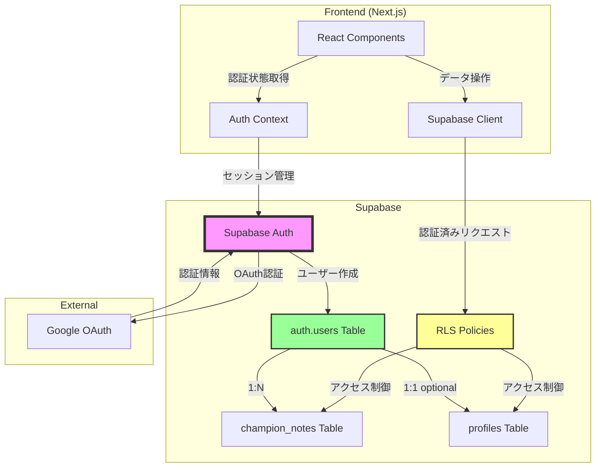
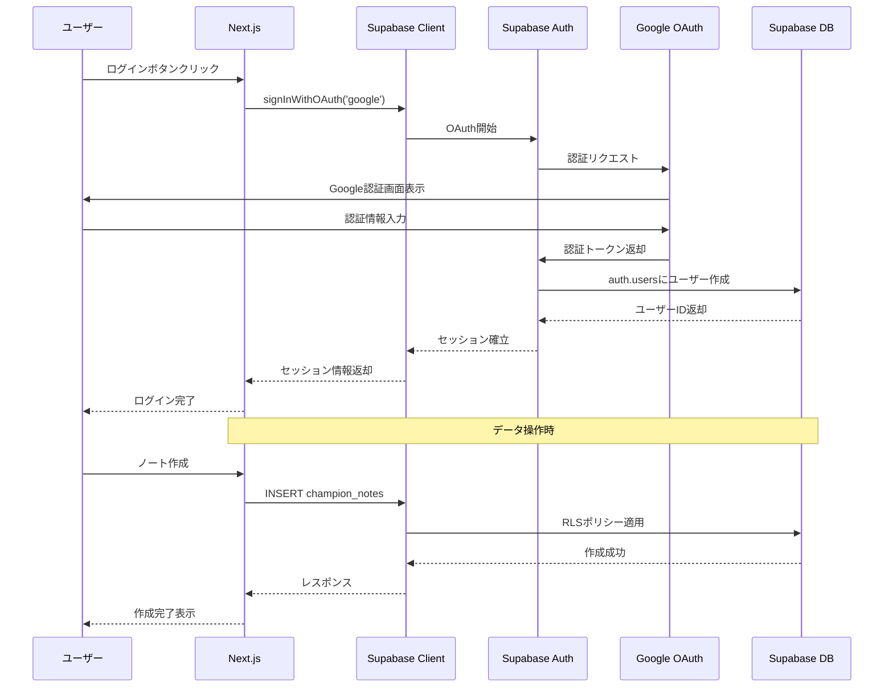

# 設計書: Supabase Auth移行

## 概要

本ドキュメントは、NextAuth.jsからSupabase Authへの完全移行の設計を定義します。現在、LoL LabではNextAuth.jsを使用してGoogle OAuth認証を実装していますが、Supabase Authとの統合が不完全であり、セキュリティとデータ整合性の問題があります。本機能では、認証システムを一元化し、RLSポリシーを完全に機能させます。

## アーキテクチャ

### システム構成



### 認証フロー



## コンポーネント設計

### 1. 認証コンテキスト

#### AuthContext（新規作成）

**目的**: アプリケーション全体で認証状態を管理

**ファイルパス**: `frontend/src/lib/contexts/AuthContext.tsx`

**責務**:
- Supabase Authのセッション状態を管理
- セッション変更をリアルタイムで検知
- 認証状態をReactコンポーネントに提供

**インターフェース**:
```typescript
interface AuthContextType {
  user: User | null;
  session: Session | null;
  loading: boolean;
  signInWithGoogle: () => Promise<void>;
  signOut: () => Promise<void>;
}
```

**実装詳細**:
- `useEffect`でSupabase Authのセッション変更を監視
- `onAuthStateChange`コールバックでセッション更新を検知
- ローディング状態を管理してUIのちらつきを防止

### 2. Supabase Client

#### createClient（既存修正）

**ファイルパス**: `frontend/src/lib/supabase/client.ts`

**変更点**:
- セッション永続化の設定を追加
- ブラウザのlocalStorageを使用してセッションを保存

**実装方針**:
- `createBrowserClient`を使用してSupabaseクライアントを作成
- 環境変数からSupabase URLとAnon Keyを取得
- セッション永続化の設定を追加（デフォルトでlocalStorageを使用）
```

### 3. UIコンポーネント

#### Navbar（既存修正）

**ファイルパス**: `frontend/src/components/Navbar.tsx`

**変更点**:
- NextAuth.jsの`useSession`を削除
- AuthContextの`useAuth`フックを使用
- ログイン・ログアウト処理をSupabase Authに変更

**主要な変更箇所**:
- NextAuth.jsの`useSession`を削除
- AuthContextの`useAuth`フックを使用
- ログイン・ログアウト処理をSupabase Authに変更

#### NotesPage（既存修正）

**ファイルパス**: `frontend/src/app/notes/page.tsx`

**変更点**:
- NextAuth.jsの`useSession`を削除
- AuthContextの`useAuth`フックを使用
- 未認証時のリダイレクト処理を追加

#### NoteForm（既存修正）

**ファイルパス**: `frontend/src/components/notes/NoteForm.tsx`

**変更点**:
- NextAuth.jsの依存関係を削除
- Supabase Clientを使用したデータ作成処理（既存のまま）

#### NoteList（既存修正）

**ファイルパス**: `frontend/src/components/notes/NoteList.tsx`

**変更点**:
- NextAuth.jsの依存関係を削除
- Supabase Clientを使用したデータ取得処理（既存のまま）

### 4. API関数

#### notes.ts（既存維持）

**ファイルパス**: `frontend/src/lib/api/notes.ts`

**変更点**: なし（既にSupabase Clientを使用）

**確認事項**:
- `createNote`関数で`user.id`を使用してRLSポリシーが適用されることを確認
- `getNotes`関数でRLSポリシーにより自分のノートのみ取得されることを確認

## データモデル

### データベーススキーマ変更

#### 変更前

```sql
-- app_users テーブル（削除対象）
CREATE TABLE app_users (
  id uuid PRIMARY KEY DEFAULT gen_random_uuid(),
  email text NOT NULL UNIQUE,
  name text,
  image text,
  provider text NOT NULL,
  provider_id text NOT NULL,
  created_at timestamp with time zone DEFAULT now()
);

-- champion_notes テーブル（変更対象）
CREATE TABLE champion_notes (
  id bigserial PRIMARY KEY,
  user_id uuid NOT NULL REFERENCES app_users(id) ON DELETE CASCADE,
  -- 他のカラム...
);

-- profiles テーブル（変更対象）
CREATE TABLE profiles (
  id uuid PRIMARY KEY REFERENCES app_users(id) ON DELETE CASCADE,
  -- 他のカラム...
);
```

#### 変更後

```sql
-- app_users テーブルを削除
DROP TABLE IF EXISTS app_users CASCADE;

-- champion_notes テーブルのuser_idをauth.usersに変更
ALTER TABLE champion_notes
DROP CONSTRAINT champion_notes_user_id_fkey,
ADD CONSTRAINT champion_notes_user_id_fkey
  FOREIGN KEY (user_id)
  REFERENCES auth.users(id)
  ON DELETE CASCADE;

-- profiles テーブルのidをauth.usersに変更
ALTER TABLE profiles
DROP CONSTRAINT profiles_id_fkey,
ADD CONSTRAINT profiles_id_fkey
  FOREIGN KEY (id)
  REFERENCES auth.users(id)
  ON DELETE CASCADE;
```

### RLSポリシー（既存維持）

```sql
-- champion_notes テーブルのRLSポリシー（変更なし）
ALTER TABLE champion_notes ENABLE ROW LEVEL SECURITY;

CREATE POLICY "Users can view their own notes"
ON champion_notes FOR SELECT
USING (auth.uid() = user_id);

CREATE POLICY "Users can create their own notes"
ON champion_notes FOR INSERT
WITH CHECK (auth.uid() = user_id);

CREATE POLICY "Users can update their own notes"
ON champion_notes FOR UPDATE
USING (auth.uid() = user_id)
WITH CHECK (auth.uid() = user_id);

CREATE POLICY "Users can delete their own notes"
ON champion_notes FOR DELETE
USING (auth.uid() = user_id);
```

## インターフェース定義

### TypeScript型定義

#### User型（Supabase Auth）

```typescript
import { User as SupabaseUser } from '@supabase/supabase-js';

// Supabase Authのユーザー型をそのまま使用
export type User = SupabaseUser;
```

#### Session型（Supabase Auth）

```typescript
import { Session as SupabaseSession } from '@supabase/supabase-js';

// Supabase Authのセッション型をそのまま使用
export type Session = SupabaseSession;
```

#### AuthContext型

```typescript
export interface AuthContextType {
  user: User | null;
  session: Session | null;
  loading: boolean;
  signInWithGoogle: () => Promise<void>;
  signOut: () => Promise<void>;
}
```

## エラーハンドリング

### エラー分類

#### 1. 認証エラー

**発生タイミング**: Google OAuth認証失敗時

**エラーメッセージ**: "ログインに失敗しました。もう一度お試しください。"

**処理方針**:
- try-catchでエラーをキャッチ
- エラーメッセージをコンソールに出力
- ユーザーにアラートで通知

#### 2. ネットワークエラー

**発生タイミング**: Supabaseへの接続失敗時

**エラーメッセージ**: "ネットワークエラーが発生しました。接続を確認してください。"

**処理方針**:
- try-catchでエラーをキャッチ
- エラーメッセージをコンソールに出力
- ユーザーにアラートで通知

#### 3. セッション復元エラー

**発生タイミング**: ページリロード時のセッション復元失敗

**エラーメッセージ**: なし（自動的に未認証状態に遷移）

**処理方針**:
- useEffectでセッション復元を試行
- 成功時はセッション情報を状態に設定
- 失敗時は未認証状態に遷移

#### 4. RLSポリシーエラー

**発生タイミング**: 未認証ユーザーがデータアクセス試行時

**エラーメッセージ**: "認証が必要です。ログインしてください。"

**処理方針**:
- データ操作時のエラーをキャッチ
- RLSポリシーエラー（PGRST301）を特別に処理
- その他のエラーは汎用メッセージを表示

### エラーログ

**コンソール出力**:
- エラーの詳細情報をコンソールに出力
- 本番環境ではSentryなどのエラー監視サービスに送信（今後）

**ユーザー表示**:
- 一般的なエラーメッセージを表示
- 技術的な詳細は表示しない

## テスト戦略

### 単体テスト

#### AuthContext

**テスト項目**:
- セッション状態の初期化
- ログイン処理の成功・失敗
- ログアウト処理
- セッション変更の検知

**テストツール**: Jest + React Testing Library

#### Supabase Client

**テスト項目**:
- クライアントの初期化
- 環境変数の検証

**テストツール**: Jest

### 統合テスト

#### 認証フロー

**テストシナリオ**:
1. 未認証状態でログインボタンをクリック
2. Google OAuth認証画面が表示される
3. 認証成功後、ユーザー情報が表示される
4. ログアウトボタンをクリック
5. 未認証状態に戻る

**テストツール**: Playwright（今後）

#### データアクセス

**テストシナリオ**:
1. 認証済みユーザーがノートを作成
2. 作成したノートが一覧に表示される
3. 他のユーザーのノートは表示されない
4. 未認証ユーザーはノートにアクセスできない

**テストツール**: Playwright（今後）

### 手動テスト

#### チェックリスト

- [ ] Google OAuthログインが正常に動作する
- [ ] ログイン後、ユーザー情報が表示される
- [ ] ページリロード後もログイン状態が維持される
- [ ] ログアウトが正常に動作する
- [ ] 未認証時にノートページにアクセスするとリダイレクトされる
- [ ] 認証済みユーザーがノートを作成できる
- [ ] 作成したノートが一覧に表示される
- [ ] 他のユーザーのノートは表示されない
- [ ] エラーメッセージが適切に表示される

## 削除対象ファイル

### NextAuth.js関連ファイル

1. **APIルート**: `frontend/src/app/api/auth/[...nextauth]/route.ts`
2. **SessionProvider**: `frontend/src/app/providers.tsx`（AuthContextProviderに置き換え）

### 依存関係

**package.json**:
```json
{
  "dependencies": {
    "next-auth": "^4.24.11"  // 削除
  }
}
```

### 環境変数

**.env.local**:
```bash
# 削除対象
NEXTAUTH_SECRET=your-secret
NEXTAUTH_URL=http://localhost:3000
GOOGLE_CLIENT_ID=your-google-client-id
GOOGLE_CLIENT_SECRET=your-google-client-secret
```

## 環境変数設定

### 必要な環境変数

**.env.local**:
```bash
# Supabase設定（既存）
NEXT_PUBLIC_SUPABASE_URL=your-supabase-url
NEXT_PUBLIC_SUPABASE_ANON_KEY=your-supabase-anon-key
```

### Supabase Dashboard設定

**Authentication > Providers > Google**:
1. Google OAuthを有効化
2. Google Cloud ConsoleでOAuth 2.0クライアントIDを作成
3. Client IDとClient Secretを設定
4. Authorized redirect URIsに`https://your-project.supabase.co/auth/v1/callback`を追加

## マイグレーション手順

### 1. データベーススキーマ変更

```sql
-- ステップ1: 既存データを削除（開発環境のみ）
TRUNCATE TABLE champion_notes CASCADE;
TRUNCATE TABLE profiles CASCADE;
DROP TABLE IF EXISTS app_users CASCADE;

-- ステップ2: 外部キー制約を変更
ALTER TABLE champion_notes
DROP CONSTRAINT IF EXISTS champion_notes_user_id_fkey,
ADD CONSTRAINT champion_notes_user_id_fkey
  FOREIGN KEY (user_id)
  REFERENCES auth.users(id)
  ON DELETE CASCADE;

ALTER TABLE profiles
DROP CONSTRAINT IF EXISTS profiles_id_fkey,
ADD CONSTRAINT profiles_id_fkey
  FOREIGN KEY (id)
  REFERENCES auth.users(id)
  ON DELETE CASCADE;

-- ステップ3: RLSポリシーを確認（変更不要）
-- auth.uid()はauth.usersテーブルのidを返すため、既存のポリシーがそのまま機能する
```

### 2. フロントエンド実装

**実装順序**:
1. AuthContextの作成
2. Supabase Clientの確認
3. Navbarの修正
4. NotesPageの修正
5. NoteForm、NoteListの修正
6. NextAuth.js関連ファイルの削除
7. package.jsonの更新
8. 環境変数の更新

### 3. 動作確認

**確認項目**:
1. ログイン・ログアウトが正常に動作する
2. セッションが永続化される
3. ノートの作成・取得が正常に動作する
4. RLSポリシーが適用される
5. エラーハンドリングが適切に動作する

## セキュリティ考慮事項

### 認証

- **OAuth 2.0**: Google OAuthによる安全な認証
- **JWT**: Supabase Authが発行するJWTトークンによるセッション管理
- **HTTPS**: 本番環境では必ずHTTPSを使用

### データ保護

- **RLS**: Row Level Securityによるデータアクセス制御
- **外部キー制約**: CASCADE削除でデータ整合性を保証
- **セッション永続化**: ブラウザのlocalStorageに暗号化されたセッション情報を保存

### 環境変数

- **公開キー**: `NEXT_PUBLIC_SUPABASE_ANON_KEY`は公開されても安全（RLSで保護）
- **秘密キー**: サーバーサイドでのみ使用（今回は不要）

## パフォーマンス考慮事項

### セッション管理

- **初回ロード**: セッション復元に約100-200ms
- **セッション変更検知**: リアルタイム（WebSocket）
- **ローディング状態**: UIのちらつきを防ぐためのローディング表示

### データフェッチング

- **RLSポリシー**: データベース側でフィルタリングされるため、効率的
- **インデックス**: user_idにインデックスが設定されているため、高速

## 今後の拡張

### 短期（1-3ヶ月）

1. **メールアドレス認証**: Google OAuth以外の認証方法を追加
2. **プロフィール編集**: ユーザー情報の編集機能
3. **パスワードリセット**: メールアドレス認証用

### 中期（3-6ヶ月）

1. **多要素認証（MFA）**: セキュリティ強化
2. **ソーシャルログイン拡張**: GitHub、Discordなど
3. **セッション管理**: アクティブセッションの一覧表示・無効化

### 長期（6ヶ月以降）

1. **シングルサインオン（SSO）**: 企業向け機能
2. **監査ログ**: ユーザーアクションの記録
3. **アカウント削除**: GDPR対応

## 参考資料

- [Supabase Auth ドキュメント](https://supabase.com/docs/guides/auth)
- [Supabase Auth with Next.js](https://supabase.com/docs/guides/auth/auth-helpers/nextjs)
- [Google OAuth 2.0](https://developers.google.com/identity/protocols/oauth2)
- [Row Level Security](https://supabase.com/docs/guides/auth/row-level-security)
