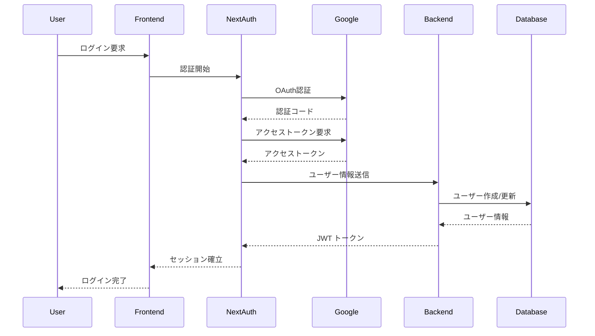

# 技術仕様書

## テクノロジースタック

### フロントエンド技術

#### コア技術
- **Next.js 14**: React フレームワーク (App Router)
- **TypeScript**: 型安全性とコード品質向上
- **React 18**: ユーザーインターフェース構築
- **Tailwind CSS**: ユーティリティファーストCSS

#### 状態管理・データフェッチング
- **SWR**: データフェッチングとキャッシュ
- **React Hook Form**: フォーム管理
- **Zod**: スキーマ検証

#### 認証・セキュリティ
- **NextAuth.js**: 認証システム
- **Google OAuth 2.0**: ソーシャルログイン

#### UI・UX
- **Headless UI**: アクセシブルなUIコンポーネント
- **Heroicons**: アイコンライブラリ
- **React Hot Toast**: 通知システム

### バックエンド技術

#### コア技術
- **Python 3.11+**: プログラミング言語
- **FastAPI**: 高性能WebAPIフレームワーク
- **Pydantic**: データ検証とシリアライゼーション
- **Uvicorn**: ASGIサーバー

#### データベース・キャッシュ
- **Supabase**: PostgreSQL データベース (BaaS)
- **Redis**: インメモリキャッシュ
- **SQLAlchemy**: ORM (Object-Relational Mapping)

#### 外部API・統合
- **httpx**: 非同期HTTPクライアント
- **Riot Games API**: League of Legends データ取得

### インフラストラクチャ

#### デプロイメント・ホスティング
- **Vercel**: フロントエンドホスティング
- **Vercel Functions**: サーバーレスバックエンド
- **Supabase**: データベースホスティング
- **Redis Cloud**: マネージドRedis

#### 開発・運用ツール
- **Git**: バージョン管理
- **GitHub**: コードリポジトリ
- **GitHub Actions**: CI/CD パイプライン
- **ESLint**: コード品質チェック
- **Prettier**: コードフォーマッター

## 開発ツールと手法

### 開発環境

#### 必要なソフトウェア
```bash
# Node.js (LTS版)
node --version  # v18.17.0+

# Python
python --version  # 3.11+

# パッケージマネージャー
npm --version   # 9.0.0+
pip --version   # 23.0+

# Git
git --version   # 2.40.0+
```

#### 開発環境セットアップ
```bash
# フロントエンド
cd frontend
npm install
npm run dev

# バックエンド
cd backend
pip install -r requirements.txt
uvicorn main:app --reload

# 環境変数設定
cp .env.example .env.local
# 必要な環境変数を設定
```

### 開発手法

#### アジャイル開発
- **スプリント期間**: 2週間
- **スクラム**: デイリースタンドアップ、スプリントレビュー
- **ユーザーストーリー**: 機能要件の管理
- **バックログ**: 優先度付きタスク管理

#### テスト駆動開発 (TDD)
1. **Red**: 失敗するテストを書く
2. **Green**: テストを通す最小限のコードを書く
3. **Refactor**: コードを改善する

#### 継続的インテグレーション (CI/CD)
```yaml
# .github/workflows/ci.yml
name: CI/CD Pipeline
on: [push, pull_request]
jobs:
  test:
    runs-on: ubuntu-latest
    steps:
      - uses: actions/checkout@v3
      - name: Setup Node.js
        uses: actions/setup-node@v3
        with:
          node-version: '18'
      - name: Install dependencies
        run: npm ci
      - name: Run tests
        run: npm test
      - name: Run linting
        run: npm run lint
      - name: Build application
        run: npm run build
```

### コード品質管理

#### 静的解析ツール
```json
// .eslintrc.json
{
  "extends": [
    "next/core-web-vitals",
    "@typescript-eslint/recommended",
    "prettier"
  ],
  "rules": {
    "@typescript-eslint/no-unused-vars": "error",
    "@typescript-eslint/explicit-function-return-type": "warn",
    "prefer-const": "error"
  }
}
```

#### コードフォーマッター
```json
// .prettierrc
{
  "semi": true,
  "trailingComma": "es5",
  "singleQuote": true,
  "printWidth": 80,
  "tabWidth": 2
}
```

#### 型チェック
```json
// tsconfig.json
{
  "compilerOptions": {
    "strict": true,
    "noUnusedLocals": true,
    "noUnusedParameters": true,
    "noImplicitReturns": true,
    "noFallthroughCasesInSwitch": true
  }
}
```

## 技術的制約と要件

### システム制約

#### パフォーマンス制約
- **API応答時間**: 平均3秒以内、最大5秒
- **ページロード時間**: 初回2秒以内、以降1秒以内
- **同時接続数**: 1,000ユーザー対応
- **データベースクエリ**: 100ms以内

#### リソース制約
- **メモリ使用量**: フロントエンド512MB、バックエンド1GB
- **ストレージ**: データベース10GB、ファイル1GB
- **帯域幅**: 月間100GB転送量
- **API呼び出し**: Riot API制限内 (100req/2min)

#### セキュリティ制約
- **認証**: OAuth 2.0必須
- **データ暗号化**: HTTPS通信、データベース暗号化
- **入力検証**: 全ユーザー入力の検証
- **アクセス制御**: ユーザー固有データの分離

### 技術要件

#### 互換性要件
```typescript
// ブラウザサポート
const SUPPORTED_BROWSERS = {
  chrome: '90+',
  firefox: '88+',
  safari: '14+',
  edge: '90+'
};

// モバイル対応
const MOBILE_SUPPORT = {
  ios: '14+',
  android: '10+'
};
```

#### API要件
```typescript
// Riot Games API制限
const API_LIMITS = {
  personal: {
    requests: 100,
    interval: '2 minutes'
  },
  production: {
    requests: 3000,
    interval: '10 seconds'
  }
};

// レスポンス形式
interface APIResponse<T> {
  data: T;
  status: 'success' | 'error';
  message?: string;
  timestamp: string;
}
```

#### データベース要件
```sql
-- パフォーマンス要件
CREATE INDEX idx_champion_notes_user_id ON champion_notes(user_id);
CREATE INDEX idx_champion_notes_champions ON champion_notes(my_champion_id, enemy_champion_id);
CREATE INDEX idx_champion_notes_created_at ON champion_notes(created_at DESC);

-- データ整合性
ALTER TABLE champion_notes 
ADD CONSTRAINT fk_user_id 
FOREIGN KEY (user_id) REFERENCES app_users(id) ON DELETE CASCADE;
```

## パフォーマンス要件

### レスポンス時間要件

#### フロントエンド
```typescript
// Core Web Vitals 目標値
const PERFORMANCE_TARGETS = {
  LCP: 2.5,      // Largest Contentful Paint (秒)
  FID: 100,      // First Input Delay (ミリ秒)
  CLS: 0.1,      // Cumulative Layout Shift
  FCP: 1.8,      // First Contentful Paint (秒)
  TTI: 3.8       // Time to Interactive (秒)
};
```

#### バックエンド
```python
# API エンドポイント目標レスポンス時間
RESPONSE_TIME_TARGETS = {
    'GET /api/summoner/*': 3.0,      # 秒
    'GET /api/notes': 1.0,           # 秒
    'POST /api/notes': 2.0,          # 秒
    'PUT /api/notes/*': 2.0,         # 秒
    'DELETE /api/notes/*': 1.0       # 秒
}
```

### スケーラビリティ要件

#### 水平スケーリング
```yaml
# Vercel Functions 設定
functions:
  'api/**':
    memory: 1024  # MB
    maxDuration: 30  # 秒
    
# データベース接続プール
database:
  max_connections: 20
  min_connections: 5
  connection_timeout: 30
```

#### キャッシュ戦略
```typescript
// キャッシュ階層
const CACHE_STRATEGY = {
  browser: {
    static_assets: '1 year',
    api_responses: '5 minutes'
  },
  cdn: {
    images: '1 month',
    css_js: '1 year'
  },
  redis: {
    summoner_data: '5 minutes',
    match_history: '5 minutes',
    champion_data: '24 hours'
  }
};
```

### 監視・メトリクス

#### パフォーマンス監視
```typescript
// 監視対象メトリクス
interface PerformanceMetrics {
  // フロントエンド
  pageLoadTime: number;
  apiResponseTime: number;
  errorRate: number;
  
  // バックエンド
  requestsPerSecond: number;
  databaseQueryTime: number;
  cacheHitRate: number;
  
  // インフラ
  cpuUsage: number;
  memoryUsage: number;
  diskUsage: number;
}
```

#### アラート設定
```yaml
# 監視アラート閾値
alerts:
  response_time:
    warning: 3000ms
    critical: 5000ms
  error_rate:
    warning: 5%
    critical: 10%
  availability:
    warning: 99.0%
    critical: 98.0%
```

## セキュリティアーキテクチャ

### 認証・認可アーキテクチャ



### データ保護

#### 暗号化
```typescript
// データ暗号化設定
const ENCRYPTION_CONFIG = {
  algorithm: 'AES-256-GCM',
  keyLength: 32,
  ivLength: 16,
  tagLength: 16
};

// パスワードハッシュ化
const HASH_CONFIG = {
  algorithm: 'bcrypt',
  saltRounds: 12
};
```

#### 入力検証
```python
# Pydantic バリデーション
from pydantic import BaseModel, validator
import re

class CreateNoteRequest(BaseModel):
    my_champion_id: str
    enemy_champion_id: str
    memo: str
    
    @validator('my_champion_id', 'enemy_champion_id')
    def validate_champion_id(cls, v):
        if not re.match(r'^[a-zA-Z0-9_]+$', v):
            raise ValueError('Invalid champion ID format')
        return v
    
    @validator('memo')
    def validate_memo(cls, v):
        if len(v) > 1000:
            raise ValueError('Memo too long')
        return v.strip()
```

### API セキュリティ

#### レート制限
```python
from slowapi import Limiter, _rate_limit_exceeded_handler
from slowapi.util import get_remote_address

limiter = Limiter(key_func=get_remote_address)

@app.get("/api/summoner/{region}/{summoner_name}")
@limiter.limit("10/minute")
async def get_summoner(request: Request, region: str, summoner_name: str):
    # API実装
    pass
```

#### CORS設定
```python
from fastapi.middleware.cors import CORSMiddleware

app.add_middleware(
    CORSMiddleware,
    allow_origins=["https://lollab.vercel.app"],
    allow_credentials=True,
    allow_methods=["GET", "POST", "PUT", "DELETE"],
    allow_headers=["*"],
)
```

## プログラミング言語選択ガイドライン

### 言語選択の原則

#### 既存プロジェクトでの言語選択
- **既存コードベース**: プロジェクトで既に確立された言語を使用
- **一貫性の維持**: 既存のパターンと規約に従う
- **言語変更**: ユーザーから明示的に要求された場合のみ提案

#### マルチ言語プロジェクト
```typescript
// フロントエンド + バックエンド構成例
const PROJECT_LANGUAGES = {
  frontend: 'TypeScript', // Next.js
  backend: 'Python',      // FastAPI
  database: 'SQL',        // PostgreSQL
  infrastructure: 'YAML'  // Docker, K8s
};
```

### 技術スタック別ガイドライン

#### フロントエンド開発
- **TypeScript**: 型安全性とコード品質向上
- **JavaScript**: 柔軟性と広範囲な対応
- **選択基準**: プロジェクト規模、チーム経験、保守性要件

#### バックエンド開発
- **Python**: API開発、データ処理、汎用開発
- **TypeScript/Node.js**: フルスタック開発、リアルタイム処理
- **Java**: エンタープライズ、大規模システム
- **Go**: マイクロサービス、クラウドネイティブ

#### 実装ガイドライン

```python
# Python バックエンド例
from fastapi import FastAPI
from pydantic import BaseModel

class SummonerRequest(BaseModel):
    region: str
    summoner_name: str

@app.get("/api/summoner/{region}/{name}")
async def get_summoner(region: str, name: str) -> SummonerResponse:
    # 実装
    pass
```

```typescript
// TypeScript フロントエンド例
interface SummonerProfile {
  id: string;
  name: string;
  level: number;
  rank?: RankInfo;
}

const fetchSummoner = async (
  region: string, 
  name: string
): Promise<SummonerProfile> => {
  // 実装
};
```

### コード品質基準

#### 言語固有の品質基準
- **型安全性**: TypeScript strict mode、Python type hints
- **コーディング規約**: ESLint (TS/JS)、Black/Flake8 (Python)
- **テスト**: Jest (TS/JS)、pytest (Python)
- **ドキュメント**: TSDoc、Python docstrings

## 運用・保守要件

### ログ管理

#### ログレベル
```python
import logging

# ログ設定
LOGGING_CONFIG = {
    'version': 1,
    'disable_existing_loggers': False,
    'formatters': {
        'standard': {
            'format': '%(asctime)s [%(levelname)s] %(name)s: %(message)s'
        },
    },
    'handlers': {
        'default': {
            'level': 'INFO',
            'formatter': 'standard',
            'class': 'logging.StreamHandler',
        },
    },
    'loggers': {
        '': {
            'handlers': ['default'],
            'level': 'INFO',
            'propagate': False
        }
    }
}
```

#### 監査ログ
```typescript
// 監査ログ対象イベント
const AUDIT_EVENTS = {
  USER_LOGIN: 'user.login',
  USER_LOGOUT: 'user.logout',
  NOTE_CREATE: 'note.create',
  NOTE_UPDATE: 'note.update',
  NOTE_DELETE: 'note.delete',
  API_ERROR: 'api.error'
};
```

### バックアップ・復旧

#### データバックアップ
```sql
-- 日次バックアップ
pg_dump -h localhost -U postgres -d lollab > backup_$(date +%Y%m%d).sql

-- 増分バックアップ
pg_basebackup -h localhost -D /backup/incremental -U postgres -v -P -W
```

#### 災害復旧計画
```yaml
# RTO/RPO 目標
disaster_recovery:
  RTO: 4 hours    # Recovery Time Objective
  RPO: 1 hour     # Recovery Point Objective
  
backup_strategy:
  frequency: daily
  retention: 30 days
  location: multiple_regions
```

### 監視・アラート

#### ヘルスチェック
```python
@app.get("/health")
async def health_check():
    return {
        "status": "healthy",
        "timestamp": datetime.utcnow(),
        "version": "1.0.0",
        "services": {
            "database": await check_database(),
            "redis": await check_redis(),
            "riot_api": await check_riot_api()
        }
    }
```

#### メトリクス収集
```typescript
// カスタムメトリクス
const metrics = {
  api_requests_total: new Counter({
    name: 'api_requests_total',
    help: 'Total number of API requests',
    labelNames: ['method', 'endpoint', 'status']
  }),
  
  response_duration_seconds: new Histogram({
    name: 'response_duration_seconds',
    help: 'Response duration in seconds',
    labelNames: ['method', 'endpoint']
  })
};
```