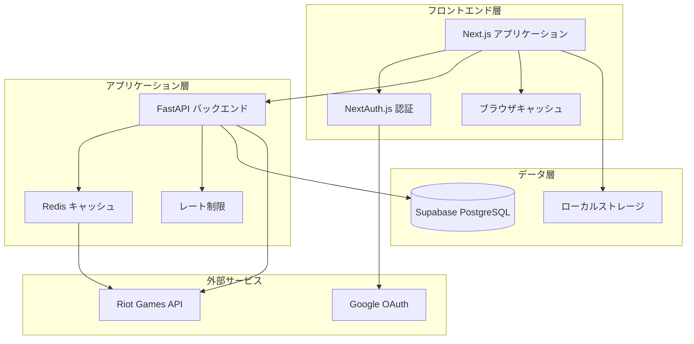
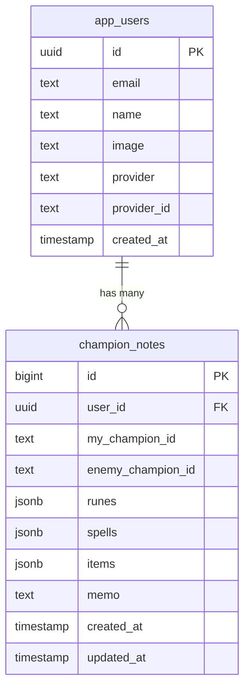
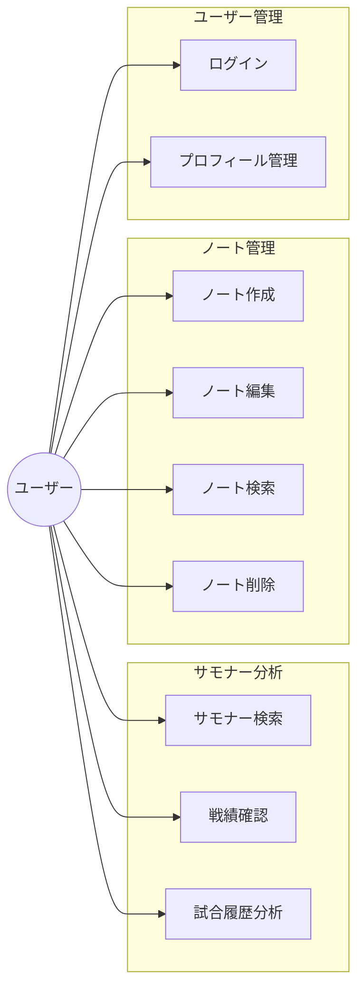
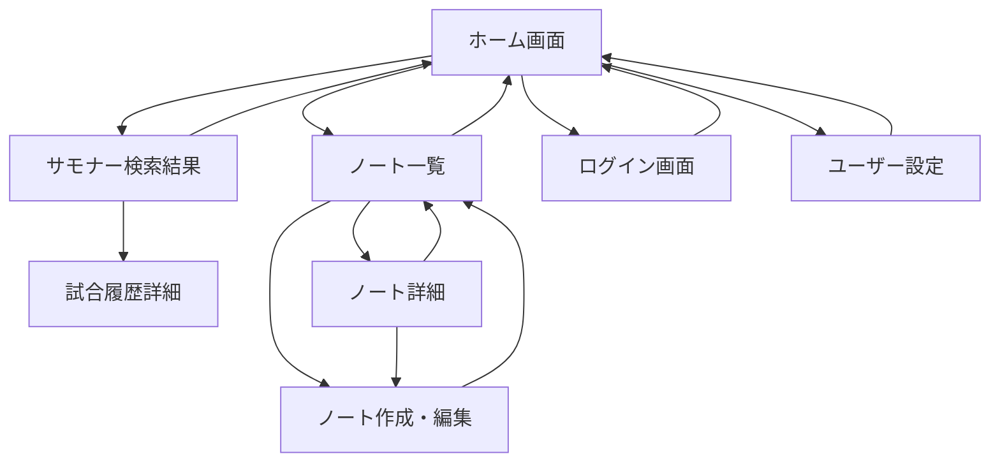

# 機能設計書

## システム構成図



## アーキテクチャ概要

### 技術スタック
- **フロントエンド**: Next.js 14 (App Router), TypeScript, Tailwind CSS
- **バックエンド**: Python FastAPI, Pydantic
- **データベース**: Supabase (PostgreSQL)
- **キャッシュ**: Redis
- **認証**: NextAuth.js + Google OAuth
- **デプロイ**: Vercel (フロントエンド), Vercel Functions (バックエンド)

### アーキテクチャパターン
- **レイヤードアーキテクチャ**: プレゼンテーション、アプリケーション、データ層の分離
- **RESTful API**: 標準的なHTTPメソッドとステータスコード
- **キャッシュファースト**: パフォーマンス最適化のための積極的キャッシュ利用

## データモデル定義

### ER図



### データモデル詳細

#### User (app_users)
```typescript
interface User {
  id: string;                 // UUID, Primary Key
  email: string;              // ユーザーメールアドレス
  name: string;               // 表示名
  image?: string;             // プロフィール画像URL
  provider: string;           // 認証プロバイダー (google)
  providerId: string;         // プロバイダー固有ID
  createdAt: Date;            // 作成日時
}
```

#### ChampionNote (champion_notes)
```typescript
interface ChampionNote {
  id: number;                 // 自動増分ID, Primary Key
  userId: string;             // ユーザーID (Foreign Key)
  myChampionId: string;       // 自分のチャンピオンID
  enemyChampionId: string;    // 相手のチャンピオンID
  runes: RuneConfiguration;   // ルーン設定
  spells: SummonerSpell[];    // サモナースペル
  items: Item[];              // アイテム
  memo: string;               // 戦略メモ
  createdAt: Date;            // 作成日時
  updatedAt: Date;            // 更新日時
}

interface RuneConfiguration {
  primary: {
    tree: string;             // メインルーンツリー
    keystone: string;         // キーストーン
    slot1: string;            // スロット1
    slot2: string;            // スロット2
    slot3: string;            // スロット3
  };
  secondary: {
    tree: string;             // サブルーンツリー
    slot1: string;            // サブスロット1
    slot2: string;            // サブスロット2
  };
  shards: {
    offense: string;          // 攻撃シャード
    flex: string;             // フレックスシャード
    defense: string;          // 防御シャード
  };
}

interface SummonerSpell {
  id: string;                 // スペルID
  name: string;               // スペル名
}

interface Item {
  id: string;                 // アイテムID
  name: string;               // アイテム名
}
```

#### 外部APIデータモデル

```typescript
// Riot API レスポンス
interface SummonerProfile {
  id: string;
  accountId: string;
  puuid: string;
  name: string;
  profileIconId: number;
  summonerLevel: number;
  rank?: RankInfo;
}

interface RankInfo {
  tier: string;               // ティア (IRON, BRONZE, SILVER, etc.)
  rank: string;               // ランク (I, II, III, IV)
  leaguePoints: number;       // LP
  wins: number;               // 勝利数
  losses: number;             // 敗北数
}

interface MatchData {
  gameId: string;
  gameCreation: number;
  gameDuration: number;
  participants: ParticipantData[];
}

interface ParticipantData {
  championId: string;
  championName: string;
  kills: number;
  deaths: number;
  assists: number;
  totalMinionsKilled: number;
  totalDamageDealtToChampions: number;
  win: boolean;
}
```

## コンポーネント設計

### フロントエンドコンポーネント階層

```
App
├── Layout
│   ├── Header
│   │   ├── Navigation
│   │   └── UserMenu
│   └── Footer
├── Pages
│   ├── HomePage
│   │   ├── SearchBar
│   │   ├── RecentSearches
│   │   └── PinnedChampions
│   ├── SummonerPage
│   │   ├── SummonerProfile
│   │   └── MatchHistory
│   └── NotesPage
│       ├── NotesList
│       ├── NoteEditor
│       └── NoteFilters
└── Common
    ├── LoadingSpinner
    ├── ErrorBoundary
    └── Modal
```

### コンポーネント詳細

#### SearchBar
```typescript
interface SearchBarProps {
  onSearch: (summonerName: string, region: string) => void;
  loading?: boolean;
}

// 機能:
// - サモナー名入力
// - リージョン選択
// - 検索実行
// - バリデーション
```

#### SummonerProfile
```typescript
interface SummonerProfileProps {
  summoner: SummonerProfile;
  rank?: RankInfo;
}

// 機能:
// - プロフィール情報表示
// - ランク情報表示
// - レスポンシブデザイン
```

#### MatchHistory
```typescript
interface MatchHistoryProps {
  matches: MatchData[];
  loading?: boolean;
}

// 機能:
// - 試合履歴テーブル表示
// - ソート機能
// - フィルタリング
// - ページネーション
```

#### NoteEditor
```typescript
interface NoteEditorProps {
  note?: ChampionNote;
  onSave: (note: ChampionNote) => void;
  onCancel: () => void;
}

// 機能:
// - ノート作成・編集フォーム
// - チャンピオン選択
// - ルーン・スペル・アイテム設定
// - バリデーション
```

### バックエンドコンポーネント

#### API エンドポイント設計

```python
# サモナー関連
@app.get("/api/summoner/{region}/{summoner_name}")
async def get_summoner(region: str, summoner_name: str) -> SummonerResponse

@app.get("/api/summoner/{region}/{summoner_name}/matches")
async def get_matches(region: str, summoner_name: str) -> MatchesResponse

# ノート関連
@app.get("/api/notes")
async def get_notes(user_id: str) -> NotesResponse

@app.post("/api/notes")
async def create_note(note: CreateNoteRequest) -> NoteResponse

@app.put("/api/notes/{note_id}")
async def update_note(note_id: int, note: UpdateNoteRequest) -> NoteResponse

@app.delete("/api/notes/{note_id}")
async def delete_note(note_id: int) -> DeleteResponse

# ユーザー関連
@app.post("/api/users/register")
async def register_user(user: CreateUserRequest) -> UserResponse

@app.get("/api/users/profile")
async def get_profile(user_id: str) -> UserResponse
```

#### サービス層設計

```python
class SummonerService:
    def __init__(self, riot_client: RiotAPIClient, cache: CacheService):
        self.riot_client = riot_client
        self.cache = cache
    
    async def get_summoner_profile(self, region: str, name: str) -> SummonerProfile:
        # キャッシュチェック → API呼び出し → キャッシュ保存
        pass
    
    async def get_match_history(self, region: str, puuid: str) -> List[MatchData]:
        # 試合履歴取得とフィルタリング
        pass

class NoteService:
    def __init__(self, db: Database):
        self.db = db
    
    async def create_note(self, user_id: str, note_data: dict) -> ChampionNote:
        # ノート作成とバリデーション
        pass
    
    async def get_user_notes(self, user_id: str, filters: dict) -> List[ChampionNote]:
        # ユーザーノート取得とフィルタリング
        pass
```

## ユースケース図



## 画面遷移図



## ワイヤフレーム

### ホーム画面
```
┌─────────────────────────────────────┐
│ LoL Lab                    [ログイン] │
├─────────────────────────────────────┤
│                                     │
│     サモナー検索                      │
│  ┌─────────────┐ ┌─────────┐ [検索]  │
│  │サモナー名    │ │リージョン │        │
│  └─────────────┘ └─────────┘        │
│                                     │
│  最近の検索                          │
│  ┌─────────────────────────────────┐ │
│  │ Player1 (NA)  Player2 (KR)     │ │
│  └─────────────────────────────────┘ │
│                                     │
│  ピン留めチャンピオン                  │
│  ┌─────────────────────────────────┐ │
│  │ [Yasuo] [Zed] [Azir] [Akali]   │ │
│  └─────────────────────────────────┘ │
│                                     │
│  ┌─────────────┐                    │
│  │ノート管理    │                    │
│  └─────────────┘                    │
└─────────────────────────────────────┘
```

### サモナー検索結果画面
```
┌─────────────────────────────────────┐
│ LoL Lab > 検索結果                   │
├─────────────────────────────────────┤
│                                     │
│  プレイヤー情報                      │
│  ┌─────────────────────────────────┐ │
│  │ [アイコン] PlayerName            │ │
│  │ レベル: 150                     │ │
│  │ ランク: Gold II (1,234 LP)      │ │
│  └─────────────────────────────────┘ │
│                                     │
│  最近の試合 (10試合)                 │
│  ┌─────────────────────────────────┐ │
│  │チャンピオン│KDA   │CS │ダメージ│勝敗│ │
│  ├─────────────────────────────────┤ │
│  │Yasuo      │12/3/8│180│25,432 │勝 │ │
│  │Zed        │8/5/4 │165│22,108 │敗 │ │
│  │...        │...   │...│...    │...│ │
│  └─────────────────────────────────┘ │
│                                     │
│  [ノート作成]                        │
└─────────────────────────────────────┘
```

### ノート作成・編集画面
```
┌─────────────────────────────────────┐
│ LoL Lab > ノート作成                 │
├─────────────────────────────────────┤
│                                     │
│  マッチアップ設定                    │
│  ┌─────────────┐ vs ┌─────────────┐ │
│  │自分のチャンピオン│   │相手のチャンピオン│ │
│  │[Yasuo ▼]    │   │[Zed ▼]     │ │
│  └─────────────┘   └─────────────┘ │
│                                     │
│  ルーン設定                          │
│  ┌─────────────────────────────────┐ │
│  │メイン: [Conqueror ▼]            │ │
│  │サブ : [Resolve ▼]               │ │
│  └─────────────────────────────────┘ │
│                                     │
│  サモナースペル                      │
│  ┌─────────────────────────────────┐ │
│  │[Flash] [Ignite]                │ │
│  └─────────────────────────────────┘ │
│                                     │
│  開始アイテム                        │
│  ┌─────────────────────────────────┐ │
│  │[Doran's Blade] [Health Potion]  │ │
│  └─────────────────────────────────┘ │
│                                     │
│  戦略メモ                            │
│  ┌─────────────────────────────────┐ │
│  │レベル3でオールインを狙う          │ │
│  │Eで回避してからQコンボ            │ │
│  │...                             │ │
│  └─────────────────────────────────┘ │
│                                     │
│  [保存] [キャンセル]                 │
└─────────────────────────────────────┘
```

## API設計

### RESTful API エンドポイント

#### サモナー関連API

```yaml
# サモナー情報取得
GET /api/summoner/{region}/{summoner_name}
Parameters:
  - region: string (required) - リージョンコード
  - summoner_name: string (required) - サモナー名
Response:
  200: SummonerProfile
  404: サモナーが見つからない
  500: API エラー

# 試合履歴取得
GET /api/summoner/{region}/{summoner_name}/matches
Parameters:
  - region: string (required)
  - summoner_name: string (required)
  - count: integer (optional, default: 10) - 取得件数
Response:
  200: MatchHistory[]
  404: サモナーが見つからない
  500: API エラー
```

#### ノート関連API

```yaml
# ノート一覧取得
GET /api/notes
Headers:
  - Authorization: Bearer {token}
Parameters:
  - my_champion: string (optional) - 自分のチャンピオンでフィルタ
  - enemy_champion: string (optional) - 相手のチャンピオンでフィルタ
  - page: integer (optional, default: 1) - ページ番号
  - limit: integer (optional, default: 20) - 1ページあたりの件数
Response:
  200: PaginatedNotes
  401: 認証エラー

# ノート作成
POST /api/notes
Headers:
  - Authorization: Bearer {token}
Body: CreateNoteRequest
Response:
  201: ChampionNote
  400: バリデーションエラー
  401: 認証エラー

# ノート更新
PUT /api/notes/{note_id}
Headers:
  - Authorization: Bearer {token}
Parameters:
  - note_id: integer (required)
Body: UpdateNoteRequest
Response:
  200: ChampionNote
  400: バリデーションエラー
  401: 認証エラー
  404: ノートが見つからない

# ノート削除
DELETE /api/notes/{note_id}
Headers:
  - Authorization: Bearer {token}
Parameters:
  - note_id: integer (required)
Response:
  204: 削除成功
  401: 認証エラー
  404: ノートが見つからない
```

### データ転送オブジェクト (DTO)

```typescript
// リクエスト
interface CreateNoteRequest {
  myChampionId: string;
  enemyChampionId: string;
  runes: RuneConfiguration;
  spells: string[];
  items: string[];
  memo: string;
}

interface UpdateNoteRequest extends Partial<CreateNoteRequest> {}

// レスポンス
interface SummonerResponse {
  summoner: SummonerProfile;
  rank?: RankInfo;
}

interface MatchesResponse {
  matches: MatchData[];
  total: number;
}

interface PaginatedNotes {
  notes: ChampionNote[];
  total: number;
  page: number;
  totalPages: number;
}

interface ErrorResponse {
  error: string;
  message: string;
  details?: any;
}
```

## キャッシュ戦略

### Redis キャッシュ設計

```typescript
// キャッシュキー設計
const CACHE_KEYS = {
  SUMMONER: (region: string, name: string) => `summoner:${region}:${name}`,
  MATCHES: (region: string, puuid: string) => `matches:${region}:${puuid}`,
  CHAMPION_DATA: 'champion-data',
  RATE_LIMIT: (apiKey: string) => `rate-limit:${apiKey}`
};

// TTL設定
const CACHE_TTL = {
  SUMMONER: 300,      // 5分
  MATCHES: 300,       // 5分
  CHAMPION_DATA: 86400, // 24時間
  RATE_LIMIT: 60      // 1分
};
```

### キャッシュ戦略

1. **キャッシュファースト**: API呼び出し前にキャッシュをチェック
2. **バックグラウンド更新**: 期限切れ前の非同期更新
3. **フォールバック**: API障害時の古いキャッシュデータ提供
4. **無効化**: 手動更新時のキャッシュクリア

## セキュリティ設計

### 認証・認可

```typescript
// JWT トークン構造
interface JWTPayload {
  sub: string;        // ユーザーID
  email: string;      // メールアドレス
  name: string;       // 表示名
  iat: number;        // 発行時刻
  exp: number;        // 有効期限
}

// 認証ミドルウェア
async function authenticate(request: Request): Promise<User | null> {
  const token = extractBearerToken(request);
  if (!token) return null;
  
  try {
    const payload = verifyJWT(token);
    return await getUserById(payload.sub);
  } catch (error) {
    return null;
  }
}
```

### データ保護

1. **入力検証**: すべてのユーザー入力の検証・サニタイゼーション
2. **SQLインジェクション対策**: パラメータ化クエリの使用
3. **XSS対策**: 出力時のエスケープ処理
4. **CSRF対策**: CSRFトークンの実装
5. **レート制限**: API呼び出し頻度の制限

## パフォーマンス設計

### フロントエンド最適化

1. **コード分割**: ページ単位での動的インポート
2. **画像最適化**: Next.js Image コンポーネントの活用
3. **キャッシュ活用**: ブラウザキャッシュとSWRの組み合わせ
4. **バンドル最適化**: Tree shakingとminification

### バックエンド最適化

1. **データベース最適化**: インデックス設計とクエリ最適化
2. **接続プーリング**: データベース接続の効率化
3. **非同期処理**: I/O集約的処理の非同期化
4. **レスポンス圧縮**: gzip圧縮の有効化

### 監視・メトリクス

```typescript
// パフォーマンスメトリクス
interface PerformanceMetrics {
  responseTime: number;     // API応答時間
  throughput: number;       // スループット
  errorRate: number;        // エラー率
  cacheHitRate: number;     // キャッシュヒット率
  activeUsers: number;      // アクティブユーザー数
}
```