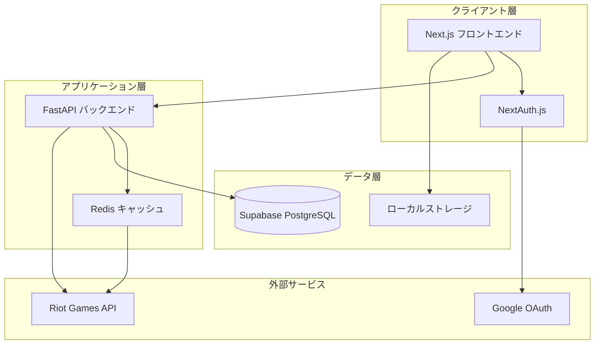

# 設計書: LoL Lab完全版アプリケーション

## 概要

LoL Labは、サモナー分析、チャンピオンノート作成、試合履歴レビューを組み合わせた包括的なLeague of Legends戦略アプリケーションです。このシステムは、FastAPIバックエンドを持つNext.jsフロントエンドを使用したモダンなウェブアーキテクチャ上に構築され、データ永続化にSupabaseを活用し、リアルタイムのLeague of LegendsデータのためにRiot Games APIと統合されています。

このアプリケーションは、League of Legendsプレイヤーの戦略的コンパニオンとして機能し、対戦相手の調査、効果的な戦略の文書化、チャンピオンマッチアップとカウンター戦略の包括的な知識ベースの構築を可能にします。

## アーキテクチャ

### 高レベルアーキテクチャ



### 技術スタック

**フロントエンド:**
- App Routerを使用したNext.js 14
- 型安全性のためのTypeScript
- スタイリングのためのTailwind CSS
- 認証のためのNextAuth.js

**バックエンド:**
- APIエンドポイントのためのPython FastAPI
- データ検証のためのPydantic
- キャッシュ層のためのRedis
- Vercelサーバーレス関数

**データベース:**
- 永続データのためのSupabase (PostgreSQL)
- ユーザー設定のためのローカルストレージ

**外部統合:**
- League of LegendsデータのためのRiot Games API
- ユーザー認証のためのGoogle OAuth

## コンポーネントとインターフェース

### フロントエンドコンポーネント

#### コアUIコンポーネント
- **SearchBar**: リージョン選択付きサモナー検索
- **SummonerProfile**: サモナーランクと統計の表示
- **MatchHistory**: 最近の試合の表形式表示
- **ChampionNoteEditor**: チャンピオンノート作成/編集フォーム
- **NotesList**: フィルタリング付き保存ノートのグリッド/リスト表示
- **LoadingSpinner**: アプリ全体での一貫したローディング状態

#### ページコンポーネント
- **HomePage**: 最近の検索とピン留めチャンピオン付き検索インターフェース
- **SummonerPage**: 試合履歴付きサモナープロフィール
- **NotesPage**: チャンピオンノート管理インターフェース
- **NoteDetailPage**: 個別ノート表示と編集

### バックエンドAPIエンドポイント

#### サモナーエンドポイント
```typescript
GET /api/summoner/{region}/{summonerName}
Response: {
  id: string,
  name: string,
  level: number,
  rank: {
    tier: string,
    division: string,
    leaguePoints: number
  }
}

GET /api/summoner/{region}/{summonerName}/matches
Response: {
  matches: Array<{
    gameId: string,
    champion: string,
    kda: { kills: number, deaths: number, assists: number },
    cs: number,
    damage: number,
    gameMode: string,
    result: 'win' | 'loss'
  }>
}
```

#### ノートエンドポイント
```typescript
GET /api/notes
Response: { notes: ChampionNote[] }

POST /api/notes
Body: {
  myChampionId: string,
  enemyChampionId: string,
  runes: object,
  spells: string[],
  items: string[],
  memo: string
}

PUT /api/notes/{noteId}
DELETE /api/notes/{noteId}
```

#### ユーザー管理
```typescript
POST /api/users/register
Body: { email: string, name: string, provider: string, providerId: string }

GET /api/users/profile
Response: { user: UserProfile }
```

### データモデル

#### ユーザーモデル
```typescript
interface User {
  id: string;
  email: string;
  name: string;
  image?: string;
  provider: string;
  providerId: string;
  createdAt: Date;
}
```

#### チャンピオンノートモデル
```typescript
interface ChampionNote {
  id: number;
  userId: string;
  myChampionId: string;
  enemyChampionId: string;
  runes: RuneConfiguration;
  spells: SummonerSpell[];
  items: Item[];
  memo: string;
  createdAt: Date;
  updatedAt: Date;
}

interface RuneConfiguration {
  primary: {
    tree: string;
    keystone: string;
    slot1: string;
    slot2: string;
    slot3: string;
  };
  secondary: {
    tree: string;
    slot1: string;
    slot2: string;
  };
  shards: {
    offense: string;
    flex: string;
    defense: string;
  };
}
```

#### サモナーデータモデル
```typescript
interface SummonerProfile {
  id: string;
  accountId: string;
  puuid: string;
  name: string;
  profileIconId: number;
  summonerLevel: number;
  rank?: RankInfo;
}

interface RankInfo {
  tier: string;
  rank: string;
  leaguePoints: number;
  wins: number;
  losses: number;
}

interface MatchData {
  gameId: string;
  gameCreation: number;
  gameDuration: number;
  participants: ParticipantData[];
}

interface ParticipantData {
  championId: string;
  championName: string;
  kills: number;
  deaths: number;
  assists: number;
  totalMinionsKilled: number;
  totalDamageDealtToChampions: number;
  win: boolean;
}
```

### キャッシュ戦略

#### Redisキャッシュ構造
```typescript
// キャッシュキーとTTL
"summoner:{region}:{name}" -> SummonerProfile (5分)
"matches:{region}:{summonerId}" -> MatchData[] (5分)
"champion-data" -> ChampionData[] (24時間)
"rate-limit:{apiKey}" -> RequestCount (1分)
```

#### キャッシュ実装
- **キャッシュファースト戦略**: APIコール前にキャッシュをチェック
- **バックグラウンド更新**: 頻繁にアクセスされるデータの非同期キャッシュ更新
- **レート制限追跡**: 違反を防ぐためのAPI使用量監視
- **フォールバック処理**: APIが利用できない場合の古いデータ提供

## 正確性プロパティ

*プロパティとは、システムのすべての有効な実行において真であるべき特性や動作のことです。本質的に、システムが何をすべきかについての正式な記述です。プロパティは、人間が読める仕様と機械で検証可能な正確性保証の橋渡しとして機能します。*

### プロパティ1: サモナーAPI統合
*任意の*有効なサモナー名とリージョンの組み合わせに対して、Riot APIへのクエリは必要なすべてのフィールド（id、name、level、ランク情報）を含む適切に構造化されたサモナープロフィールを返すべきです。
**検証対象: 要件 1.1, 1.2**

### プロパティ2: 試合履歴表示
*任意の*試合履歴を持つサモナーに対して、システムは完全な情報（チャンピオン、K/D/A、CS、ダメージ統計）を含む最新10試合のランク戦を正確に表示すべきです。
**検証対象: 要件 1.3**

### プロパティ3: 無効なサモナーのエラー処理
*任意の*無効なサモナー名またはリージョンに対して、システムはクラッシュすることなく説明的なエラーメッセージを返すべきです。
**検証対象: 要件 1.4**

### プロパティ4: チャンピオンノートCRUD操作
*任意の*有効なチャンピオンノートデータに対して、ノートの作成、更新、削除は適切なユーザー関連付けでデータベースへの変更を正しく永続化し、データ整合性を維持すべきです。
**検証対象: 要件 2.3, 2.5, 3.1**

### プロパティ5: ノートインターフェース提供
*任意の*チャンピオンマッチアップ選択に対して、システムは必要なすべてのフォーム要素（ルーン、サモナースペル、アイテム、戦略テキスト）を含む完全なインターフェースを提供すべきです。
**検証対象: 要件 2.1, 2.2**

### プロパティ6: ユーザーデータ取得と表示
*任意の*認証されたユーザーに対して、ログインは保存されたすべてのノートを取得し、整理された形式で完全な情報を表示すべきです。
**検証対象: 要件 2.4, 3.2, 9.2**

### プロパティ7: 検索とフィルタリング機能
*任意の*検索条件（自分のチャンピオン、敵チャンピオン、またはその両方）に対して、システムは指定されたフィルターに一致するノートのみを返すべきです。
**検証対象: 要件 3.3, 9.1**

### プロパティ8: ローカルストレージ永続化
*任意の*最近の検索またはピン留めチャンピオンデータに対して、情報はローカルストレージを通じてブラウザセッション間で永続化されるべきです。
**検証対象: 要件 3.4**

### プロパティ9: APIレート制限
*任意の*Riot APIリクエストシーケンスに対して、システムは適切なスロットリングを通じてレート制限を尊重し、API違反を防ぐべきです。
**検証対象: 要件 4.1**

### プロパティ10: キャッシュ動作
*任意の*APIレスポンスに対して、システムは指定された期間データをキャッシュし、キャッシュウィンドウ内の後続の同一リクエストに対してキャッシュされた結果を返すべきです。
**検証対象: 要件 4.2, 4.3**

### プロパティ11: データテーブル操作
*任意の*データテーブル表示に対して、ソートとフィルタリング操作は表示されたデータを正しく整理およびフィルタリングすべきです。
**検証対象: 要件 5.3**

### プロパティ12: ユーザーフレンドリーなエラーメッセージ
*任意の*エラー条件に対して、システムは技術的なエラー詳細ではなく、推奨アクション付きのユーザーフレンドリーなエラーメッセージを表示すべきです。
**検証対象: 要件 5.4**

### プロパティ13: 認証強制
*任意の*保護された機能またはエンドポイントに対して、システムはアクセスを許可する前にGoogle OAuth認証を要求すべきです。
**検証対象: 要件 6.1**

### プロパティ14: ユーザープロフィール管理
*任意の*成功したログインに対して、システムは正しい情報でapp_usersテーブルのユーザープロフィールを作成または更新すべきです。
**検証対象: 要件 6.2**

### プロパティ15: データ認可
*任意の*ユーザーデータアクセスに対して、システムはユーザーが自分のノートのみを表示・変更でき、他のユーザーのデータにアクセスできないことを保証すべきです。
**検証対象: 要件 6.3**

### プロパティ16: 入力検証とサニタイゼーション
*任意の*ユーザー入力（サモナー名、ノートデータ）に対して、システムは形式、データ型を検証し、セキュリティ問題を防ぐためにコンテンツをサニタイズすべきです。
**検証対象: 要件 6.4, 8.1, 8.2**

### プロパティ17: 不正な形式のデータ処理
*任意の*不正な形式のAPIレスポンスまたは無効なデータに対して、システムはクラッシュすることなく解析エラーを適切に処理すべきです。
**検証対象: 要件 8.3**

### プロパティ18: データベース制約違反
*任意の*データベース制約違反に対して、システムはユーザーに具体的で実行可能なエラーメッセージを提供すべきです。
**検証対象: 要件 8.4**

### プロパティ19: ノートソートとページネーション
*任意の*ノートリスト表示に対して、システムは日付、チャンピオン、または頻度による正しいソートを提供し、大きな結果セットに対してページネーションを実装すべきです。
**検証対象: 要件 9.4, 9.5**

## エラー処理

### APIエラー処理
- **Riot API障害**: キャッシュされたデータへのフォールバック付きサーキットブレーカーパターンの実装
- **レート制限超過**: 指数バックオフ再試行ロジック付きリクエストキュー
- **ネットワークタイムアウト**: ユーザーフィードバックと再試行メカニズムの提供
- **無効なレスポンス**: エラー回復付きすべてのAPIレスポンスの解析と検証

### データベースエラー処理
- **接続障害**: 自動再試行付きコネクションプーリングの実装
- **制約違反**: 各制約タイプに対する具体的なエラーメッセージの提供
- **トランザクション障害**: 適切なロールバックメカニズムの実装
- **データ破損**: 操作前後のデータ整合性検証

### ユーザー入力エラー処理
- **無効なサモナー名**: 形式検証と提案の提供
- **不正な形式のノートデータ**: 具体的なエラーメッセージ付きすべてのフィールド検証
- **認証失敗**: 明確なエラーメッセージ付きログインへのリダイレクト
- **認可失敗**: 適切なアクセス拒否メッセージの提供

### フロントエンドエラー処理
- **コンポーネントエラー**: フォールバックUI付きエラーバウンダリの実装
- **ネットワークエラー**: オフラインインジケーターと再試行オプションの表示
- **ローディング失敗**: ローディング状態とタイムアウト処理の提供
- **状態管理エラー**: 適切なエラー状態管理の実装

## テスト戦略

### デュアルテストアプローチ

アプリケーションは包括的なカバレッジを確保するため、ユニットテストとプロパティベーステストの両方を実装します：

**ユニットテスト**の焦点：
- 具体的な例とエッジケース
- コンポーネント間の統合ポイント
- エラー条件と境界ケース
- UIコンポーネントのレンダリングとインタラクション

**プロパティテスト**の焦点：
- すべての入力に対して成り立つ普遍的プロパティ
- ランダム化による包括的な入力カバレッジ
- 操作全体でのデータ整合性と一貫性
- APIコントラクト検証

### プロパティベーステスト設定

**テストライブラリ**: JavaScript/TypeScriptプロパティベーステストに`fast-check`を使用
**テスト設定**: プロパティテストあたり最低100回の反復
**テストタグ付け**: 各プロパティテストは以下の形式を使用して設計ドキュメントプロパティを参照する必要があります：
`// Feature: lol-lab-complete-app, Property {number}: {property_text}`

### ユニットテスト戦略

**フロントエンドテスト**：
- React Testing LibraryによるReactコンポーネントテスト
- Jestによるユーザーインタラクションテスト
- MSW (Mock Service Worker)によるAPI統合テスト
- 認証フローテスト

**バックエンドテスト**：
- pytestによるFastAPIエンドポイントテスト
- テストデータベースによるデータベース操作テスト
- モックレスポンスによる外部API統合テスト
- 認証と認可のテスト

### 統合テスト

**エンドツーエンドフロー**：
- 完全なユーザー登録と認証フロー
- サモナー検索から試合履歴表示までのフロー
- チャンピオンノート作成、編集、削除フロー
- アプリケーション全体での検索とフィルタリング機能

**パフォーマンステスト**：
- APIレスポンス時間検証
- データベースクエリパフォーマンステスト
- キャッシュ効果測定
- 同時ユーザー処理検証

### テストデータ管理

**テストフィクスチャ**：
- 様々なシナリオのサンプルサモナーデータ
- すべてのデータ型をカバーするチャンピオンノート例
- 異なる条件のモックRiot APIレスポンス
- ユーザー認証テストデータ

**データ生成**：
- サモナー名のプロパティベーステストジェネレーター
- ランダムチャンピオンノートデータ生成
- モックAPIレスポンスジェネレーター
- ユーザーセッションデータジェネレーター