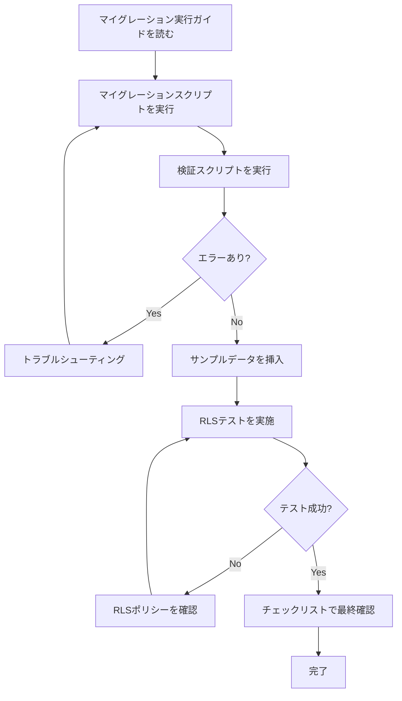

# Supabase マイグレーション

このディレクトリにはLoL LabのSupabaseデータベーススキーマ定義が含まれています。

## マイグレーションファイル

### `migrations/20240101000000_initial_schema.sql`

初期データベーススキーマを定義するマイグレーションファイルです。

**含まれるテーブル:**
- `app_users`: Google認証ユーザー管理
- `profiles`: ユーザープロフィール情報（任意）
- `champion_notes`: チャンピオン対策ノート

**含まれる機能:**
- CHECK制約によるデータ整合性保証
- 外部キー制約とCASCADE削除
- インデックスによる検索パフォーマンス最適化
- Row Level Security (RLS) ポリシー
- updated_at自動更新トリガー

## マイグレーション実行ドキュメント

マイグレーションの実行と検証については、以下のドキュメントを参照してください：

### 📋 主要ドキュメント

1. **[マイグレーション実行ガイド](./migration-execution-guide.md)** ⭐ 必読
   - マイグレーションの実行手順（Dashboard / CLI）
   - トラブルシューティング
   - 次のステップ

2. **[検証スクリプト](./verification-scripts.sql)**
   - テーブル・インデックス・RLS・トリガーの確認
   - マイグレーション後に実行

3. **[RLSテストガイド](./rls-test-guide.md)**
   - Row Level Securityの動作確認手順
   - テストユーザーの作成方法
   - 各ポリシーのテスト方法

4. **[サンプルデータ](./sample-data.sql)**
   - アプリケーション動作確認用データ
   - テストユーザーとノートのサンプル

5. **[マイグレーションテストチェックリスト](./migration-test-checklist.md)**
   - 包括的なテストチェックリスト
   - すべての検証項目を網羅

### 🚀 クイックスタート

```bash
# 1. マイグレーション実行ガイドを読む
cat migration-execution-guide.md

# 2. Supabase Dashboardでマイグレーションを実行
# migrations/20240101000000_initial_schema.sql をSQL Editorで実行

# 3. 検証スクリプトを実行
# verification-scripts.sql をSQL Editorで実行

# 4. サンプルデータを挿入
# sample-data.sql をSQL Editorで実行

# 5. RLSテストを実施
# rls-test-guide.md の手順に従ってテスト

# 6. チェックリストで最終確認
# migration-test-checklist.md を使用して全項目を確認
```

## ドキュメント構成

| ファイル | 目的 | 使用タイミング |
|---------|------|--------------|
| `migration-execution-guide.md` | マイグレーション実行手順 | マイグレーション実行前 |
| `verification-scripts.sql` | データベース状態の検証 | マイグレーション実行後 |
| `rls-test-guide.md` | RLSポリシーの動作確認 | 検証スクリプト実行後 |
| `sample-data.sql` | サンプルデータの挿入 | RLSテスト前 |
| `migration-test-checklist.md` | 包括的なテストチェックリスト | 全テスト実施時 |

## マイグレーション実行フロー



## データ例

詳細なサンプルデータについては、[sample-data.sql](./sample-data.sql) を参照してください。

### app_usersテーブル

```sql
INSERT INTO app_users (email, name, image, provider, provider_id)
VALUES (
  'user@example.com',
  'Test User',
  'https://example.com/avatar.jpg',
  'google',
  'google-user-id-123'
);
```

### champion_notesテーブル（汎用ノート）

```sql
INSERT INTO champion_notes (
  user_id,
  note_type,
  my_champion_id,
  runes,
  spells,
  items,
  memo
)
VALUES (
  'user-uuid-here',
  'general',
  'Ahri',
  '{"primaryPath": 8100, "secondaryPath": 8200, "keystone": 8112, "primaryRunes": [8126, 8138, 8135], "secondaryRunes": [9111, 9104], "shards": [5008, 5008, 5002]}'::jsonb,
  '["SummonerFlash", "SummonerIgnite"]'::jsonb,
  '["1055", "2003"]'::jsonb,
  '基本的なビルドとプレイスタイル'
);
```

### champion_notesテーブル（対策ノート）

```sql
INSERT INTO champion_notes (
  user_id,
  note_type,
  my_champion_id,
  enemy_champion_id,
  runes,
  spells,
  items,
  memo
)
VALUES (
  'user-uuid-here',
  'matchup',
  'Ahri',
  'Yasuo',
  '{"primaryPath": 8100, "secondaryPath": 8300, "keystone": 8112, "primaryRunes": [8126, 8138, 8135], "secondaryRunes": [8304, 8345], "shards": [5008, 5008, 5002]}'::jsonb,
  '["SummonerFlash", "SummonerExhaust"]'::jsonb,
  '["1056", "2003"]'::jsonb,
  'Yasuoのウィンドウォールに注意。Eでハラスしてから距離を取る。'
);
```

## トラブルシューティング

### エラー: "relation already exists"

テーブルが既に存在する場合は、以下のコマンドで削除してから再実行してください。

```sql
DROP TABLE IF EXISTS champion_notes CASCADE;
DROP TABLE IF EXISTS profiles CASCADE;
DROP TABLE IF EXISTS app_users CASCADE;
DROP FUNCTION IF EXISTS update_updated_at_column() CASCADE;
```

### エラー: "permission denied"

RLSポリシーが原因の場合は、サービスキーを使用してアクセスしてください。

```javascript
// Supabase Clientでサービスキーを使用
const supabase = createClient(
  process.env.SUPABASE_URL,
  process.env.SUPABASE_SERVICE_KEY // anonキーではなくサービスキー
);
```

## 参考資料

- [Supabase Documentation](https://supabase.com/docs)
- [PostgreSQL Documentation](https://www.postgresql.org/docs/)
- [Row Level Security Guide](https://supabase.com/docs/guides/auth/row-level-security)
